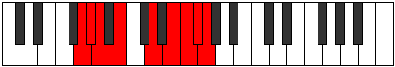

# Mode Ionagyllic

## Links

- [Documentation](index.md)
- [Scales Index](Scales.md)
- [Modes Index](Modes.md)
- [Chords Index](Chords.md)

## Parent Scale

[Mixolydyllic](ScaleMixolydyllic.md)

## Number

[3735](https://ianring.com/musictheory/scales/3735)

## Perfection

- 5 Perfect notes
- 3 Perfect notes

## Perfection Profile

[true false true true true true false false]

## Permutations

| Tonic | Notes | Signature | Illustration | Audio |
|-------|-------|-----------|--------------|-------|
| [C](ModeCNaturalIonagyllic.md) | C, **C#**, D, E, G, A, **A#**, **B**, C | C |  | [midi](ModeCNaturalIonagyllic.mid) [ogg](ModeCNaturalIonagyllic.ogg) |
| [C#](ModeCSharpIonagyllic.md) | C#, **D**, D#, F, G#, A#, **B**, **C**, C# | C |  | [midi](ModeCSharpIonagyllic.mid) [ogg](ModeCSharpIonagyllic.ogg) |
| [Db](ModeDFlatIonagyllic.md) | Db, **D**, Eb, F, Ab, Bb, **B**, **C**, Db | C |  | [midi](ModeDFlatIonagyllic.mid) [ogg](ModeDFlatIonagyllic.ogg) |
| [D](ModeDNaturalIonagyllic.md) | D, **D#**, E, F#, A, B, **C**, **C#**, D | C |  | [midi](ModeDNaturalIonagyllic.mid) [ogg](ModeDNaturalIonagyllic.ogg) |
| [D#](ModeDSharpIonagyllic.md) | D#, **E**, F, G, A#, C, **C#**, **D**, D# | C |  | [midi](ModeDSharpIonagyllic.mid) [ogg](ModeDSharpIonagyllic.ogg) |
| [Eb](ModeEFlatIonagyllic.md) | Eb, **E**, F, G, Bb, C, **Db**, **D**, Eb | C |  | [midi](ModeEFlatIonagyllic.mid) [ogg](ModeEFlatIonagyllic.ogg) |
| [E](ModeENaturalIonagyllic.md) | E, **F**, F#, G#, B, C#, **D**, **D#**, E | C |  | [midi](ModeENaturalIonagyllic.mid) [ogg](ModeENaturalIonagyllic.ogg) |
| [F](ModeFNaturalIonagyllic.md) | F, **F#**, G, A, C, D, **D#**, **E**, F | C |  | [midi](ModeFNaturalIonagyllic.mid) [ogg](ModeFNaturalIonagyllic.ogg) |
| [F#](ModeFSharpIonagyllic.md) | F#, **G**, G#, A#, C#, D#, **E**, **F**, F# | C |  | [midi](ModeFSharpIonagyllic.mid) [ogg](ModeFSharpIonagyllic.ogg) |
| [Gb](ModeGFlatIonagyllic.md) | Gb, **G**, Ab, Bb, Db, Eb, **E**, **F**, Gb | C |  | [midi](ModeGFlatIonagyllic.mid) [ogg](ModeGFlatIonagyllic.ogg) |
| [G](ModeGNaturalIonagyllic.md) | G, **G#**, A, B, D, E, **F**, **F#**, G | C |  | [midi](ModeGNaturalIonagyllic.mid) [ogg](ModeGNaturalIonagyllic.ogg) |
| [G#](ModeGSharpIonagyllic.md) | G#, **A**, A#, C, D#, F, **F#**, **G**, G# | C |  | [midi](ModeGSharpIonagyllic.mid) [ogg](ModeGSharpIonagyllic.ogg) |
| [Ab](ModeAFlatIonagyllic.md) | Ab, **A**, Bb, C, Eb, F, **Gb**, **G**, Ab | C |  | [midi](ModeAFlatIonagyllic.mid) [ogg](ModeAFlatIonagyllic.ogg) |
| [A](ModeANaturalIonagyllic.md) | A, **A#**, B, C#, E, F#, **G**, **G#**, A | C |  | [midi](ModeANaturalIonagyllic.mid) [ogg](ModeANaturalIonagyllic.ogg) |
| [A#](ModeASharpIonagyllic.md) | A#, **B**, C, D, F, G, **G#**, **A**, A# | C |  | [midi](ModeASharpIonagyllic.mid) [ogg](ModeASharpIonagyllic.ogg) |
| [Bb](ModeBFlatIonagyllic.md) | Bb, **B**, C, D, F, G, **Ab**, **A**, Bb | C |  | [midi](ModeBFlatIonagyllic.mid) [ogg](ModeBFlatIonagyllic.ogg) |
| [B](ModeBNaturalIonagyllic.md) | B, **C**, C#, D#, F#, G#, **A**, **A#**, B | C |  | [midi](ModeBNaturalIonagyllic.mid) [ogg](ModeBNaturalIonagyllic.ogg) |
