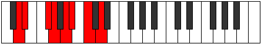

# Mode Ionalian

## Links

- [Documentation](index.md)
- [Scales Index](Scales.md)
- [Modes Index](Modes.md)
- [Chords Index](Chords.md)

## Parent Scale

[Bycrian](ScaleBycrian.md)

## Number

[1459](https://ianring.com/musictheory/scales/1459)

## Perfection

- 4 Perfect notes
- 3 Perfect notes

## Perfection Profile

[true true false true false false true]

## Permutations

| Tonic | Notes | Signature | Illustration | Audio |
|-------|-------|-----------|--------------|-------|
| [C](ModeCNaturalIonalian.md) | C, Db, **E**, F, **G**, **Ab**, Bb, C | C |  | [midi](ModeCNaturalIonalian.mid) [ogg](ModeCNaturalIonalian.ogg) |
| [C#](ModeCSharpIonalian.md) | C#, D, **E#**, F#, **G#**, **A**, B, C# | C |  | [midi](ModeCSharpIonalian.mid) [ogg](ModeCSharpIonalian.ogg) |
| [Db](ModeDFlatIonalian.md) | Db, Ebb, **F**, Gb, **Ab**, **Bbb**, Cb, Db | C |  | [midi](ModeDFlatIonalian.mid) [ogg](ModeDFlatIonalian.ogg) |
| [D](ModeDNaturalIonalian.md) | D, Eb, **F#**, G, **A**, **Bb**, C, D | C |  | [midi](ModeDNaturalIonalian.mid) [ogg](ModeDNaturalIonalian.ogg) |
| [D#](ModeDSharpIonalian.md) | D#, E, **F##**, G#, **A#**, **B**, C#, D# | C |  | [midi](ModeDSharpIonalian.mid) [ogg](ModeDSharpIonalian.ogg) |
| [Eb](ModeEFlatIonalian.md) | Eb, Fb, **G**, Ab, **Bb**, **Cb**, Db, Eb | C |  | [midi](ModeEFlatIonalian.mid) [ogg](ModeEFlatIonalian.ogg) |
| [E](ModeENaturalIonalian.md) | E, F, **G#**, A, **B**, **C**, D, E | C |  | [midi](ModeENaturalIonalian.mid) [ogg](ModeENaturalIonalian.ogg) |
| [F](ModeFNaturalIonalian.md) | F, Gb, **A**, Bb, **C**, **Db**, Eb, F | C |  | [midi](ModeFNaturalIonalian.mid) [ogg](ModeFNaturalIonalian.ogg) |
| [F#](ModeFSharpIonalian.md) | F#, G, **A#**, B, **C#**, **D**, E, F# | C |  | [midi](ModeFSharpIonalian.mid) [ogg](ModeFSharpIonalian.ogg) |
| [Gb](ModeGFlatIonalian.md) | Gb, Abb, **Bb**, Cb, **Db**, **Ebb**, Fb, Gb | C |  | [midi](ModeGFlatIonalian.mid) [ogg](ModeGFlatIonalian.ogg) |
| [G](ModeGNaturalIonalian.md) | G, Ab, **B**, C, **D**, **Eb**, F, G | C |  | [midi](ModeGNaturalIonalian.mid) [ogg](ModeGNaturalIonalian.ogg) |
| [G#](ModeGSharpIonalian.md) | G#, A, **B#**, C#, **D#**, **E**, F#, G# | C |  | [midi](ModeGSharpIonalian.mid) [ogg](ModeGSharpIonalian.ogg) |
| [Ab](ModeAFlatIonalian.md) | Ab, Bbb, **C**, Db, **Eb**, **Fb**, Gb, Ab | C |  | [midi](ModeAFlatIonalian.mid) [ogg](ModeAFlatIonalian.ogg) |
| [A](ModeANaturalIonalian.md) | A, Bb, **C#**, D, **E**, **F**, G, A | C |  | [midi](ModeANaturalIonalian.mid) [ogg](ModeANaturalIonalian.ogg) |
| [A#](ModeASharpIonalian.md) | A#, B, **C##**, D#, **E#**, **F#**, G#, A# | C |  | [midi](ModeASharpIonalian.mid) [ogg](ModeASharpIonalian.ogg) |
| [Bb](ModeBFlatIonalian.md) | Bb, Cb, **D**, Eb, **F**, **Gb**, Ab, Bb | C |  | [midi](ModeBFlatIonalian.mid) [ogg](ModeBFlatIonalian.ogg) |
| [B](ModeBNaturalIonalian.md) | B, C, **D#**, E, **F#**, **G**, A, B | C |  | [midi](ModeBNaturalIonalian.mid) [ogg](ModeBNaturalIonalian.ogg) |
