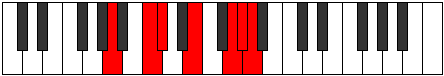
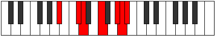

# Mode Ionalimic

## Links

- [Documentation](README.md)
- [Scales Index](Scales.md)
- [Modes Index](Modes.md)
- [Chords Index](Chords.md)

## Parent Scale

[Mydimic](ScaleMydimic.md)

## Number

[3225](https://ianring.com/musictheory/scales/3225)

## Transposition

3, 1, 3, 3, 1, 1

## Chord Pattern

II⁺, IV⁺, v⁰b3, VI⁺

## Perfection

- 3 Perfect notes
- 3 Perfect notes

## Perfection Profile

[true true true false false false]

## Permutations

| Tonic | Notes | Signature | Illustration | Audio |
|-------|-------|-----------|--------------|-------|
| [C](ModeCNaturalIonalimic.md) | C, D#, E, **F##**, **G###**, **A##**, C | C |  | [midi](https://github.com/edipermadi/music/blob/main/docs/ModeCNaturalIonalimic.mid?raw=true) |
| [C#](ModeCSharpIonalimic.md) | C#, D##, E#, **F###**, **Cb**, **Dbb**, C# | C |  | [midi](https://github.com/edipermadi/music/blob/main/docs/ModeCSharpIonalimic.mid?raw=true) |
| [Db](ModeDFlatIonalimic.md) | Db, E, F, **G#**, **A##**, **B#**, Db | C |  | [midi](https://github.com/edipermadi/music/blob/main/docs/ModeDFlatIonalimic.mid?raw=true) |
| [D](ModeDNaturalIonalimic.md) | D, E#, F#, **G##**, **A###**, **B##**, D | C |  | [midi](https://github.com/edipermadi/music/blob/main/docs/ModeDNaturalIonalimic.mid?raw=true) |
| [D#](ModeDSharpIonalimic.md) | D#, E##, F##, **G###**, **Db**, **Ebb**, D# | C |  | [midi](https://github.com/edipermadi/music/blob/main/docs/ModeDSharpIonalimic.mid?raw=true) |
| [Eb](ModeEFlatIonalimic.md) | Eb, F#, G, **A#**, **B##**, **C##**, Eb | C |  | [midi](https://github.com/edipermadi/music/blob/main/docs/ModeEFlatIonalimic.mid?raw=true) |
| [E](ModeENaturalIonalimic.md) | E, F##, G#, **A##**, **B###**, **C###**, E | C |  | [midi](https://github.com/edipermadi/music/blob/main/docs/ModeENaturalIonalimic.mid?raw=true) |
| [F](ModeFNaturalIonalimic.md) | F, G#, A, **B#**, **C###**, **D##**, F | C |  | [midi](https://github.com/edipermadi/music/blob/main/docs/ModeFNaturalIonalimic.mid?raw=true) |
| [F#](ModeFSharpIonalimic.md) | F#, G##, A#, **B##**, **D##**, **E#**, F# | C |  | [midi](https://github.com/edipermadi/music/blob/main/docs/ModeFSharpIonalimic.mid?raw=true) |
| [Gb](ModeGFlatIonalimic.md) | Gb, A, Bb, **C#**, **D##**, **E#**, Gb | C |  | [midi](https://github.com/edipermadi/music/blob/main/docs/ModeGFlatIonalimic.mid?raw=true) |
| [G](ModeGNaturalIonalimic.md) | G, A#, B, **C##**, **D###**, **E##**, G | C |  | [midi](https://github.com/edipermadi/music/blob/main/docs/ModeGNaturalIonalimic.mid?raw=true) |
| [G#](ModeGSharpIonalimic.md) | G#, A##, B#, **C###**, **E##**, **F##**, G# | C |  | [midi](https://github.com/edipermadi/music/blob/main/docs/ModeGSharpIonalimic.mid?raw=true) |
| [Ab](ModeAFlatIonalimic.md) | Ab, B, C, **D#**, **E##**, **F##**, Ab | C |  | [midi](https://github.com/edipermadi/music/blob/main/docs/ModeAFlatIonalimic.mid?raw=true) |
| [A](ModeANaturalIonalimic.md) | A, B#, C#, **D##**, **E###**, **F###**, A | C |  | [midi](https://github.com/edipermadi/music/blob/main/docs/ModeANaturalIonalimic.mid?raw=true) |
| [A#](ModeASharpIonalimic.md) | A#, B##, C##, **D###**, **F###**, **G##**, A# | C |  | [midi](https://github.com/edipermadi/music/blob/main/docs/ModeASharpIonalimic.mid?raw=true) |
| [Bb](ModeBFlatIonalimic.md) | Bb, C#, D, **E#**, **F###**, **G##**, Bb | C |  | [midi](https://github.com/edipermadi/music/blob/main/docs/ModeBFlatIonalimic.mid?raw=true) |
| [B](ModeBNaturalIonalimic.md) | B, C##, D#, **E##**, **Cbbb**, **Cbb**, B | C |  | [midi](https://github.com/edipermadi/music/blob/main/docs/ModeBNaturalIonalimic.mid?raw=true) |
