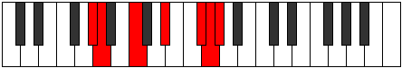

# Mode Ionaphimic

## Links

- [Documentation](README.md)
- [Scales Index](Scales.md)
- [Modes Index](Modes.md)
- [Chords Index](Chords.md)

## Parent Scale

[Epynimic](ScaleEpynimic.md)

## Number

[3219](https://ianring.com/musictheory/scales/3219)

## Transposition

1, 3, 3, 3, 1, 1

## Chord Pattern

IVb5, v⁰b3

## Perfection

- 2 Perfect notes
- 4 Perfect notes

## Perfection Profile

true, false, true, false, false, false

## Permutations

| Tonic | Notes | Signature | Illustration | Audio |
|-------|-------|-----------|--------------|-------|
| [C](ModeCNaturalIonaphimic.md) | C, **Db**, E, **F##**, **G###**, **A##**, C | C |  | [midi](https://github.com/edipermadi/music/blob/main/docs/ModeCNaturalIonaphimic.mid?raw=true) |
| [C#](ModeCSharpIonaphimic.md) | C#, **D**, E#, **F###**, **Cb**, **Dbb**, C# | C |  | [midi](https://github.com/edipermadi/music/blob/main/docs/ModeCSharpIonaphimic.mid?raw=true) |
| [Db](ModeDFlatIonaphimic.md) | Db, **Ebb**, F, **G#**, **A##**, **B#**, Db | C |  | [midi](https://github.com/edipermadi/music/blob/main/docs/ModeDFlatIonaphimic.mid?raw=true) |
| [D](ModeDNaturalIonaphimic.md) | D, **Eb**, F#, **G##**, **A###**, **B##**, D | C |  | [midi](https://github.com/edipermadi/music/blob/main/docs/ModeDNaturalIonaphimic.mid?raw=true) |
| [D#](ModeDSharpIonaphimic.md) | D#, **E**, F##, **G###**, **Db**, **Ebb**, D# | C |  | [midi](https://github.com/edipermadi/music/blob/main/docs/ModeDSharpIonaphimic.mid?raw=true) |
| [Eb](ModeEFlatIonaphimic.md) | Eb, **Fb**, G, **A#**, **B##**, **C##**, Eb | C |  | [midi](https://github.com/edipermadi/music/blob/main/docs/ModeEFlatIonaphimic.mid?raw=true) |
| [E](ModeENaturalIonaphimic.md) | E, **F**, G#, **A##**, **B###**, **C###**, E | C |  | [midi](https://github.com/edipermadi/music/blob/main/docs/ModeENaturalIonaphimic.mid?raw=true) |
| [F](ModeFNaturalIonaphimic.md) | F, **Gb**, A, **B#**, **C###**, **D##**, F | C |  | [midi](https://github.com/edipermadi/music/blob/main/docs/ModeFNaturalIonaphimic.mid?raw=true) |
| [F#](ModeFSharpIonaphimic.md) | F#, **G**, A#, **B##**, **D##**, **E#**, F# | C |  | [midi](https://github.com/edipermadi/music/blob/main/docs/ModeFSharpIonaphimic.mid?raw=true) |
| [Gb](ModeGFlatIonaphimic.md) | Gb, **Abb**, Bb, **C#**, **D##**, **E#**, Gb | C |  | [midi](https://github.com/edipermadi/music/blob/main/docs/ModeGFlatIonaphimic.mid?raw=true) |
| [G](ModeGNaturalIonaphimic.md) | G, **Ab**, B, **C##**, **D###**, **E##**, G | C |  | [midi](https://github.com/edipermadi/music/blob/main/docs/ModeGNaturalIonaphimic.mid?raw=true) |
| [G#](ModeGSharpIonaphimic.md) | G#, **A**, B#, **C###**, **E##**, **F##**, G# | C |  | [midi](https://github.com/edipermadi/music/blob/main/docs/ModeGSharpIonaphimic.mid?raw=true) |
| [Ab](ModeAFlatIonaphimic.md) | Ab, **Bbb**, C, **D#**, **E##**, **F##**, Ab | C |  | [midi](https://github.com/edipermadi/music/blob/main/docs/ModeAFlatIonaphimic.mid?raw=true) |
| [A](ModeANaturalIonaphimic.md) | A, **Bb**, C#, **D##**, **E###**, **F###**, A | C |  | [midi](https://github.com/edipermadi/music/blob/main/docs/ModeANaturalIonaphimic.mid?raw=true) |
| [A#](ModeASharpIonaphimic.md) | A#, **B**, C##, **D###**, **F###**, **G##**, A# | C |  | [midi](https://github.com/edipermadi/music/blob/main/docs/ModeASharpIonaphimic.mid?raw=true) |
| [Bb](ModeBFlatIonaphimic.md) | Bb, **Cb**, D, **E#**, **F###**, **G##**, Bb | C |  | [midi](https://github.com/edipermadi/music/blob/main/docs/ModeBFlatIonaphimic.mid?raw=true) |
| [B](ModeBNaturalIonaphimic.md) | B, **C**, D#, **E##**, **Cbbb**, **Cbb**, B | C |  | [midi](https://github.com/edipermadi/music/blob/main/docs/ModeBNaturalIonaphimic.mid?raw=true) |
