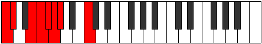

# Mode Ionaptian

## Links

- [Documentation](README.md)
- [Scales Index](Scales.md)
- [Modes Index](Modes.md)
- [Chords Index](Chords.md)

## Parent Scale

[Parian](ScaleParian.md)

## Number

[499](https://ianring.com/musictheory/scales/499)

## Interval Pattern

1, 3, 1, 1, 1, 1, 4

## Chord Pattern

## Perfection

- 4 Perfect notes
- 3 Perfect notes

## Perfection Profile

[true true false true true false false]

## Permutations

| Tonic | Notes | Signature | Illustration | Audio |
|-------|-------|-----------|--------------|-------|
| [C](ModeCNaturalIonaptian.md) | C, Db, **E**, F, Gb, **Abb**, **Bbbb**, C | C |  | [midi](https://github.com/edipermadi/music/blob/main/docs/ModeCNaturalIonaptian.mid?raw=true) |
| [C#](ModeCSharpIonaptian.md) | C#, D, **E#**, F#, G, **Ab**, **Bbb**, C# | C |  | [midi](https://github.com/edipermadi/music/blob/main/docs/ModeCSharpIonaptian.mid?raw=true) |
| [Db](ModeDFlatIonaptian.md) | Db, Ebb, **F**, Gb, Abb, **Bbbb**, **Cbbb**, Db | C |  | [midi](https://github.com/edipermadi/music/blob/main/docs/ModeDFlatIonaptian.mid?raw=true) |
| [D](ModeDNaturalIonaptian.md) | D, Eb, **F#**, G, Ab, **Bbb**, **Cbb**, D | C |  | [midi](https://github.com/edipermadi/music/blob/main/docs/ModeDNaturalIonaptian.mid?raw=true) |
| [D#](ModeDSharpIonaptian.md) | D#, E, **F##**, G#, A, **Bb**, **Cb**, D# | C |  | [midi](https://github.com/edipermadi/music/blob/main/docs/ModeDSharpIonaptian.mid?raw=true) |
| [Eb](ModeEFlatIonaptian.md) | Eb, Fb, **G**, Ab, Bbb, **Cbb**, **Dbbb**, Eb | C |  | [midi](https://github.com/edipermadi/music/blob/main/docs/ModeEFlatIonaptian.mid?raw=true) |
| [E](ModeENaturalIonaptian.md) | E, F, **G#**, A, Bb, **Cb**, **Dbb**, E | C |  | [midi](https://github.com/edipermadi/music/blob/main/docs/ModeENaturalIonaptian.mid?raw=true) |
| [F](ModeFNaturalIonaptian.md) | F, Gb, **A**, Bb, Cb, **Dbb**, **Ebbb**, F | C |  | [midi](https://github.com/edipermadi/music/blob/main/docs/ModeFNaturalIonaptian.mid?raw=true) |
| [F#](ModeFSharpIonaptian.md) | F#, G, **A#**, B, C, **Db**, **Ebb**, F# | C |  | [midi](https://github.com/edipermadi/music/blob/main/docs/ModeFSharpIonaptian.mid?raw=true) |
| [Gb](ModeGFlatIonaptian.md) | Gb, Abb, **Bb**, Cb, Dbb, **Ebbb**, **Fbbb**, Gb | C |  | [midi](https://github.com/edipermadi/music/blob/main/docs/ModeGFlatIonaptian.mid?raw=true) |
| [G](ModeGNaturalIonaptian.md) | G, Ab, **B**, C, Db, **Ebb**, **Fbb**, G | C |  | [midi](https://github.com/edipermadi/music/blob/main/docs/ModeGNaturalIonaptian.mid?raw=true) |
| [G#](ModeGSharpIonaptian.md) | G#, A, **B#**, C#, D, **Eb**, **Fb**, G# | C |  | [midi](https://github.com/edipermadi/music/blob/main/docs/ModeGSharpIonaptian.mid?raw=true) |
| [Ab](ModeAFlatIonaptian.md) | Ab, Bbb, **C**, Db, Ebb, **Fbb**, **Gbbb**, Ab | C |  | [midi](https://github.com/edipermadi/music/blob/main/docs/ModeAFlatIonaptian.mid?raw=true) |
| [A](ModeANaturalIonaptian.md) | A, Bb, **C#**, D, Eb, **Fb**, **Gbb**, A | C |  | [midi](https://github.com/edipermadi/music/blob/main/docs/ModeANaturalIonaptian.mid?raw=true) |
| [A#](ModeASharpIonaptian.md) | A#, B, **C##**, D#, E, **F**, **Gb**, A# | C |  | [midi](https://github.com/edipermadi/music/blob/main/docs/ModeASharpIonaptian.mid?raw=true) |
| [Bb](ModeBFlatIonaptian.md) | Bb, Cb, **D**, Eb, Fb, **Gbb**, **Abbb**, Bb | C |  | [midi](https://github.com/edipermadi/music/blob/main/docs/ModeBFlatIonaptian.mid?raw=true) |
| [B](ModeBNaturalIonaptian.md) | B, C, **D#**, E, F, **Gb**, **Abb**, B | C |  | [midi](https://github.com/edipermadi/music/blob/main/docs/ModeBNaturalIonaptian.mid?raw=true) |
