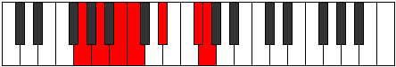

# Mode Ionaptimic

## Links

- [Documentation](index.md)
- [Scales Index](Scales.md)
- [Modes Index](Modes.md)
- [Chords Index](Chords.md)

## Parent Scale

[Dagimic](ScaleDagimic.md)

## Number

[2357](https://ianring.com/musictheory/scales/2357)

## Perfection

- 2 Perfect notes
- 4 Perfect notes

## Perfection Profile

[false false true true false false]

## Permutations

| Tonic | Notes | Signature | Illustration | Audio |
|-------|-------|-----------|--------------|-------|
| [C](ModeCNaturalIonaptimic.md) | **C**, **D**, E, F, **G#**, **A##**, **C** | C |  | [midi](ModeCNaturalIonaptimic.mid) [ogg](ModeCNaturalIonaptimic.ogg) |
| [C#](ModeCSharpIonaptimic.md) | **C#**, **D#**, E#, F#, **G##**, **A###**, **C#** | C |  | [midi](ModeCSharpIonaptimic.mid) [ogg](ModeCSharpIonaptimic.ogg) |
| [Db](ModeDFlatIonaptimic.md) | **Db**, **Eb**, F, Gb, **A**, **B#**, **Db** | C |  | [midi](ModeDFlatIonaptimic.mid) [ogg](ModeDFlatIonaptimic.ogg) |
| [D](ModeDNaturalIonaptimic.md) | **D**, **E**, F#, G, **A#**, **B##**, **D** | C |  | [midi](ModeDNaturalIonaptimic.mid) [ogg](ModeDNaturalIonaptimic.ogg) |
| [D#](ModeDSharpIonaptimic.md) | **D#**, **E#**, F##, G#, **A##**, **B###**, **D#** | C |  | [midi](ModeDSharpIonaptimic.mid) [ogg](ModeDSharpIonaptimic.ogg) |
| [Eb](ModeEFlatIonaptimic.md) | **Eb**, **F**, G, Ab, **B**, **C##**, **Eb** | C |  | [midi](ModeEFlatIonaptimic.mid) [ogg](ModeEFlatIonaptimic.ogg) |
| [E](ModeENaturalIonaptimic.md) | **E**, **F#**, G#, A, **B#**, **C###**, **E** | C |  | [midi](ModeENaturalIonaptimic.mid) [ogg](ModeENaturalIonaptimic.ogg) |
| [F](ModeFNaturalIonaptimic.md) | **F**, **G**, A, Bb, **C#**, **D##**, **F** | C |  | [midi](ModeFNaturalIonaptimic.mid) [ogg](ModeFNaturalIonaptimic.ogg) |
| [F#](ModeFSharpIonaptimic.md) | **F#**, **G#**, A#, B, **C##**, **D###**, **F#** | C |  | [midi](ModeFSharpIonaptimic.mid) [ogg](ModeFSharpIonaptimic.ogg) |
| [Gb](ModeGFlatIonaptimic.md) | **Gb**, **Ab**, Bb, Cb, **D**, **E#**, **Gb** | C |  | [midi](ModeGFlatIonaptimic.mid) [ogg](ModeGFlatIonaptimic.ogg) |
| [G](ModeGNaturalIonaptimic.md) | **G**, **A**, B, C, **D#**, **E##**, **G** | C |  | [midi](ModeGNaturalIonaptimic.mid) [ogg](ModeGNaturalIonaptimic.ogg) |
| [G#](ModeGSharpIonaptimic.md) | **G#**, **A#**, B#, C#, **D##**, **E###**, **G#** | C |  | [midi](ModeGSharpIonaptimic.mid) [ogg](ModeGSharpIonaptimic.ogg) |
| [Ab](ModeAFlatIonaptimic.md) | **Ab**, **Bb**, C, Db, **E**, **F##**, **Ab** | C |  | [midi](ModeAFlatIonaptimic.mid) [ogg](ModeAFlatIonaptimic.ogg) |
| [A](ModeANaturalIonaptimic.md) | **A**, **B**, C#, D, **E#**, **F###**, **A** | C |  | [midi](ModeANaturalIonaptimic.mid) [ogg](ModeANaturalIonaptimic.ogg) |
| [A#](ModeASharpIonaptimic.md) | **A#**, **B#**, C##, D#, **E##**, **Cbbb**, **A#** | C |  | [midi](ModeASharpIonaptimic.mid) [ogg](ModeASharpIonaptimic.ogg) |
| [Bb](ModeBFlatIonaptimic.md) | **Bb**, **C**, D, Eb, **F#**, **G##**, **Bb** | C |  | [midi](ModeBFlatIonaptimic.mid) [ogg](ModeBFlatIonaptimic.ogg) |
| [B](ModeBNaturalIonaptimic.md) | **B**, **C#**, D#, E, **F##**, **G###**, **B** | C |  | [midi](ModeBNaturalIonaptimic.mid) [ogg](ModeBNaturalIonaptimic.ogg) |
