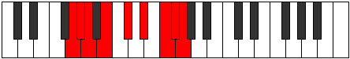

# Mode Ionaptyllic

## Links

- [Documentation](index.md)
- [Scales Index](Scales.md)
- [Modes Index](Modes.md)
- [Chords Index](Chords.md)

## Parent Scale

[Thyryllic](ScaleThyryllic.md)

## Number

[3415](https://ianring.com/musictheory/scales/3415)

## Perfection

- 4 Perfect notes
- 4 Perfect notes

## Perfection Profile

[false true false true true false false true]

## Permutations

| Tonic | Notes | Signature | Illustration | Audio |
|-------|-------|-----------|--------------|-------|
| [C](ModeCNaturalIonaptyllic.md) | **C**, C#, **D**, E, F#, **G#**, **A#**, B, **C** | C |  | [midi](ModeCNaturalIonaptyllic.mid) [ogg](ModeCNaturalIonaptyllic.ogg) |
| [C#](ModeCSharpIonaptyllic.md) | **C#**, D, **D#**, F, G, **A**, **B**, C, **C#** | C |  | [midi](ModeCSharpIonaptyllic.mid) [ogg](ModeCSharpIonaptyllic.ogg) |
| [Db](ModeDFlatIonaptyllic.md) | **Db**, D, **Eb**, F, G, **A**, **B**, C, **Db** | C |  | [midi](ModeDFlatIonaptyllic.mid) [ogg](ModeDFlatIonaptyllic.ogg) |
| [D](ModeDNaturalIonaptyllic.md) | **D**, D#, **E**, F#, G#, **A#**, **C**, C#, **D** | C |  | [midi](ModeDNaturalIonaptyllic.mid) [ogg](ModeDNaturalIonaptyllic.ogg) |
| [D#](ModeDSharpIonaptyllic.md) | **D#**, E, **F**, G, A, **B**, **C#**, D, **D#** | C |  | [midi](ModeDSharpIonaptyllic.mid) [ogg](ModeDSharpIonaptyllic.ogg) |
| [Eb](ModeEFlatIonaptyllic.md) | **Eb**, E, **F**, G, A, **B**, **Db**, D, **Eb** | C |  | [midi](ModeEFlatIonaptyllic.mid) [ogg](ModeEFlatIonaptyllic.ogg) |
| [E](ModeENaturalIonaptyllic.md) | **E**, F, **F#**, G#, A#, **C**, **D**, D#, **E** | C |  | [midi](ModeENaturalIonaptyllic.mid) [ogg](ModeENaturalIonaptyllic.ogg) |
| [F](ModeFNaturalIonaptyllic.md) | **F**, F#, **G**, A, B, **C#**, **D#**, E, **F** | C |  | [midi](ModeFNaturalIonaptyllic.mid) [ogg](ModeFNaturalIonaptyllic.ogg) |
| [F#](ModeFSharpIonaptyllic.md) | **F#**, G, **G#**, A#, C, **D**, **E**, F, **F#** | C |  | [midi](ModeFSharpIonaptyllic.mid) [ogg](ModeFSharpIonaptyllic.ogg) |
| [Gb](ModeGFlatIonaptyllic.md) | **Gb**, G, **Ab**, Bb, C, **D**, **E**, F, **Gb** | C |  | [midi](ModeGFlatIonaptyllic.mid) [ogg](ModeGFlatIonaptyllic.ogg) |
| [G](ModeGNaturalIonaptyllic.md) | **G**, G#, **A**, B, C#, **D#**, **F**, F#, **G** | C |  | [midi](ModeGNaturalIonaptyllic.mid) [ogg](ModeGNaturalIonaptyllic.ogg) |
| [G#](ModeGSharpIonaptyllic.md) | **G#**, A, **A#**, C, D, **E**, **F#**, G, **G#** | C |  | [midi](ModeGSharpIonaptyllic.mid) [ogg](ModeGSharpIonaptyllic.ogg) |
| [Ab](ModeAFlatIonaptyllic.md) | **Ab**, A, **Bb**, C, D, **E**, **Gb**, G, **Ab** | C |  | [midi](ModeAFlatIonaptyllic.mid) [ogg](ModeAFlatIonaptyllic.ogg) |
| [A](ModeANaturalIonaptyllic.md) | **A**, A#, **B**, C#, D#, **F**, **G**, G#, **A** | C |  | [midi](ModeANaturalIonaptyllic.mid) [ogg](ModeANaturalIonaptyllic.ogg) |
| [A#](ModeASharpIonaptyllic.md) | **A#**, B, **C**, D, E, **F#**, **G#**, A, **A#** | C |  | [midi](ModeASharpIonaptyllic.mid) [ogg](ModeASharpIonaptyllic.ogg) |
| [Bb](ModeBFlatIonaptyllic.md) | **Bb**, B, **C**, D, E, **Gb**, **Ab**, A, **Bb** | C |  | [midi](ModeBFlatIonaptyllic.mid) [ogg](ModeBFlatIonaptyllic.ogg) |
| [B](ModeBNaturalIonaptyllic.md) | **B**, C, **C#**, D#, F, **G**, **A**, A#, **B** | C |  | [midi](ModeBNaturalIonaptyllic.mid) [ogg](ModeBNaturalIonaptyllic.ogg) |
