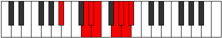

# Mode Ionarian

## Links

- [Documentation](index.md)
- [Scales Index](Scales.md)
- [Modes Index](Modes.md)
- [Chords Index](Chords.md)

## Parent Scale

[Ionarian](ScaleIonarian.md)

## Number

[3697](https://ianring.com/musictheory/scales/3697)

## Perfection

- 5 Perfect notes
- 2 Perfect notes

## Interval Pattern

4, 1, 1, 3, 1, 1, 1

## Perfection Profile

[false true true false true true true]

## Permutations

| Tonic | Notes | Signature | Illustration | Audio |
|-------|-------|-----------|--------------|-------|
| [C](ModeCNaturalIonarian.md) | **C**, D##, E#, **F#**, G##, A#, B, **C** | C |  | [midi](https://github.com/edipermadi/music/blob/main/docs/ModeCNaturalIonarian.mid?raw=true) |
| [C#](ModeCSharpIonarian.md) | **C#**, D###, E##, **F##**, G###, A##, B#, **C#** | C |  | [midi](https://github.com/edipermadi/music/blob/main/docs/ModeCSharpIonarian.mid?raw=true) |
| [Db](ModeDFlatIonarian.md) | **Db**, E#, F#, **G**, A#, B, C, **Db** | C |  | [midi](https://github.com/edipermadi/music/blob/main/docs/ModeDFlatIonarian.mid?raw=true) |
| [D](ModeDNaturalIonarian.md) | **D**, E##, F##, **G#**, A##, B#, C#, **D** | C |  | [midi](https://github.com/edipermadi/music/blob/main/docs/ModeDNaturalIonarian.mid?raw=true) |
| [D#](ModeDSharpIonarian.md) | **D#**, E###, F###, **G##**, A###, B##, C##, **D#** | C |  | [midi](https://github.com/edipermadi/music/blob/main/docs/ModeDSharpIonarian.mid?raw=true) |
| [Eb](ModeEFlatIonarian.md) | **Eb**, F##, G#, **A**, B#, C#, D, **Eb** | C |  | [midi](https://github.com/edipermadi/music/blob/main/docs/ModeEFlatIonarian.mid?raw=true) |
| [E](ModeENaturalIonarian.md) | **E**, F###, G##, **A#**, B##, C##, D#, **E** | C |  | [midi](https://github.com/edipermadi/music/blob/main/docs/ModeENaturalIonarian.mid?raw=true) |
| [F](ModeFNaturalIonarian.md) | **F**, G##, A#, **B**, C##, D#, E, **F** | C |  | [midi](https://github.com/edipermadi/music/blob/main/docs/ModeFNaturalIonarian.mid?raw=true) |
| [F#](ModeFSharpIonarian.md) | **F#**, G###, A##, **B#**, C###, D##, E#, **F#** | C |  | [midi](https://github.com/edipermadi/music/blob/main/docs/ModeFSharpIonarian.mid?raw=true) |
| [Gb](ModeGFlatIonarian.md) | **Gb**, A#, B, **C**, D#, E, F, **Gb** | C |  | [midi](https://github.com/edipermadi/music/blob/main/docs/ModeGFlatIonarian.mid?raw=true) |
| [G](ModeGNaturalIonarian.md) | **G**, A##, B#, **C#**, D##, E#, F#, **G** | C |  | [midi](https://github.com/edipermadi/music/blob/main/docs/ModeGNaturalIonarian.mid?raw=true) |
| [G#](ModeGSharpIonarian.md) | **G#**, A###, B##, **C##**, D###, E##, F##, **G#** | C |  | [midi](https://github.com/edipermadi/music/blob/main/docs/ModeGSharpIonarian.mid?raw=true) |
| [Ab](ModeAFlatIonarian.md) | **Ab**, B#, C#, **D**, E#, F#, G, **Ab** | C |  | [midi](https://github.com/edipermadi/music/blob/main/docs/ModeAFlatIonarian.mid?raw=true) |
| [A](ModeANaturalIonarian.md) | **A**, B##, C##, **D#**, E##, F##, G#, **A** | C |  | [midi](https://github.com/edipermadi/music/blob/main/docs/ModeANaturalIonarian.mid?raw=true) |
| [A#](ModeASharpIonarian.md) | **A#**, B###, C###, **D##**, E###, F###, G##, **A#** | C |  | [midi](https://github.com/edipermadi/music/blob/main/docs/ModeASharpIonarian.mid?raw=true) |
| [Bb](ModeBFlatIonarian.md) | **Bb**, C##, D#, **E**, F##, G#, A, **Bb** | C |  | [midi](https://github.com/edipermadi/music/blob/main/docs/ModeBFlatIonarian.mid?raw=true) |
| [B](ModeBNaturalIonarian.md) | **B**, C###, D##, **E#**, F###, G##, A#, **B** | C |  | [midi](https://github.com/edipermadi/music/blob/main/docs/ModeBNaturalIonarian.mid?raw=true) |
