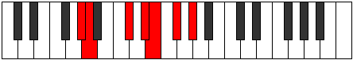
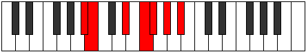

# Mode Ionarimic

## Links

- [Documentation](index.md)
- [Scales Index](Scales.md)
- [Modes Index](Modes.md)
- [Chords Index](Chords.md)

## Parent Scale

[Dyrimic](ScaleDyrimic.md)

## Number

[1443](https://ianring.com/musictheory/scales/1443)

## Perfection

- 4 Perfect notes
- 2 Perfect notes

## Perfection Profile

[true true true false false true]

## Permutations

| Tonic | Notes | Signature | Illustration | Audio |
|-------|-------|-----------|--------------|-------|
| [C](ModeCNaturalIonarimic.md) | C, Db, E#, **F##**, **G#**, A#, C | C |  | [midi](ModeCNaturalIonarimic.mid) [ogg](ModeCNaturalIonarimic.ogg) |
| [C#](ModeCSharpIonarimic.md) | C#, D, E##, **F###**, **G##**, A##, C# | C |  | [midi](ModeCSharpIonarimic.mid) [ogg](ModeCSharpIonarimic.ogg) |
| [Db](ModeDFlatIonarimic.md) | Db, Ebb, F#, **G#**, **A**, B, Db | C |  | [midi](ModeDFlatIonarimic.mid) [ogg](ModeDFlatIonarimic.ogg) |
| [D](ModeDNaturalIonarimic.md) | D, Eb, F##, **G##**, **A#**, B#, D | C |  | [midi](ModeDNaturalIonarimic.mid) [ogg](ModeDNaturalIonarimic.ogg) |
| [D#](ModeDSharpIonarimic.md) | D#, E, F###, **G###**, **A##**, B##, D# | C |  | [midi](ModeDSharpIonarimic.mid) [ogg](ModeDSharpIonarimic.ogg) |
| [Eb](ModeEFlatIonarimic.md) | Eb, Fb, G#, **A#**, **B**, C#, Eb | C |  | [midi](ModeEFlatIonarimic.mid) [ogg](ModeEFlatIonarimic.ogg) |
| [E](ModeENaturalIonarimic.md) | E, F, G##, **A##**, **B#**, C##, E | C |  | [midi](ModeENaturalIonarimic.mid) [ogg](ModeENaturalIonarimic.ogg) |
| [F](ModeFNaturalIonarimic.md) | F, Gb, A#, **B#**, **C#**, D#, F | C |  | [midi](ModeFNaturalIonarimic.mid) [ogg](ModeFNaturalIonarimic.ogg) |
| [F#](ModeFSharpIonarimic.md) | F#, G, A##, **B##**, **C##**, D##, F# | C |  | [midi](ModeFSharpIonarimic.mid) [ogg](ModeFSharpIonarimic.ogg) |
| [Gb](ModeGFlatIonarimic.md) | Gb, Abb, B, **C#**, **D**, E, Gb | C |  | [midi](ModeGFlatIonarimic.mid) [ogg](ModeGFlatIonarimic.ogg) |
| [G](ModeGNaturalIonarimic.md) | G, Ab, B#, **C##**, **D#**, E#, G | C |  | [midi](ModeGNaturalIonarimic.mid) [ogg](ModeGNaturalIonarimic.ogg) |
| [G#](ModeGSharpIonarimic.md) | G#, A, B##, **C###**, **D##**, E##, G# | C |  | [midi](ModeGSharpIonarimic.mid) [ogg](ModeGSharpIonarimic.ogg) |
| [Ab](ModeAFlatIonarimic.md) | Ab, Bbb, C#, **D#**, **E**, F#, Ab | C |  | [midi](ModeAFlatIonarimic.mid) [ogg](ModeAFlatIonarimic.ogg) |
| [A](ModeANaturalIonarimic.md) | A, Bb, C##, **D##**, **E#**, F##, A | C |  | [midi](ModeANaturalIonarimic.mid) [ogg](ModeANaturalIonarimic.ogg) |
| [A#](ModeASharpIonarimic.md) | A#, B, C###, **D###**, **E##**, F###, A# | C |  | [midi](ModeASharpIonarimic.mid) [ogg](ModeASharpIonarimic.ogg) |
| [Bb](ModeBFlatIonarimic.md) | Bb, Cb, D#, **E#**, **F#**, G#, Bb | C |  | [midi](ModeBFlatIonarimic.mid) [ogg](ModeBFlatIonarimic.ogg) |
| [B](ModeBNaturalIonarimic.md) | B, C, D##, **E##**, **F##**, G##, B | C |  | [midi](ModeBNaturalIonarimic.mid) [ogg](ModeBNaturalIonarimic.ogg) |
