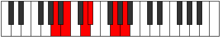

# Mode Ionaritonic

## Links

- [Documentation](README.md)
- [Scales Index](Scales.md)
- [Modes Index](Modes.md)
- [Chords Index](Chords.md)

## Parent Scale

[Aeolanitonic](ScaleAeolanitonic.md)

## Number

[1125](https://ianring.com/musictheory/scales/1125)

## Luminosity

3

## Transposition

2, 3, 1, 4, 2

## Chord Pattern

V⁺

## Perfection

- 2 Perfect notes
- 3 Perfect notes

## Perfection Profile

false, false, true, false, true

## Permutations

| Tonic | Notes | Signature | Illustration | Audio |
|-------|-------|-----------|--------------|-------|
| [C](ModeCNaturalIonaritonic.md) | **C**, **D**, F, **F#**, A#, **C** | C |  | [midi](https://github.com/edipermadi/music/blob/main/docs/ModeCNaturalIonaritonic.mid?raw=true) |
| [C#](ModeCSharpIonaritonic.md) | **C#**, **D#**, F#, **G**, B, **C#** | C |  | [midi](https://github.com/edipermadi/music/blob/main/docs/ModeCSharpIonaritonic.mid?raw=true) |
| [Db](ModeDFlatIonaritonic.md) | **Db**, **Eb**, Gb, **G**, B, **Db** | C |  | [midi](https://github.com/edipermadi/music/blob/main/docs/ModeDFlatIonaritonic.mid?raw=true) |
| [D](ModeDNaturalIonaritonic.md) | **D**, **E**, G, **G#**, C, **D** | C |  | [midi](https://github.com/edipermadi/music/blob/main/docs/ModeDNaturalIonaritonic.mid?raw=true) |
| [D#](ModeDSharpIonaritonic.md) | **D#**, **F**, G#, **A**, C#, **D#** | C |  | [midi](https://github.com/edipermadi/music/blob/main/docs/ModeDSharpIonaritonic.mid?raw=true) |
| [Eb](ModeEFlatIonaritonic.md) | **Eb**, **F**, Ab, **A**, Db, **Eb** | C |  | [midi](https://github.com/edipermadi/music/blob/main/docs/ModeEFlatIonaritonic.mid?raw=true) |
| [E](ModeENaturalIonaritonic.md) | **E**, **F#**, A, **A#**, D, **E** | C |  | [midi](https://github.com/edipermadi/music/blob/main/docs/ModeENaturalIonaritonic.mid?raw=true) |
| [F](ModeFNaturalIonaritonic.md) | **F**, **G**, A#, **B**, D#, **F** | C |  | [midi](https://github.com/edipermadi/music/blob/main/docs/ModeFNaturalIonaritonic.mid?raw=true) |
| [F#](ModeFSharpIonaritonic.md) | **F#**, **G#**, B, **C**, E, **F#** | C |  | [midi](https://github.com/edipermadi/music/blob/main/docs/ModeFSharpIonaritonic.mid?raw=true) |
| [Gb](ModeGFlatIonaritonic.md) | **Gb**, **Ab**, B, **C**, E, **Gb** | C |  | [midi](https://github.com/edipermadi/music/blob/main/docs/ModeGFlatIonaritonic.mid?raw=true) |
| [G](ModeGNaturalIonaritonic.md) | **G**, **A**, C, **C#**, F, **G** | C |  | [midi](https://github.com/edipermadi/music/blob/main/docs/ModeGNaturalIonaritonic.mid?raw=true) |
| [G#](ModeGSharpIonaritonic.md) | **G#**, **A#**, C#, **D**, F#, **G#** | C |  | [midi](https://github.com/edipermadi/music/blob/main/docs/ModeGSharpIonaritonic.mid?raw=true) |
| [Ab](ModeAFlatIonaritonic.md) | **Ab**, **Bb**, Db, **D**, Gb, **Ab** | C |  | [midi](https://github.com/edipermadi/music/blob/main/docs/ModeAFlatIonaritonic.mid?raw=true) |
| [A](ModeANaturalIonaritonic.md) | **A**, **B**, D, **D#**, G, **A** | C |  | [midi](https://github.com/edipermadi/music/blob/main/docs/ModeANaturalIonaritonic.mid?raw=true) |
| [A#](ModeASharpIonaritonic.md) | **A#**, **C**, D#, **E**, G#, **A#** | C |  | [midi](https://github.com/edipermadi/music/blob/main/docs/ModeASharpIonaritonic.mid?raw=true) |
| [Bb](ModeBFlatIonaritonic.md) | **Bb**, **C**, Eb, **E**, Ab, **Bb** | C |  | [midi](https://github.com/edipermadi/music/blob/main/docs/ModeBFlatIonaritonic.mid?raw=true) |
| [B](ModeBNaturalIonaritonic.md) | **B**, **C#**, E, **F**, A, **B** | C |  | [midi](https://github.com/edipermadi/music/blob/main/docs/ModeBNaturalIonaritonic.mid?raw=true) |
