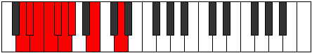

# Mode Ionaryllic

## Links

- [Documentation](index.md)
- [Scales Index](Scales.md)
- [Modes Index](Modes.md)
- [Chords Index](Chords.md)

## Parent Scale

[Zaryllic](ScaleZaryllic.md)

## Number

[639](https://ianring.com/musictheory/scales/639)

## Perfection

- 4 Perfect notes
- 4 Perfect notes

## Interval Pattern

1, 1, 1, 1, 1, 1, 3, 3

## Perfection Profile

[false false true false false true true true]

## Permutations

| Tonic | Notes | Signature | Illustration | Audio |
|-------|-------|-----------|--------------|-------|
| [C](ModeCNaturalIonaryllic.md) | **C**, **C#**, D, **D#**, **E**, F, F#, A, **C** | C |  | [midi](https://github.com/edipermadi/music/blob/main/docs/ModeCNaturalIonaryllic.mid?raw=true) |
| [C#](ModeCSharpIonaryllic.md) | **C#**, **D**, D#, **E**, **F**, F#, G, A#, **C#** | C |  | [midi](https://github.com/edipermadi/music/blob/main/docs/ModeCSharpIonaryllic.mid?raw=true) |
| [Db](ModeDFlatIonaryllic.md) | **Db**, **D**, Eb, **E**, **F**, Gb, G, Bb, **Db** | C |  | [midi](https://github.com/edipermadi/music/blob/main/docs/ModeDFlatIonaryllic.mid?raw=true) |
| [D](ModeDNaturalIonaryllic.md) | **D**, **D#**, E, **F**, **F#**, G, G#, B, **D** | C |  | [midi](https://github.com/edipermadi/music/blob/main/docs/ModeDNaturalIonaryllic.mid?raw=true) |
| [D#](ModeDSharpIonaryllic.md) | **D#**, **E**, F, **F#**, **G**, G#, A, C, **D#** | C |  | [midi](https://github.com/edipermadi/music/blob/main/docs/ModeDSharpIonaryllic.mid?raw=true) |
| [Eb](ModeEFlatIonaryllic.md) | **Eb**, **E**, F, **Gb**, **G**, Ab, A, C, **Eb** | C |  | [midi](https://github.com/edipermadi/music/blob/main/docs/ModeEFlatIonaryllic.mid?raw=true) |
| [E](ModeENaturalIonaryllic.md) | **E**, **F**, F#, **G**, **G#**, A, A#, C#, **E** | C |  | [midi](https://github.com/edipermadi/music/blob/main/docs/ModeENaturalIonaryllic.mid?raw=true) |
| [F](ModeFNaturalIonaryllic.md) | **F**, **F#**, G, **G#**, **A**, A#, B, D, **F** | C |  | [midi](https://github.com/edipermadi/music/blob/main/docs/ModeFNaturalIonaryllic.mid?raw=true) |
| [F#](ModeFSharpIonaryllic.md) | **F#**, **G**, G#, **A**, **A#**, B, C, D#, **F#** | C |  | [midi](https://github.com/edipermadi/music/blob/main/docs/ModeFSharpIonaryllic.mid?raw=true) |
| [Gb](ModeGFlatIonaryllic.md) | **Gb**, **G**, Ab, **A**, **Bb**, B, C, Eb, **Gb** | C |  | [midi](https://github.com/edipermadi/music/blob/main/docs/ModeGFlatIonaryllic.mid?raw=true) |
| [G](ModeGNaturalIonaryllic.md) | **G**, **G#**, A, **A#**, **B**, C, C#, E, **G** | C |  | [midi](https://github.com/edipermadi/music/blob/main/docs/ModeGNaturalIonaryllic.mid?raw=true) |
| [G#](ModeGSharpIonaryllic.md) | **G#**, **A**, A#, **B**, **C**, C#, D, F, **G#** | C |  | [midi](https://github.com/edipermadi/music/blob/main/docs/ModeGSharpIonaryllic.mid?raw=true) |
| [Ab](ModeAFlatIonaryllic.md) | **Ab**, **A**, Bb, **B**, **C**, Db, D, F, **Ab** | C |  | [midi](https://github.com/edipermadi/music/blob/main/docs/ModeAFlatIonaryllic.mid?raw=true) |
| [A](ModeANaturalIonaryllic.md) | **A**, **A#**, B, **C**, **C#**, D, D#, F#, **A** | C |  | [midi](https://github.com/edipermadi/music/blob/main/docs/ModeANaturalIonaryllic.mid?raw=true) |
| [A#](ModeASharpIonaryllic.md) | **A#**, **B**, C, **C#**, **D**, D#, E, G, **A#** | C |  | [midi](https://github.com/edipermadi/music/blob/main/docs/ModeASharpIonaryllic.mid?raw=true) |
| [Bb](ModeBFlatIonaryllic.md) | **Bb**, **B**, C, **Db**, **D**, Eb, E, G, **Bb** | C |  | [midi](https://github.com/edipermadi/music/blob/main/docs/ModeBFlatIonaryllic.mid?raw=true) |
| [B](ModeBNaturalIonaryllic.md) | **B**, **C**, C#, **D**, **D#**, E, F, G#, **B** | C |  | [midi](https://github.com/edipermadi/music/blob/main/docs/ModeBNaturalIonaryllic.mid?raw=true) |
