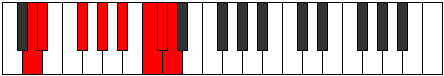

# Mode Ionathian

## Links

- [Documentation](index.md)
- [Scales Index](Scales.md)
- [Modes Index](Modes.md)
- [Chords Index](Chords.md)

## Parent Scale

[Phraptian](ScalePhraptian.md)

## Number

[3411](https://ianring.com/musictheory/scales/3411)

## Perfection

- 4 Perfect notes
- 3 Perfect notes

## Perfection Profile

[false true true true false false true]

## Permutations

| Tonic | Notes | Signature | Illustration | Audio |
|-------|-------|-----------|--------------|-------|
| [C](ModeCNaturalIonathian.md) | **C**, Db, E, F#, **G#**, **A#**, B, **C** | C |  | [midi](ModeCNaturalIonathian.mid) [ogg](ModeCNaturalIonathian.ogg) |
| [C#](ModeCSharpIonathian.md) | **C#**, D, E#, F##, **G##**, **A##**, B#, **C#** | C |  | [midi](ModeCSharpIonathian.mid) [ogg](ModeCSharpIonathian.ogg) |
| [Db](ModeDFlatIonathian.md) | **Db**, Ebb, F, G, **A**, **B**, C, **Db** | C |  | [midi](ModeDFlatIonathian.mid) [ogg](ModeDFlatIonathian.ogg) |
| [D](ModeDNaturalIonathian.md) | **D**, Eb, F#, G#, **A#**, **B#**, C#, **D** | C |  | [midi](ModeDNaturalIonathian.mid) [ogg](ModeDNaturalIonathian.ogg) |
| [D#](ModeDSharpIonathian.md) | **D#**, E, F##, G##, **A##**, **B##**, C##, **D#** | C |  | [midi](ModeDSharpIonathian.mid) [ogg](ModeDSharpIonathian.ogg) |
| [Eb](ModeEFlatIonathian.md) | **Eb**, Fb, G, A, **B**, **C#**, D, **Eb** | C |  | [midi](ModeEFlatIonathian.mid) [ogg](ModeEFlatIonathian.ogg) |
| [E](ModeENaturalIonathian.md) | **E**, F, G#, A#, **B#**, **C##**, D#, **E** | C |  | [midi](ModeENaturalIonathian.mid) [ogg](ModeENaturalIonathian.ogg) |
| [F](ModeFNaturalIonathian.md) | **F**, Gb, A, B, **C#**, **D#**, E, **F** | C |  | [midi](ModeFNaturalIonathian.mid) [ogg](ModeFNaturalIonathian.ogg) |
| [F#](ModeFSharpIonathian.md) | **F#**, G, A#, B#, **C##**, **D##**, E#, **F#** | C |  | [midi](ModeFSharpIonathian.mid) [ogg](ModeFSharpIonathian.ogg) |
| [Gb](ModeGFlatIonathian.md) | **Gb**, Abb, Bb, C, **D**, **E**, F, **Gb** | C |  | [midi](ModeGFlatIonathian.mid) [ogg](ModeGFlatIonathian.ogg) |
| [G](ModeGNaturalIonathian.md) | **G**, Ab, B, C#, **D#**, **E#**, F#, **G** | C |  | [midi](ModeGNaturalIonathian.mid) [ogg](ModeGNaturalIonathian.ogg) |
| [G#](ModeGSharpIonathian.md) | **G#**, A, B#, C##, **D##**, **E##**, F##, **G#** | C |  | [midi](ModeGSharpIonathian.mid) [ogg](ModeGSharpIonathian.ogg) |
| [Ab](ModeAFlatIonathian.md) | **Ab**, Bbb, C, D, **E**, **F#**, G, **Ab** | C |  | [midi](ModeAFlatIonathian.mid) [ogg](ModeAFlatIonathian.ogg) |
| [A](ModeANaturalIonathian.md) | **A**, Bb, C#, D#, **E#**, **F##**, G#, **A** | C |  | [midi](ModeANaturalIonathian.mid) [ogg](ModeANaturalIonathian.ogg) |
| [A#](ModeASharpIonathian.md) | **A#**, B, C##, D##, **E##**, **F###**, G##, **A#** | C |  | [midi](ModeASharpIonathian.mid) [ogg](ModeASharpIonathian.ogg) |
| [Bb](ModeBFlatIonathian.md) | **Bb**, Cb, D, E, **F#**, **G#**, A, **Bb** | C |  | [midi](ModeBFlatIonathian.mid) [ogg](ModeBFlatIonathian.ogg) |
| [B](ModeBNaturalIonathian.md) | **B**, C, D#, E#, **F##**, **G##**, A#, **B** | C |  | [midi](ModeBNaturalIonathian.mid) [ogg](ModeBNaturalIonathian.ogg) |
