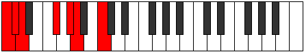
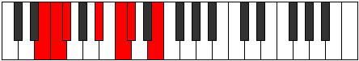
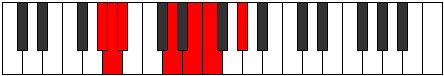
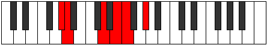

# Mode Ionathimic

## Links

- [Documentation](README.md)
- [Scales Index](Scales.md)
- [Modes Index](Modes.md)
- [Chords Index](Chords.md)

## Parent Scale

[Katythimic](ScaleKatythimic.md)

## Number

[839](https://ianring.com/musictheory/scales/839)

## Transposition

1, 1, 4, 2, 1, 3

## Chord Pattern

iv, iv, Vb5, Vb5

## Perfection

- 3 Perfect notes
- 3 Perfect notes

## Perfection Profile

[false true true true false false]

## Permutations

| Tonic | Notes | Signature | Illustration | Audio |
|-------|-------|-----------|--------------|-------|
| [C](ModeCNaturalIonathimic.md) | **C**, Db, Ebb, F#, **G#**, **A**, **C** | C |  | [midi](https://github.com/edipermadi/music/blob/main/docs/ModeCNaturalIonathimic.mid?raw=true) |
| [C#](ModeCSharpIonathimic.md) | **C#**, D, Eb, F##, **G##**, **A#**, **C#** | C |  | [midi](https://github.com/edipermadi/music/blob/main/docs/ModeCSharpIonathimic.mid?raw=true) |
| [Db](ModeDFlatIonathimic.md) | **Db**, Ebb, Fbb, G, **A**, **Bb**, **Db** | C |  | [midi](https://github.com/edipermadi/music/blob/main/docs/ModeDFlatIonathimic.mid?raw=true) |
| [D](ModeDNaturalIonathimic.md) | **D**, Eb, Fb, G#, **A#**, **B**, **D** | C |  | [midi](https://github.com/edipermadi/music/blob/main/docs/ModeDNaturalIonathimic.mid?raw=true) |
| [D#](ModeDSharpIonathimic.md) | **D#**, E, F, G##, **A##**, **B#**, **D#** | C |  | [midi](https://github.com/edipermadi/music/blob/main/docs/ModeDSharpIonathimic.mid?raw=true) |
| [Eb](ModeEFlatIonathimic.md) | **Eb**, Fb, Gbb, A, **B**, **C**, **Eb** | C |  | [midi](https://github.com/edipermadi/music/blob/main/docs/ModeEFlatIonathimic.mid?raw=true) |
| [E](ModeENaturalIonathimic.md) | **E**, F, Gb, A#, **B#**, **C#**, **E** | C |  | [midi](https://github.com/edipermadi/music/blob/main/docs/ModeENaturalIonathimic.mid?raw=true) |
| [F](ModeFNaturalIonathimic.md) | **F**, Gb, Abb, B, **C#**, **D**, **F** | C |  | [midi](https://github.com/edipermadi/music/blob/main/docs/ModeFNaturalIonathimic.mid?raw=true) |
| [F#](ModeFSharpIonathimic.md) | **F#**, G, Ab, B#, **C##**, **D#**, **F#** | C |  | [midi](https://github.com/edipermadi/music/blob/main/docs/ModeFSharpIonathimic.mid?raw=true) |
| [Gb](ModeGFlatIonathimic.md) | **Gb**, Abb, Bbbb, C, **D**, **Eb**, **Gb** | C |  | [midi](https://github.com/edipermadi/music/blob/main/docs/ModeGFlatIonathimic.mid?raw=true) |
| [G](ModeGNaturalIonathimic.md) | **G**, Ab, Bbb, C#, **D#**, **E**, **G** | C |  | [midi](https://github.com/edipermadi/music/blob/main/docs/ModeGNaturalIonathimic.mid?raw=true) |
| [G#](ModeGSharpIonathimic.md) | **G#**, A, Bb, C##, **D##**, **E#**, **G#** | C |  | [midi](https://github.com/edipermadi/music/blob/main/docs/ModeGSharpIonathimic.mid?raw=true) |
| [Ab](ModeAFlatIonathimic.md) | **Ab**, Bbb, Cbb, D, **E**, **F**, **Ab** | C |  | [midi](https://github.com/edipermadi/music/blob/main/docs/ModeAFlatIonathimic.mid?raw=true) |
| [A](ModeANaturalIonathimic.md) | **A**, Bb, Cb, D#, **E#**, **F#**, **A** | C |  | [midi](https://github.com/edipermadi/music/blob/main/docs/ModeANaturalIonathimic.mid?raw=true) |
| [A#](ModeASharpIonathimic.md) | **A#**, B, C, D##, **E##**, **F##**, **A#** | C |  | [midi](https://github.com/edipermadi/music/blob/main/docs/ModeASharpIonathimic.mid?raw=true) |
| [Bb](ModeBFlatIonathimic.md) | **Bb**, Cb, Dbb, E, **F#**, **G**, **Bb** | C |  | [midi](https://github.com/edipermadi/music/blob/main/docs/ModeBFlatIonathimic.mid?raw=true) |
| [B](ModeBNaturalIonathimic.md) | **B**, C, Db, E#, **F##**, **G#**, **B** | C |  | [midi](https://github.com/edipermadi/music/blob/main/docs/ModeBNaturalIonathimic.mid?raw=true) |
