# Mode Ionian

## Links

- [Documentation](README.md)
- [Scales Index](Scales.md)
- [Modes Index](Modes.md)
- [Chords Index](Chords.md)

## Parent Scale

[Lydian](ScaleLydian.md)

## Number

[2741](https://ianring.com/musictheory/scales/2741)

## Interval Pattern

2, 2, 1, 2, 2, 2, 1

## Chord Pattern

I, ii, iii, IV, V, vi, vii⁰

## Perfection

- 6 Perfect notes
- 1 Perfect notes

## Perfection Profile

[true true true true true true false]

## Permutations

| Tonic | Notes | Signature | Illustration | Audio |
|-------|-------|-----------|--------------|-------|
| [C](ModeCNaturalIonian.md) | C, D, E, F, G, A, **B**, C | C | 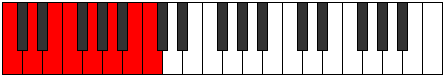 | [midi](https://github.com/edipermadi/music/blob/main/docs/ModeCNaturalIonian.mid?raw=true) |
| [C#](ModeCSharpIonian.md) | C#, D#, E#, F#, G#, A#, **B#**, C# | Db, C# | 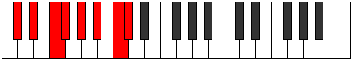 | [midi](https://github.com/edipermadi/music/blob/main/docs/ModeCSharpIonian.mid?raw=true) |
| [Db](ModeDFlatIonian.md) | Db, Eb, F, Gb, Ab, Bb, **C**, Db | Db, C# |  | [midi](https://github.com/edipermadi/music/blob/main/docs/ModeDFlatIonian.mid?raw=true) |
| [D](ModeDNaturalIonian.md) | D, E, F#, G, A, B, **C#**, D | D | 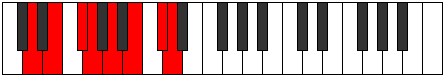 | [midi](https://github.com/edipermadi/music/blob/main/docs/ModeDNaturalIonian.mid?raw=true) |
| [D#](ModeDSharpIonian.md) | D#, E#, F##, G#, A#, B#, **C##**, D# | Eb | 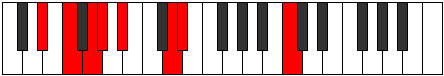 | [midi](https://github.com/edipermadi/music/blob/main/docs/ModeDSharpIonian.mid?raw=true) |
| [Eb](ModeEFlatIonian.md) | Eb, F, G, Ab, Bb, C, **D**, Eb | Eb | 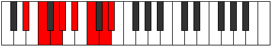 | [midi](https://github.com/edipermadi/music/blob/main/docs/ModeEFlatIonian.mid?raw=true) |
| [E](ModeENaturalIonian.md) | E, F#, G#, A, B, C#, **D#**, E | E | 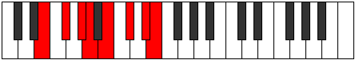 | [midi](https://github.com/edipermadi/music/blob/main/docs/ModeENaturalIonian.mid?raw=true) |
| [F](ModeFNaturalIonian.md) | F, G, A, Bb, C, D, **E**, F | F | 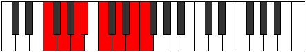 | [midi](https://github.com/edipermadi/music/blob/main/docs/ModeFNaturalIonian.mid?raw=true) |
| [F#](ModeFSharpIonian.md) | F#, G#, A#, B, C#, D#, **E#**, F# | F#, Gb | 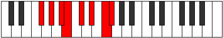 | [midi](https://github.com/edipermadi/music/blob/main/docs/ModeFSharpIonian.mid?raw=true) |
| [Gb](ModeGFlatIonian.md) | Gb, Ab, Bb, Cb, Db, Eb, **F**, Gb | F#, Gb | 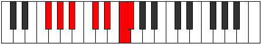 | [midi](https://github.com/edipermadi/music/blob/main/docs/ModeGFlatIonian.mid?raw=true) |
| [G](ModeGNaturalIonian.md) | G, A, B, C, D, E, **F#**, G | G | 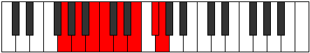 | [midi](https://github.com/edipermadi/music/blob/main/docs/ModeGNaturalIonian.mid?raw=true) |
| [G#](ModeGSharpIonian.md) | G#, A#, B#, C#, D#, E#, **F##**, G# | Ab | 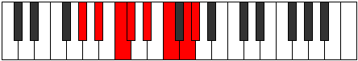 | [midi](https://github.com/edipermadi/music/blob/main/docs/ModeGSharpIonian.mid?raw=true) |
| [Ab](ModeAFlatIonian.md) | Ab, Bb, C, Db, Eb, F, **G**, Ab | Ab |  | [midi](https://github.com/edipermadi/music/blob/main/docs/ModeAFlatIonian.mid?raw=true) |
| [A](ModeANaturalIonian.md) | A, B, C#, D, E, F#, **G#**, A | A | 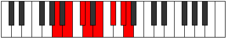 | [midi](https://github.com/edipermadi/music/blob/main/docs/ModeANaturalIonian.mid?raw=true) |
| [A#](ModeASharpIonian.md) | A#, B#, C##, D#, E#, F##, **G##**, A# | Bb | 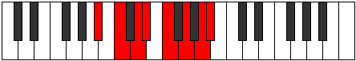 | [midi](https://github.com/edipermadi/music/blob/main/docs/ModeASharpIonian.mid?raw=true) |
| [Bb](ModeBFlatIonian.md) | Bb, C, D, Eb, F, G, **A**, Bb | Bb |  | [midi](https://github.com/edipermadi/music/blob/main/docs/ModeBFlatIonian.mid?raw=true) |
| [B](ModeBNaturalIonian.md) | B, C#, D#, E, F#, G#, **A#**, B | B | 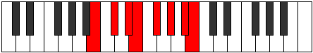 | [midi](https://github.com/edipermadi/music/blob/main/docs/ModeBNaturalIonian.mid?raw=true) |
