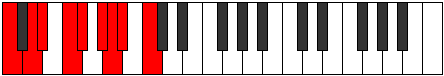
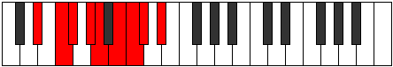

# Mode Ionidyllic

## Links

- [Documentation](index.md)
- [Scales Index](Scales.md)
- [Modes Index](Modes.md)
- [Chords Index](Chords.md)

## Parent Scale

[Stogyllic](ScaleStogyllic.md)

## Number

[1901](https://ianring.com/musictheory/scales/1901)

## Perfection

- 5 Perfect notes
- 3 Perfect notes

## Perfection Profile

[false true true true false true false true]

## Permutations

| Tonic | Notes | Signature | Illustration | Audio |
|-------|-------|-----------|--------------|-------|
| [C](ModeCNaturalIonidyllic.md) | **C**, D, D#, F, **F#**, G#, **A**, A#, **C** | C |  | [midi](https://github.com/edipermadi/music/blob/main/docs/ModeCNaturalIonidyllic.mid?raw=true) |
| [C#](ModeCSharpIonidyllic.md) | **C#**, D#, E, F#, **G**, A, **A#**, B, **C#** | C |  | [midi](https://github.com/edipermadi/music/blob/main/docs/ModeCSharpIonidyllic.mid?raw=true) |
| [Db](ModeDFlatIonidyllic.md) | **Db**, Eb, E, Gb, **G**, A, **Bb**, B, **Db** | C |  | [midi](https://github.com/edipermadi/music/blob/main/docs/ModeDFlatIonidyllic.mid?raw=true) |
| [D](ModeDNaturalIonidyllic.md) | **D**, E, F, G, **G#**, A#, **B**, C, **D** | C |  | [midi](https://github.com/edipermadi/music/blob/main/docs/ModeDNaturalIonidyllic.mid?raw=true) |
| [D#](ModeDSharpIonidyllic.md) | **D#**, F, F#, G#, **A**, B, **C**, C#, **D#** | C |  | [midi](https://github.com/edipermadi/music/blob/main/docs/ModeDSharpIonidyllic.mid?raw=true) |
| [Eb](ModeEFlatIonidyllic.md) | **Eb**, F, Gb, Ab, **A**, B, **C**, Db, **Eb** | C |  | [midi](https://github.com/edipermadi/music/blob/main/docs/ModeEFlatIonidyllic.mid?raw=true) |
| [E](ModeENaturalIonidyllic.md) | **E**, F#, G, A, **A#**, C, **C#**, D, **E** | C |  | [midi](https://github.com/edipermadi/music/blob/main/docs/ModeENaturalIonidyllic.mid?raw=true) |
| [F](ModeFNaturalIonidyllic.md) | **F**, G, G#, A#, **B**, C#, **D**, D#, **F** | C |  | [midi](https://github.com/edipermadi/music/blob/main/docs/ModeFNaturalIonidyllic.mid?raw=true) |
| [F#](ModeFSharpIonidyllic.md) | **F#**, G#, A, B, **C**, D, **D#**, E, **F#** | C |  | [midi](https://github.com/edipermadi/music/blob/main/docs/ModeFSharpIonidyllic.mid?raw=true) |
| [Gb](ModeGFlatIonidyllic.md) | **Gb**, Ab, A, B, **C**, D, **Eb**, E, **Gb** | C |  | [midi](https://github.com/edipermadi/music/blob/main/docs/ModeGFlatIonidyllic.mid?raw=true) |
| [G](ModeGNaturalIonidyllic.md) | **G**, A, A#, C, **C#**, D#, **E**, F, **G** | C |  | [midi](https://github.com/edipermadi/music/blob/main/docs/ModeGNaturalIonidyllic.mid?raw=true) |
| [G#](ModeGSharpIonidyllic.md) | **G#**, A#, B, C#, **D**, E, **F**, F#, **G#** | C |  | [midi](https://github.com/edipermadi/music/blob/main/docs/ModeGSharpIonidyllic.mid?raw=true) |
| [Ab](ModeAFlatIonidyllic.md) | **Ab**, Bb, B, Db, **D**, E, **F**, Gb, **Ab** | C |  | [midi](https://github.com/edipermadi/music/blob/main/docs/ModeAFlatIonidyllic.mid?raw=true) |
| [A](ModeANaturalIonidyllic.md) | **A**, B, C, D, **D#**, F, **F#**, G, **A** | C |  | [midi](https://github.com/edipermadi/music/blob/main/docs/ModeANaturalIonidyllic.mid?raw=true) |
| [A#](ModeASharpIonidyllic.md) | **A#**, C, C#, D#, **E**, F#, **G**, G#, **A#** | C |  | [midi](https://github.com/edipermadi/music/blob/main/docs/ModeASharpIonidyllic.mid?raw=true) |
| [Bb](ModeBFlatIonidyllic.md) | **Bb**, C, Db, Eb, **E**, Gb, **G**, Ab, **Bb** | C |  | [midi](https://github.com/edipermadi/music/blob/main/docs/ModeBFlatIonidyllic.mid?raw=true) |
| [B](ModeBNaturalIonidyllic.md) | **B**, C#, D, E, **F**, G, **G#**, A, **B** | C |  | [midi](https://github.com/edipermadi/music/blob/main/docs/ModeBNaturalIonidyllic.mid?raw=true) |
