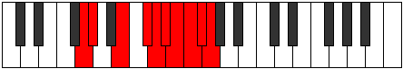

# Mode Ionilygic

## Links

- [Documentation](README.md)
- [Scales Index](Scales.md)
- [Modes Index](Modes.md)
- [Chords Index](Chords.md)

## Parent Scale

[Sathygic](ScaleSathygic.md)

## Number

[4051](https://ianring.com/musictheory/scales/4051)

## Luminosity

9

## Transposition

1, 3, 2, 1, 1, 1, 1, 1, 1

## Chord Pattern

I, viii⁰b3

## Perfection

- 6 Perfect notes
- 3 Perfect notes

## Perfection Profile

true, true, true, true, false, false, true, false, true

## Permutations

| Tonic | Notes | Signature | Illustration | Audio |
|-------|-------|-----------|--------------|-------|
| [C](ModeCNaturalIonilygic.md) | C, C#, E, F#, **G**, **G#**, A, **A#**, B, C | C |  | [midi](https://github.com/edipermadi/music/blob/main/docs/ModeCNaturalIonilygic.mid?raw=true) |
| [C#](ModeCSharpIonilygic.md) | C#, D, F, G, **G#**, **A**, A#, **B**, C, C# | C |  | [midi](https://github.com/edipermadi/music/blob/main/docs/ModeCSharpIonilygic.mid?raw=true) |
| [Db](ModeDFlatIonilygic.md) | Db, D, F, G, **Ab**, **A**, Bb, **B**, C, Db | C |  | [midi](https://github.com/edipermadi/music/blob/main/docs/ModeDFlatIonilygic.mid?raw=true) |
| [D](ModeDNaturalIonilygic.md) | D, D#, F#, G#, **A**, **A#**, B, **C**, C#, D | C |  | [midi](https://github.com/edipermadi/music/blob/main/docs/ModeDNaturalIonilygic.mid?raw=true) |
| [D#](ModeDSharpIonilygic.md) | D#, E, G, A, **A#**, **B**, C, **C#**, D, D# | C |  | [midi](https://github.com/edipermadi/music/blob/main/docs/ModeDSharpIonilygic.mid?raw=true) |
| [Eb](ModeEFlatIonilygic.md) | Eb, E, G, A, **Bb**, **B**, C, **Db**, D, Eb | C |  | [midi](https://github.com/edipermadi/music/blob/main/docs/ModeEFlatIonilygic.mid?raw=true) |
| [E](ModeENaturalIonilygic.md) | E, F, G#, A#, **B**, **C**, C#, **D**, D#, E | C |  | [midi](https://github.com/edipermadi/music/blob/main/docs/ModeENaturalIonilygic.mid?raw=true) |
| [F](ModeFNaturalIonilygic.md) | F, F#, A, B, **C**, **C#**, D, **D#**, E, F | C |  | [midi](https://github.com/edipermadi/music/blob/main/docs/ModeFNaturalIonilygic.mid?raw=true) |
| [F#](ModeFSharpIonilygic.md) | F#, G, A#, C, **C#**, **D**, D#, **E**, F, F# | C |  | [midi](https://github.com/edipermadi/music/blob/main/docs/ModeFSharpIonilygic.mid?raw=true) |
| [Gb](ModeGFlatIonilygic.md) | Gb, G, Bb, C, **Db**, **D**, Eb, **E**, F, Gb | C |  | [midi](https://github.com/edipermadi/music/blob/main/docs/ModeGFlatIonilygic.mid?raw=true) |
| [G](ModeGNaturalIonilygic.md) | G, G#, B, C#, **D**, **D#**, E, **F**, F#, G | C |  | [midi](https://github.com/edipermadi/music/blob/main/docs/ModeGNaturalIonilygic.mid?raw=true) |
| [G#](ModeGSharpIonilygic.md) | G#, A, C, D, **D#**, **E**, F, **F#**, G, G# | C |  | [midi](https://github.com/edipermadi/music/blob/main/docs/ModeGSharpIonilygic.mid?raw=true) |
| [Ab](ModeAFlatIonilygic.md) | Ab, A, C, D, **Eb**, **E**, F, **Gb**, G, Ab | C |  | [midi](https://github.com/edipermadi/music/blob/main/docs/ModeAFlatIonilygic.mid?raw=true) |
| [A](ModeANaturalIonilygic.md) | A, A#, C#, D#, **E**, **F**, F#, **G**, G#, A | C |  | [midi](https://github.com/edipermadi/music/blob/main/docs/ModeANaturalIonilygic.mid?raw=true) |
| [A#](ModeASharpIonilygic.md) | A#, B, D, E, **F**, **F#**, G, **G#**, A, A# | C |  | [midi](https://github.com/edipermadi/music/blob/main/docs/ModeASharpIonilygic.mid?raw=true) |
| [Bb](ModeBFlatIonilygic.md) | Bb, B, D, E, **F**, **Gb**, G, **Ab**, A, Bb | C |  | [midi](https://github.com/edipermadi/music/blob/main/docs/ModeBFlatIonilygic.mid?raw=true) |
| [B](ModeBNaturalIonilygic.md) | B, C, D#, F, **F#**, **G**, G#, **A**, A#, B | C |  | [midi](https://github.com/edipermadi/music/blob/main/docs/ModeBNaturalIonilygic.mid?raw=true) |
