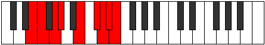

# Mode Ioninyllic

## Links

- [Documentation](index.md)
- [Scales Index](Scales.md)
- [Modes Index](Modes.md)
- [Chords Index](Chords.md)

## Parent Scale

[Aeronyllic](ScaleAeronyllic.md)

## Number

[3739](https://ianring.com/musictheory/scales/3739)

## Perfection

- 4 Perfect notes
- 4 Perfect notes

## Perfection Profile

[true false true true false true false false]

## Permutations

| Tonic | Notes | Signature | Illustration | Audio |
|-------|-------|-----------|--------------|-------|
| [C](ModeCNaturalIoninyllic.md) | C, **C#**, D#, E, **G**, A, **A#**, **B**, C | C |  | [midi](ModeCNaturalIoninyllic.mid) [ogg](ModeCNaturalIoninyllic.ogg) |
| [C#](ModeCSharpIoninyllic.md) | C#, **D**, E, F, **G#**, A#, **B**, **C**, C# | C |  | [midi](ModeCSharpIoninyllic.mid) [ogg](ModeCSharpIoninyllic.ogg) |
| [Db](ModeDFlatIoninyllic.md) | Db, **D**, E, F, **Ab**, Bb, **B**, **C**, Db | C |  | [midi](ModeDFlatIoninyllic.mid) [ogg](ModeDFlatIoninyllic.ogg) |
| [D](ModeDNaturalIoninyllic.md) | D, **D#**, F, F#, **A**, B, **C**, **C#**, D | C |  | [midi](ModeDNaturalIoninyllic.mid) [ogg](ModeDNaturalIoninyllic.ogg) |
| [D#](ModeDSharpIoninyllic.md) | D#, **E**, F#, G, **A#**, C, **C#**, **D**, D# | C |  | [midi](ModeDSharpIoninyllic.mid) [ogg](ModeDSharpIoninyllic.ogg) |
| [Eb](ModeEFlatIoninyllic.md) | Eb, **E**, Gb, G, **Bb**, C, **Db**, **D**, Eb | C |  | [midi](ModeEFlatIoninyllic.mid) [ogg](ModeEFlatIoninyllic.ogg) |
| [E](ModeENaturalIoninyllic.md) | E, **F**, G, G#, **B**, C#, **D**, **D#**, E | C |  | [midi](ModeENaturalIoninyllic.mid) [ogg](ModeENaturalIoninyllic.ogg) |
| [F](ModeFNaturalIoninyllic.md) | F, **F#**, G#, A, **C**, D, **D#**, **E**, F | C |  | [midi](ModeFNaturalIoninyllic.mid) [ogg](ModeFNaturalIoninyllic.ogg) |
| [F#](ModeFSharpIoninyllic.md) | F#, **G**, A, A#, **C#**, D#, **E**, **F**, F# | C |  | [midi](ModeFSharpIoninyllic.mid) [ogg](ModeFSharpIoninyllic.ogg) |
| [Gb](ModeGFlatIoninyllic.md) | Gb, **G**, A, Bb, **Db**, Eb, **E**, **F**, Gb | C |  | [midi](ModeGFlatIoninyllic.mid) [ogg](ModeGFlatIoninyllic.ogg) |
| [G](ModeGNaturalIoninyllic.md) | G, **G#**, A#, B, **D**, E, **F**, **F#**, G | C |  | [midi](ModeGNaturalIoninyllic.mid) [ogg](ModeGNaturalIoninyllic.ogg) |
| [G#](ModeGSharpIoninyllic.md) | G#, **A**, B, C, **D#**, F, **F#**, **G**, G# | C |  | [midi](ModeGSharpIoninyllic.mid) [ogg](ModeGSharpIoninyllic.ogg) |
| [Ab](ModeAFlatIoninyllic.md) | Ab, **A**, B, C, **Eb**, F, **Gb**, **G**, Ab | C |  | [midi](ModeAFlatIoninyllic.mid) [ogg](ModeAFlatIoninyllic.ogg) |
| [A](ModeANaturalIoninyllic.md) | A, **A#**, C, C#, **E**, F#, **G**, **G#**, A | C |  | [midi](ModeANaturalIoninyllic.mid) [ogg](ModeANaturalIoninyllic.ogg) |
| [A#](ModeASharpIoninyllic.md) | A#, **B**, C#, D, **F**, G, **G#**, **A**, A# | C |  | [midi](ModeASharpIoninyllic.mid) [ogg](ModeASharpIoninyllic.ogg) |
| [Bb](ModeBFlatIoninyllic.md) | Bb, **B**, Db, D, **F**, G, **Ab**, **A**, Bb | C |  | [midi](ModeBFlatIoninyllic.mid) [ogg](ModeBFlatIoninyllic.ogg) |
| [B](ModeBNaturalIoninyllic.md) | B, **C**, D, D#, **F#**, G#, **A**, **A#**, B | C |  | [midi](ModeBNaturalIoninyllic.mid) [ogg](ModeBNaturalIoninyllic.ogg) |
