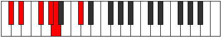
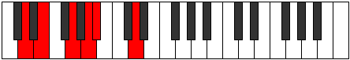
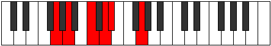
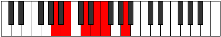
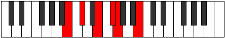

# Mode Ionitonic

## Links

- [Documentation](index.md)
- [Scales Index](Scales.md)
- [Modes Index](Modes.md)
- [Chords Index](Chords.md)

## Parent Scale

[Gathitonic](ScaleGathitonic.md)

## Number

[421](https://ianring.com/musictheory/scales/421)

## Interval Pattern

2, 3, 2, 1, 4

## Chord Pattern

## Perfection

- 3 Perfect notes
- 2 Perfect notes

## Perfection Profile

[true false true true false]

## Permutations

| Tonic | Notes | Signature | Illustration | Audio |
|-------|-------|-----------|--------------|-------|
| [C](ModeCNaturalIonitonic.md) | C, **D**, F, G, **G#**, C | C |  | [midi](https://github.com/edipermadi/music/blob/main/docs/ModeCNaturalIonitonic.mid?raw=true) |
| [C#](ModeCSharpIonitonic.md) | C#, **D#**, F#, G#, **A**, C# | C |  | [midi](https://github.com/edipermadi/music/blob/main/docs/ModeCSharpIonitonic.mid?raw=true) |
| [Db](ModeDFlatIonitonic.md) | Db, **Eb**, Gb, Ab, **A**, Db | C |  | [midi](https://github.com/edipermadi/music/blob/main/docs/ModeDFlatIonitonic.mid?raw=true) |
| [D](ModeDNaturalIonitonic.md) | D, **E**, G, A, **A#**, D | C |  | [midi](https://github.com/edipermadi/music/blob/main/docs/ModeDNaturalIonitonic.mid?raw=true) |
| [D#](ModeDSharpIonitonic.md) | D#, **F**, G#, A#, **B**, D# | C |  | [midi](https://github.com/edipermadi/music/blob/main/docs/ModeDSharpIonitonic.mid?raw=true) |
| [Eb](ModeEFlatIonitonic.md) | Eb, **F**, Ab, Bb, **B**, Eb | C |  | [midi](https://github.com/edipermadi/music/blob/main/docs/ModeEFlatIonitonic.mid?raw=true) |
| [E](ModeENaturalIonitonic.md) | E, **F#**, A, B, **C**, E | C |  | [midi](https://github.com/edipermadi/music/blob/main/docs/ModeENaturalIonitonic.mid?raw=true) |
| [F](ModeFNaturalIonitonic.md) | F, **G**, A#, C, **C#**, F | C |  | [midi](https://github.com/edipermadi/music/blob/main/docs/ModeFNaturalIonitonic.mid?raw=true) |
| [F#](ModeFSharpIonitonic.md) | F#, **G#**, B, C#, **D**, F# | C |  | [midi](https://github.com/edipermadi/music/blob/main/docs/ModeFSharpIonitonic.mid?raw=true) |
| [Gb](ModeGFlatIonitonic.md) | Gb, **Ab**, B, Db, **D**, Gb | C |  | [midi](https://github.com/edipermadi/music/blob/main/docs/ModeGFlatIonitonic.mid?raw=true) |
| [G](ModeGNaturalIonitonic.md) | G, **A**, C, D, **D#**, G | C |  | [midi](https://github.com/edipermadi/music/blob/main/docs/ModeGNaturalIonitonic.mid?raw=true) |
| [G#](ModeGSharpIonitonic.md) | G#, **A#**, C#, D#, **E**, G# | C |  | [midi](https://github.com/edipermadi/music/blob/main/docs/ModeGSharpIonitonic.mid?raw=true) |
| [Ab](ModeAFlatIonitonic.md) | Ab, **Bb**, Db, Eb, **E**, Ab | C |  | [midi](https://github.com/edipermadi/music/blob/main/docs/ModeAFlatIonitonic.mid?raw=true) |
| [A](ModeANaturalIonitonic.md) | A, **B**, D, E, **F**, A | C |  | [midi](https://github.com/edipermadi/music/blob/main/docs/ModeANaturalIonitonic.mid?raw=true) |
| [A#](ModeASharpIonitonic.md) | A#, **C**, D#, F, **F#**, A# | C |  | [midi](https://github.com/edipermadi/music/blob/main/docs/ModeASharpIonitonic.mid?raw=true) |
| [Bb](ModeBFlatIonitonic.md) | Bb, **C**, Eb, F, **Gb**, Bb | C |  | [midi](https://github.com/edipermadi/music/blob/main/docs/ModeBFlatIonitonic.mid?raw=true) |
| [B](ModeBNaturalIonitonic.md) | B, **C#**, E, F#, **G**, B | C |  | [midi](https://github.com/edipermadi/music/blob/main/docs/ModeBNaturalIonitonic.mid?raw=true) |
