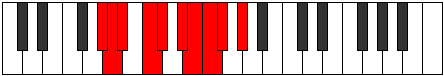

# Mode Ionocrygic

## Links

- [Documentation](README.md)
- [Scales Index](Scales.md)
- [Modes Index](Modes.md)
- [Chords Index](Chords.md)

## Parent Scale

[Aeolorygic](ScaleAeolorygic.md)

## Number

[1975](https://ianring.com/musictheory/scales/1975)

## Interval Pattern

1, 1, 2, 1, 2, 1, 1, 1, 2

## Chord Pattern

ii⁰, iii⁰, ix⁰

## Perfection

- 7 Perfect notes
- 2 Perfect notes

## Perfection Profile

[true true true false true true false true true]

## Permutations

| Tonic | Notes | Signature | Illustration | Audio |
|-------|-------|-----------|--------------|-------|
| [C](ModeCNaturalIonocrygic.md) | C, C#, D, **E**, F, G, **G#**, A, A#, C | C |  | [midi](https://github.com/edipermadi/music/blob/main/docs/ModeCNaturalIonocrygic.mid?raw=true) |
| [C#](ModeCSharpIonocrygic.md) | C#, D, D#, **F**, F#, G#, **A**, A#, B, C# | C |  | [midi](https://github.com/edipermadi/music/blob/main/docs/ModeCSharpIonocrygic.mid?raw=true) |
| [Db](ModeDFlatIonocrygic.md) | Db, D, Eb, **F**, Gb, Ab, **A**, Bb, B, Db | C |  | [midi](https://github.com/edipermadi/music/blob/main/docs/ModeDFlatIonocrygic.mid?raw=true) |
| [D](ModeDNaturalIonocrygic.md) | D, D#, E, **F#**, G, A, **A#**, B, C, D | C |  | [midi](https://github.com/edipermadi/music/blob/main/docs/ModeDNaturalIonocrygic.mid?raw=true) |
| [D#](ModeDSharpIonocrygic.md) | D#, E, F, **G**, G#, A#, **B**, C, C#, D# | C |  | [midi](https://github.com/edipermadi/music/blob/main/docs/ModeDSharpIonocrygic.mid?raw=true) |
| [Eb](ModeEFlatIonocrygic.md) | Eb, E, F, **G**, Ab, Bb, **B**, C, Db, Eb | C |  | [midi](https://github.com/edipermadi/music/blob/main/docs/ModeEFlatIonocrygic.mid?raw=true) |
| [E](ModeENaturalIonocrygic.md) | E, F, F#, **G#**, A, B, **C**, C#, D, E | C |  | [midi](https://github.com/edipermadi/music/blob/main/docs/ModeENaturalIonocrygic.mid?raw=true) |
| [F](ModeFNaturalIonocrygic.md) | F, F#, G, **A**, A#, C, **C#**, D, D#, F | C |  | [midi](https://github.com/edipermadi/music/blob/main/docs/ModeFNaturalIonocrygic.mid?raw=true) |
| [F#](ModeFSharpIonocrygic.md) | F#, G, G#, **A#**, B, C#, **D**, D#, E, F# | C |  | [midi](https://github.com/edipermadi/music/blob/main/docs/ModeFSharpIonocrygic.mid?raw=true) |
| [Gb](ModeGFlatIonocrygic.md) | Gb, G, Ab, **Bb**, B, Db, **D**, Eb, E, Gb | C |  | [midi](https://github.com/edipermadi/music/blob/main/docs/ModeGFlatIonocrygic.mid?raw=true) |
| [G](ModeGNaturalIonocrygic.md) | G, G#, A, **B**, C, D, **D#**, E, F, G | C |  | [midi](https://github.com/edipermadi/music/blob/main/docs/ModeGNaturalIonocrygic.mid?raw=true) |
| [G#](ModeGSharpIonocrygic.md) | G#, A, A#, **C**, C#, D#, **E**, F, F#, G# | C |  | [midi](https://github.com/edipermadi/music/blob/main/docs/ModeGSharpIonocrygic.mid?raw=true) |
| [Ab](ModeAFlatIonocrygic.md) | Ab, A, Bb, **C**, Db, Eb, **E**, F, Gb, Ab | C |  | [midi](https://github.com/edipermadi/music/blob/main/docs/ModeAFlatIonocrygic.mid?raw=true) |
| [A](ModeANaturalIonocrygic.md) | A, A#, B, **C#**, D, E, **F**, F#, G, A | C |  | [midi](https://github.com/edipermadi/music/blob/main/docs/ModeANaturalIonocrygic.mid?raw=true) |
| [A#](ModeASharpIonocrygic.md) | A#, B, C, **D**, D#, F, **F#**, G, G#, A# | C |  | [midi](https://github.com/edipermadi/music/blob/main/docs/ModeASharpIonocrygic.mid?raw=true) |
| [Bb](ModeBFlatIonocrygic.md) | Bb, B, C, **D**, Eb, F, **Gb**, G, Ab, Bb | C |  | [midi](https://github.com/edipermadi/music/blob/main/docs/ModeBFlatIonocrygic.mid?raw=true) |
| [B](ModeBNaturalIonocrygic.md) | B, C, C#, **D#**, E, F#, **G**, G#, A, B | C |  | [midi](https://github.com/edipermadi/music/blob/main/docs/ModeBNaturalIonocrygic.mid?raw=true) |
