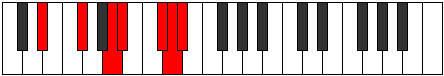
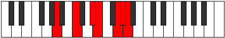

# Mode Ionodimic

## Links

- [Documentation](README.md)
- [Scales Index](Scales.md)
- [Modes Index](Modes.md)
- [Chords Index](Chords.md)

## Parent Scale

[Ionodimic](ScaleIonodimic.md)

## Number

[3273](https://ianring.com/musictheory/scales/3273)

## Transposition

3, 3, 1, 3, 1, 1

## Chord Pattern

II⁺, IIIb5, IV⁺, VI⁺

## Perfection

- 3 Perfect notes
- 3 Perfect notes

## Perfection Profile

true, true, false, false, false, true

## Permutations

| Tonic | Notes | Signature | Illustration | Audio |
|-------|-------|-----------|--------------|-------|
| [C](ModeCNaturalIonodimic.md) | C, D#, **E##**, **F##**, **G###**, A##, C | C |  | [midi](https://github.com/edipermadi/music/blob/main/docs/ModeCNaturalIonodimic.mid?raw=true) |
| [C#](ModeCSharpIonodimic.md) | C#, D##, **E###**, **F###**, **Cb**, Dbb, C# | C |  | [midi](https://github.com/edipermadi/music/blob/main/docs/ModeCSharpIonodimic.mid?raw=true) |
| [Db](ModeDFlatIonodimic.md) | Db, E, **F##**, **G#**, **A##**, B#, Db | C |  | [midi](https://github.com/edipermadi/music/blob/main/docs/ModeDFlatIonodimic.mid?raw=true) |
| [D](ModeDNaturalIonodimic.md) | D, E#, **F###**, **G##**, **A###**, B##, D | C |  | [midi](https://github.com/edipermadi/music/blob/main/docs/ModeDNaturalIonodimic.mid?raw=true) |
| [D#](ModeDSharpIonodimic.md) | D#, E##, **Cbbb**, **Cbb**, **Db**, Ebb, D# | C |  | [midi](https://github.com/edipermadi/music/blob/main/docs/ModeDSharpIonodimic.mid?raw=true) |
| [Eb](ModeEFlatIonodimic.md) | Eb, F#, **G##**, **A#**, **B##**, C##, Eb | C |  | [midi](https://github.com/edipermadi/music/blob/main/docs/ModeEFlatIonodimic.mid?raw=true) |
| [E](ModeENaturalIonodimic.md) | E, F##, **G###**, **A##**, **B###**, C###, E | C |  | [midi](https://github.com/edipermadi/music/blob/main/docs/ModeENaturalIonodimic.mid?raw=true) |
| [F](ModeFNaturalIonodimic.md) | F, G#, **A##**, **B#**, **C###**, D##, F | C |  | [midi](https://github.com/edipermadi/music/blob/main/docs/ModeFNaturalIonodimic.mid?raw=true) |
| [F#](ModeFSharpIonodimic.md) | F#, G##, **A###**, **B##**, **D##**, E#, F# | C |  | [midi](https://github.com/edipermadi/music/blob/main/docs/ModeFSharpIonodimic.mid?raw=true) |
| [Gb](ModeGFlatIonodimic.md) | Gb, A, **B#**, **C#**, **D##**, E#, Gb | C |  | [midi](https://github.com/edipermadi/music/blob/main/docs/ModeGFlatIonodimic.mid?raw=true) |
| [G](ModeGNaturalIonodimic.md) | G, A#, **B##**, **C##**, **D###**, E##, G | C |  | [midi](https://github.com/edipermadi/music/blob/main/docs/ModeGNaturalIonodimic.mid?raw=true) |
| [G#](ModeGSharpIonodimic.md) | G#, A##, **B###**, **C###**, **E##**, F##, G# | C |  | [midi](https://github.com/edipermadi/music/blob/main/docs/ModeGSharpIonodimic.mid?raw=true) |
| [Ab](ModeAFlatIonodimic.md) | Ab, B, **C##**, **D#**, **E##**, F##, Ab | C |  | [midi](https://github.com/edipermadi/music/blob/main/docs/ModeAFlatIonodimic.mid?raw=true) |
| [A](ModeANaturalIonodimic.md) | A, B#, **C###**, **D##**, **E###**, F###, A | C |  | [midi](https://github.com/edipermadi/music/blob/main/docs/ModeANaturalIonodimic.mid?raw=true) |
| [A#](ModeASharpIonodimic.md) | A#, B##, **D##**, **E#**, **F###**, G##, A# | C |  | [midi](https://github.com/edipermadi/music/blob/main/docs/ModeASharpIonodimic.mid?raw=true) |
| [Bb](ModeBFlatIonodimic.md) | Bb, C#, **D##**, **E#**, **F###**, G##, Bb | C |  | [midi](https://github.com/edipermadi/music/blob/main/docs/ModeBFlatIonodimic.mid?raw=true) |
| [B](ModeBNaturalIonodimic.md) | B, C##, **D###**, **E##**, **Cbbb**, Cbb, B | C |  | [midi](https://github.com/edipermadi/music/blob/main/docs/ModeBNaturalIonodimic.mid?raw=true) |
