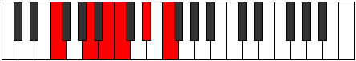

# Mode Ionoditonic

## Links

- [Documentation](index.md)
- [Scales Index](Scales.md)
- [Modes Index](Modes.md)
- [Chords Index](Chords.md)

## Parent Scale

[Ionoditonic](ScaleIonoditonic.md)

## Number

[1233](https://ianring.com/musictheory/scales/1233)

## Perfection

- 1 Perfect notes
- 4 Perfect notes

## Perfection Profile

[true false false false false]

## Permutations

| Tonic | Notes | Signature | Illustration | Audio |
|-------|-------|-----------|--------------|-------|
| [C](ModeCNaturalIonoditonic.md) | C, **E**, **F#**, **G**, **A#**, C | C |  | [midi](ModeCNaturalIonoditonic.mid) [ogg](ModeCNaturalIonoditonic.ogg) |
| [C#](ModeCSharpIonoditonic.md) | C#, **F**, **G**, **G#**, **B**, C# | C |  | [midi](ModeCSharpIonoditonic.mid) [ogg](ModeCSharpIonoditonic.ogg) |
| [Db](ModeDFlatIonoditonic.md) | Db, **F**, **G**, **Ab**, **B**, Db | C |  | [midi](ModeDFlatIonoditonic.mid) [ogg](ModeDFlatIonoditonic.ogg) |
| [D](ModeDNaturalIonoditonic.md) | D, **F#**, **G#**, **A**, **C**, D | C |  | [midi](ModeDNaturalIonoditonic.mid) [ogg](ModeDNaturalIonoditonic.ogg) |
| [D#](ModeDSharpIonoditonic.md) | D#, **G**, **A**, **A#**, **C#**, D# | C |  | [midi](ModeDSharpIonoditonic.mid) [ogg](ModeDSharpIonoditonic.ogg) |
| [Eb](ModeEFlatIonoditonic.md) | Eb, **G**, **A**, **Bb**, **Db**, Eb | C |  | [midi](ModeEFlatIonoditonic.mid) [ogg](ModeEFlatIonoditonic.ogg) |
| [E](ModeENaturalIonoditonic.md) | E, **G#**, **A#**, **B**, **D**, E | C |  | [midi](ModeENaturalIonoditonic.mid) [ogg](ModeENaturalIonoditonic.ogg) |
| [F](ModeFNaturalIonoditonic.md) | F, **A**, **B**, **C**, **D#**, F | C |  | [midi](ModeFNaturalIonoditonic.mid) [ogg](ModeFNaturalIonoditonic.ogg) |
| [F#](ModeFSharpIonoditonic.md) | F#, **A#**, **C**, **C#**, **E**, F# | C |  | [midi](ModeFSharpIonoditonic.mid) [ogg](ModeFSharpIonoditonic.ogg) |
| [Gb](ModeGFlatIonoditonic.md) | Gb, **Bb**, **C**, **Db**, **E**, Gb | C |  | [midi](ModeGFlatIonoditonic.mid) [ogg](ModeGFlatIonoditonic.ogg) |
| [G](ModeGNaturalIonoditonic.md) | G, **B**, **C#**, **D**, **F**, G | C |  | [midi](ModeGNaturalIonoditonic.mid) [ogg](ModeGNaturalIonoditonic.ogg) |
| [G#](ModeGSharpIonoditonic.md) | G#, **C**, **D**, **D#**, **F#**, G# | C |  | [midi](ModeGSharpIonoditonic.mid) [ogg](ModeGSharpIonoditonic.ogg) |
| [Ab](ModeAFlatIonoditonic.md) | Ab, **C**, **D**, **Eb**, **Gb**, Ab | C |  | [midi](ModeAFlatIonoditonic.mid) [ogg](ModeAFlatIonoditonic.ogg) |
| [A](ModeANaturalIonoditonic.md) | A, **C#**, **D#**, **E**, **G**, A | C |  | [midi](ModeANaturalIonoditonic.mid) [ogg](ModeANaturalIonoditonic.ogg) |
| [A#](ModeASharpIonoditonic.md) | A#, **D**, **E**, **F**, **G#**, A# | C |  | [midi](ModeASharpIonoditonic.mid) [ogg](ModeASharpIonoditonic.ogg) |
| [Bb](ModeBFlatIonoditonic.md) | Bb, **D**, **E**, **F**, **Ab**, Bb | C |  | [midi](ModeBFlatIonoditonic.mid) [ogg](ModeBFlatIonoditonic.ogg) |
| [B](ModeBNaturalIonoditonic.md) | B, **D#**, **F**, **F#**, **A**, B | C |  | [midi](ModeBNaturalIonoditonic.mid) [ogg](ModeBNaturalIonoditonic.ogg) |
