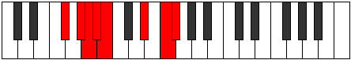

# Mode Ionogian

## Links

- [Documentation](index.md)
- [Scales Index](Scales.md)
- [Modes Index](Modes.md)
- [Chords Index](Chords.md)

## Parent Scale

[Aeopian](ScaleAeopian.md)

## Number

[2621](https://ianring.com/musictheory/scales/2621)

## Perfection

- 4 Perfect notes
- 3 Perfect notes

## Perfection Profile

[false true false true true true false]

## Permutations

| Tonic | Notes | Signature | Illustration | Audio |
|-------|-------|-----------|--------------|-------|
| [C](ModeCNaturalIonogian.md) | **C**, D, **Eb**, Fb, Gbb, A, **B**, **C** | C |  | [midi](ModeCNaturalIonogian.mid) [ogg](ModeCNaturalIonogian.ogg) |
| [C#](ModeCSharpIonogian.md) | **C#**, D#, **E**, F, Gb, A#, **B#**, **C#** | C |  | [midi](ModeCSharpIonogian.mid) [ogg](ModeCSharpIonogian.ogg) |
| [Db](ModeDFlatIonogian.md) | **Db**, Eb, **Fb**, Gbb, Abbb, Bb, **C**, **Db** | C |  | [midi](ModeDFlatIonogian.mid) [ogg](ModeDFlatIonogian.ogg) |
| [D](ModeDNaturalIonogian.md) | **D**, E, **F**, Gb, Abb, B, **C#**, **D** | C |  | [midi](ModeDNaturalIonogian.mid) [ogg](ModeDNaturalIonogian.ogg) |
| [D#](ModeDSharpIonogian.md) | **D#**, E#, **F#**, G, Ab, B#, **C##**, **D#** | C |  | [midi](ModeDSharpIonogian.mid) [ogg](ModeDSharpIonogian.ogg) |
| [Eb](ModeEFlatIonogian.md) | **Eb**, F, **Gb**, Abb, Bbbb, C, **D**, **Eb** | C |  | [midi](ModeEFlatIonogian.mid) [ogg](ModeEFlatIonogian.ogg) |
| [E](ModeENaturalIonogian.md) | **E**, F#, **G**, Ab, Bbb, C#, **D#**, **E** | C |  | [midi](ModeENaturalIonogian.mid) [ogg](ModeENaturalIonogian.ogg) |
| [F](ModeFNaturalIonogian.md) | **F**, G, **Ab**, Bbb, Cbb, D, **E**, **F** | C |  | [midi](ModeFNaturalIonogian.mid) [ogg](ModeFNaturalIonogian.ogg) |
| [F#](ModeFSharpIonogian.md) | **F#**, G#, **A**, Bb, Cb, D#, **E#**, **F#** | C |  | [midi](ModeFSharpIonogian.mid) [ogg](ModeFSharpIonogian.ogg) |
| [Gb](ModeGFlatIonogian.md) | **Gb**, Ab, **Bbb**, Cbb, Dbbb, Eb, **F**, **Gb** | C |  | [midi](ModeGFlatIonogian.mid) [ogg](ModeGFlatIonogian.ogg) |
| [G](ModeGNaturalIonogian.md) | **G**, A, **Bb**, Cb, Dbb, E, **F#**, **G** | C |  | [midi](ModeGNaturalIonogian.mid) [ogg](ModeGNaturalIonogian.ogg) |
| [G#](ModeGSharpIonogian.md) | **G#**, A#, **B**, C, Db, E#, **F##**, **G#** | C |  | [midi](ModeGSharpIonogian.mid) [ogg](ModeGSharpIonogian.ogg) |
| [Ab](ModeAFlatIonogian.md) | **Ab**, Bb, **Cb**, Dbb, Ebbb, F, **G**, **Ab** | C |  | [midi](ModeAFlatIonogian.mid) [ogg](ModeAFlatIonogian.ogg) |
| [A](ModeANaturalIonogian.md) | **A**, B, **C**, Db, Ebb, F#, **G#**, **A** | C |  | [midi](ModeANaturalIonogian.mid) [ogg](ModeANaturalIonogian.ogg) |
| [A#](ModeASharpIonogian.md) | **A#**, B#, **C#**, D, Eb, F##, **G##**, **A#** | C |  | [midi](ModeASharpIonogian.mid) [ogg](ModeASharpIonogian.ogg) |
| [Bb](ModeBFlatIonogian.md) | **Bb**, C, **Db**, Ebb, Fbb, G, **A**, **Bb** | C |  | [midi](ModeBFlatIonogian.mid) [ogg](ModeBFlatIonogian.ogg) |
| [B](ModeBNaturalIonogian.md) | **B**, C#, **D**, Eb, Fb, G#, **A#**, **B** | C |  | [midi](ModeBNaturalIonogian.mid) [ogg](ModeBNaturalIonogian.ogg) |
