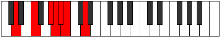
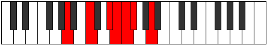

# Mode Ionogimic

## Links

- [Documentation](index.md)
- [Scales Index](Scales.md)
- [Modes Index](Modes.md)
- [Chords Index](Chords.md)

## Parent Scale

[Epynimic](ScaleEpynimic.md)

## Number

[969](https://ianring.com/musictheory/scales/969)

## Perfection

- 2 Perfect notes
- 4 Perfect notes

## Perfection Profile

[true false false false true false]

## Permutations

| Tonic | Notes | Signature | Illustration | Audio |
|-------|-------|-----------|--------------|-------|
| [C](ModeCNaturalIonogimic.md) | C, **D#**, **E##**, **F##**, G#, **A**, C | C |  | [midi](ModeCNaturalIonogimic.mid) [ogg](ModeCNaturalIonogimic.ogg) |
| [C#](ModeCSharpIonogimic.md) | C#, **D##**, **E###**, **F###**, G##, **A#**, C# | C |  | [midi](ModeCSharpIonogimic.mid) [ogg](ModeCSharpIonogimic.ogg) |
| [Db](ModeDFlatIonogimic.md) | Db, **E**, **F##**, **G#**, A, **Bb**, Db | C |  | [midi](ModeDFlatIonogimic.mid) [ogg](ModeDFlatIonogimic.ogg) |
| [D](ModeDNaturalIonogimic.md) | D, **E#**, **F###**, **G##**, A#, **B**, D | C |  | [midi](ModeDNaturalIonogimic.mid) [ogg](ModeDNaturalIonogimic.ogg) |
| [D#](ModeDSharpIonogimic.md) | D#, **E##**, **Cbbb**, **Cbb**, Dbbb, **Dbb**, D# | C |  | [midi](ModeDSharpIonogimic.mid) [ogg](ModeDSharpIonogimic.ogg) |
| [Eb](ModeEFlatIonogimic.md) | Eb, **F#**, **G##**, **A#**, B, **C**, Eb | C |  | [midi](ModeEFlatIonogimic.mid) [ogg](ModeEFlatIonogimic.ogg) |
| [E](ModeENaturalIonogimic.md) | E, **F##**, **G###**, **A##**, B#, **C#**, E | C |  | [midi](ModeENaturalIonogimic.mid) [ogg](ModeENaturalIonogimic.ogg) |
| [F](ModeFNaturalIonogimic.md) | F, **G#**, **A##**, **B#**, C#, **D**, F | C |  | [midi](ModeFNaturalIonogimic.mid) [ogg](ModeFNaturalIonogimic.ogg) |
| [F#](ModeFSharpIonogimic.md) | F#, **G##**, **A###**, **B##**, C##, **D#**, F# | C |  | [midi](ModeFSharpIonogimic.mid) [ogg](ModeFSharpIonogimic.ogg) |
| [Gb](ModeGFlatIonogimic.md) | Gb, **A**, **B#**, **C#**, D, **Eb**, Gb | C |  | [midi](ModeGFlatIonogimic.mid) [ogg](ModeGFlatIonogimic.ogg) |
| [G](ModeGNaturalIonogimic.md) | G, **A#**, **B##**, **C##**, D#, **E**, G | C |  | [midi](ModeGNaturalIonogimic.mid) [ogg](ModeGNaturalIonogimic.ogg) |
| [G#](ModeGSharpIonogimic.md) | G#, **A##**, **B###**, **C###**, D##, **E#**, G# | C |  | [midi](ModeGSharpIonogimic.mid) [ogg](ModeGSharpIonogimic.ogg) |
| [Ab](ModeAFlatIonogimic.md) | Ab, **B**, **C##**, **D#**, E, **F**, Ab | C |  | [midi](ModeAFlatIonogimic.mid) [ogg](ModeAFlatIonogimic.ogg) |
| [A](ModeANaturalIonogimic.md) | A, **B#**, **C###**, **D##**, E#, **F#**, A | C |  | [midi](ModeANaturalIonogimic.mid) [ogg](ModeANaturalIonogimic.ogg) |
| [A#](ModeASharpIonogimic.md) | A#, **B##**, **D##**, **E#**, F#, **G**, A# | C |  | [midi](ModeASharpIonogimic.mid) [ogg](ModeASharpIonogimic.ogg) |
| [Bb](ModeBFlatIonogimic.md) | Bb, **C#**, **D##**, **E#**, F#, **G**, Bb | C |  | [midi](ModeBFlatIonogimic.mid) [ogg](ModeBFlatIonogimic.ogg) |
| [B](ModeBNaturalIonogimic.md) | B, **C##**, **D###**, **E##**, F##, **G#**, B | C |  | [midi](ModeBNaturalIonogimic.mid) [ogg](ModeBNaturalIonogimic.ogg) |
