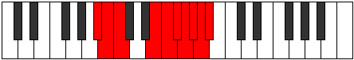

# Mode Ionogygic

## Links

- [Documentation](index.md)
- [Scales Index](Scales.md)
- [Modes Index](Modes.md)
- [Chords Index](Chords.md)

## Parent Scale

[Manygic](ScaleManygic.md)

## Number

[4039](https://ianring.com/musictheory/scales/4039)

## Perfection

- 6 Perfect notes
- 3 Perfect notes

## Perfection Profile

[true true true true true false false false true]

## Permutations

| Tonic | Notes | Signature | Illustration | Audio |
|-------|-------|-----------|--------------|-------|
| [C](ModeCNaturalIonogygic.md) | C, C#, D, F#, G, **G#**, **A**, **A#**, B, C | C |  | [midi](ModeCNaturalIonogygic.mid) [ogg](ModeCNaturalIonogygic.ogg) |
| [C#](ModeCSharpIonogygic.md) | C#, D, D#, G, G#, **A**, **A#**, **B**, C, C# | C |  | [midi](ModeCSharpIonogygic.mid) [ogg](ModeCSharpIonogygic.ogg) |
| [Db](ModeDFlatIonogygic.md) | Db, D, Eb, G, Ab, **A**, **Bb**, **B**, C, Db | C |  | [midi](ModeDFlatIonogygic.mid) [ogg](ModeDFlatIonogygic.ogg) |
| [D](ModeDNaturalIonogygic.md) | D, D#, E, G#, A, **A#**, **B**, **C**, C#, D | C |  | [midi](ModeDNaturalIonogygic.mid) [ogg](ModeDNaturalIonogygic.ogg) |
| [D#](ModeDSharpIonogygic.md) | D#, E, F, A, A#, **B**, **C**, **C#**, D, D# | C |  | [midi](ModeDSharpIonogygic.mid) [ogg](ModeDSharpIonogygic.ogg) |
| [Eb](ModeEFlatIonogygic.md) | Eb, E, F, A, Bb, **B**, **C**, **Db**, D, Eb | C |  | [midi](ModeEFlatIonogygic.mid) [ogg](ModeEFlatIonogygic.ogg) |
| [E](ModeENaturalIonogygic.md) | E, F, F#, A#, B, **C**, **C#**, **D**, D#, E | C |  | [midi](ModeENaturalIonogygic.mid) [ogg](ModeENaturalIonogygic.ogg) |
| [F](ModeFNaturalIonogygic.md) | F, F#, G, B, C, **C#**, **D**, **D#**, E, F | C |  | [midi](ModeFNaturalIonogygic.mid) [ogg](ModeFNaturalIonogygic.ogg) |
| [F#](ModeFSharpIonogygic.md) | F#, G, G#, C, C#, **D**, **D#**, **E**, F, F# | C |  | [midi](ModeFSharpIonogygic.mid) [ogg](ModeFSharpIonogygic.ogg) |
| [Gb](ModeGFlatIonogygic.md) | Gb, G, Ab, C, Db, **D**, **Eb**, **E**, F, Gb | C |  | [midi](ModeGFlatIonogygic.mid) [ogg](ModeGFlatIonogygic.ogg) |
| [G](ModeGNaturalIonogygic.md) | G, G#, A, C#, D, **D#**, **E**, **F**, F#, G | C |  | [midi](ModeGNaturalIonogygic.mid) [ogg](ModeGNaturalIonogygic.ogg) |
| [G#](ModeGSharpIonogygic.md) | G#, A, A#, D, D#, **E**, **F**, **F#**, G, G# | C |  | [midi](ModeGSharpIonogygic.mid) [ogg](ModeGSharpIonogygic.ogg) |
| [Ab](ModeAFlatIonogygic.md) | Ab, A, Bb, D, Eb, **E**, **F**, **Gb**, G, Ab | C |  | [midi](ModeAFlatIonogygic.mid) [ogg](ModeAFlatIonogygic.ogg) |
| [A](ModeANaturalIonogygic.md) | A, A#, B, D#, E, **F**, **F#**, **G**, G#, A | C |  | [midi](ModeANaturalIonogygic.mid) [ogg](ModeANaturalIonogygic.ogg) |
| [A#](ModeASharpIonogygic.md) | A#, B, C, E, F, **F#**, **G**, **G#**, A, A# | C |  | [midi](ModeASharpIonogygic.mid) [ogg](ModeASharpIonogygic.ogg) |
| [Bb](ModeBFlatIonogygic.md) | Bb, B, C, E, F, **Gb**, **G**, **Ab**, A, Bb | C |  | [midi](ModeBFlatIonogygic.mid) [ogg](ModeBFlatIonogygic.ogg) |
| [B](ModeBNaturalIonogygic.md) | B, C, C#, F, F#, **G**, **G#**, **A**, A#, B | C |  | [midi](ModeBNaturalIonogygic.mid) [ogg](ModeBNaturalIonogygic.ogg) |
