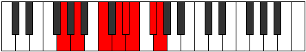

# Mode Ionolian

## Links

- [Documentation](index.md)
- [Scales Index](Scales.md)
- [Modes Index](Modes.md)
- [Chords Index](Chords.md)

## Parent Scale

[Rythian](ScaleRythian.md)

## Number

[2981](https://ianring.com/musictheory/scales/2981)

## Interval Pattern

2, 3, 2, 1, 1, 2, 1

## Chord Pattern

iii⁰, v⁰

## Perfection

- 4 Perfect notes
- 3 Perfect notes

## Perfection Profile

[true true true true false false false]

## Permutations

| Tonic | Notes | Signature | Illustration | Audio |
|-------|-------|-----------|--------------|-------|
| [C](ModeCNaturalIonolian.md) | C, D, E#, F##, **G#**, **A**, **B**, C | C |  | [midi](https://github.com/edipermadi/music/blob/main/docs/ModeCNaturalIonolian.mid?raw=true) |
| [C#](ModeCSharpIonolian.md) | C#, D#, E##, F###, **G##**, **A#**, **B#**, C# | C |  | [midi](https://github.com/edipermadi/music/blob/main/docs/ModeCSharpIonolian.mid?raw=true) |
| [Db](ModeDFlatIonolian.md) | Db, Eb, F#, G#, **A**, **Bb**, **C**, Db | C |  | [midi](https://github.com/edipermadi/music/blob/main/docs/ModeDFlatIonolian.mid?raw=true) |
| [D](ModeDNaturalIonolian.md) | D, E, F##, G##, **A#**, **B**, **C#**, D | C |  | [midi](https://github.com/edipermadi/music/blob/main/docs/ModeDNaturalIonolian.mid?raw=true) |
| [D#](ModeDSharpIonolian.md) | D#, E#, F###, G###, **A##**, **B#**, **C##**, D# | C |  | [midi](https://github.com/edipermadi/music/blob/main/docs/ModeDSharpIonolian.mid?raw=true) |
| [Eb](ModeEFlatIonolian.md) | Eb, F, G#, A#, **B**, **C**, **D**, Eb | C |  | [midi](https://github.com/edipermadi/music/blob/main/docs/ModeEFlatIonolian.mid?raw=true) |
| [E](ModeENaturalIonolian.md) | E, F#, G##, A##, **B#**, **C#**, **D#**, E | C |  | [midi](https://github.com/edipermadi/music/blob/main/docs/ModeENaturalIonolian.mid?raw=true) |
| [F](ModeFNaturalIonolian.md) | F, G, A#, B#, **C#**, **D**, **E**, F | C |  | [midi](https://github.com/edipermadi/music/blob/main/docs/ModeFNaturalIonolian.mid?raw=true) |
| [F#](ModeFSharpIonolian.md) | F#, G#, A##, B##, **C##**, **D#**, **E#**, F# | C |  | [midi](https://github.com/edipermadi/music/blob/main/docs/ModeFSharpIonolian.mid?raw=true) |
| [Gb](ModeGFlatIonolian.md) | Gb, Ab, B, C#, **D**, **Eb**, **F**, Gb | C |  | [midi](https://github.com/edipermadi/music/blob/main/docs/ModeGFlatIonolian.mid?raw=true) |
| [G](ModeGNaturalIonolian.md) | G, A, B#, C##, **D#**, **E**, **F#**, G | C |  | [midi](https://github.com/edipermadi/music/blob/main/docs/ModeGNaturalIonolian.mid?raw=true) |
| [G#](ModeGSharpIonolian.md) | G#, A#, B##, C###, **D##**, **E#**, **F##**, G# | C |  | [midi](https://github.com/edipermadi/music/blob/main/docs/ModeGSharpIonolian.mid?raw=true) |
| [Ab](ModeAFlatIonolian.md) | Ab, Bb, C#, D#, **E**, **F**, **G**, Ab | C |  | [midi](https://github.com/edipermadi/music/blob/main/docs/ModeAFlatIonolian.mid?raw=true) |
| [A](ModeANaturalIonolian.md) | A, B, C##, D##, **E#**, **F#**, **G#**, A | C |  | [midi](https://github.com/edipermadi/music/blob/main/docs/ModeANaturalIonolian.mid?raw=true) |
| [A#](ModeASharpIonolian.md) | A#, B#, C###, D###, **E##**, **F##**, **G##**, A# | C |  | [midi](https://github.com/edipermadi/music/blob/main/docs/ModeASharpIonolian.mid?raw=true) |
| [Bb](ModeBFlatIonolian.md) | Bb, C, D#, E#, **F#**, **G**, **A**, Bb | C |  | [midi](https://github.com/edipermadi/music/blob/main/docs/ModeBFlatIonolian.mid?raw=true) |
| [B](ModeBNaturalIonolian.md) | B, C#, D##, E##, **F##**, **G#**, **A#**, B | C |  | [midi](https://github.com/edipermadi/music/blob/main/docs/ModeBNaturalIonolian.mid?raw=true) |
