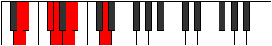

# Mode Ionolimic

## Links

- [Documentation](index.md)
- [Scales Index](Scales.md)
- [Modes Index](Modes.md)
- [Chords Index](Chords.md)

## Parent Scale

[Solimic](ScaleSolimic.md)

## Number

[435](https://ianring.com/musictheory/scales/435)

## Perfection

- 3 Perfect notes
- 3 Perfect notes

## Interval Pattern

1, 3, 1, 2, 1, 4

## Perfection Profile

[true true false true false false]

## Permutations

| Tonic | Notes | Signature | Illustration | Audio |
|-------|-------|-----------|--------------|-------|
| [C](ModeCNaturalIonolimic.md) | C, Db, **E**, F, **G**, **Ab**, C | C |  | [midi](https://github.com/edipermadi/music/blob/main/docs/ModeCNaturalIonolimic.mid?raw=true) |
| [C#](ModeCSharpIonolimic.md) | C#, D, **E#**, F#, **G#**, **A**, C# | C |  | [midi](https://github.com/edipermadi/music/blob/main/docs/ModeCSharpIonolimic.mid?raw=true) |
| [Db](ModeDFlatIonolimic.md) | Db, Ebb, **F**, Gb, **Ab**, **Bbb**, Db | C |  | [midi](https://github.com/edipermadi/music/blob/main/docs/ModeDFlatIonolimic.mid?raw=true) |
| [D](ModeDNaturalIonolimic.md) | D, Eb, **F#**, G, **A**, **Bb**, D | C |  | [midi](https://github.com/edipermadi/music/blob/main/docs/ModeDNaturalIonolimic.mid?raw=true) |
| [D#](ModeDSharpIonolimic.md) | D#, E, **F##**, G#, **A#**, **B**, D# | C |  | [midi](https://github.com/edipermadi/music/blob/main/docs/ModeDSharpIonolimic.mid?raw=true) |
| [Eb](ModeEFlatIonolimic.md) | Eb, Fb, **G**, Ab, **Bb**, **Cb**, Eb | C |  | [midi](https://github.com/edipermadi/music/blob/main/docs/ModeEFlatIonolimic.mid?raw=true) |
| [E](ModeENaturalIonolimic.md) | E, F, **G#**, A, **B**, **C**, E | C |  | [midi](https://github.com/edipermadi/music/blob/main/docs/ModeENaturalIonolimic.mid?raw=true) |
| [F](ModeFNaturalIonolimic.md) | F, Gb, **A**, Bb, **C**, **Db**, F | C |  | [midi](https://github.com/edipermadi/music/blob/main/docs/ModeFNaturalIonolimic.mid?raw=true) |
| [F#](ModeFSharpIonolimic.md) | F#, G, **A#**, B, **C#**, **D**, F# | C |  | [midi](https://github.com/edipermadi/music/blob/main/docs/ModeFSharpIonolimic.mid?raw=true) |
| [Gb](ModeGFlatIonolimic.md) | Gb, Abb, **Bb**, Cb, **Db**, **Ebb**, Gb | C |  | [midi](https://github.com/edipermadi/music/blob/main/docs/ModeGFlatIonolimic.mid?raw=true) |
| [G](ModeGNaturalIonolimic.md) | G, Ab, **B**, C, **D**, **Eb**, G | C |  | [midi](https://github.com/edipermadi/music/blob/main/docs/ModeGNaturalIonolimic.mid?raw=true) |
| [G#](ModeGSharpIonolimic.md) | G#, A, **B#**, C#, **D#**, **E**, G# | C |  | [midi](https://github.com/edipermadi/music/blob/main/docs/ModeGSharpIonolimic.mid?raw=true) |
| [Ab](ModeAFlatIonolimic.md) | Ab, Bbb, **C**, Db, **Eb**, **Fb**, Ab | C |  | [midi](https://github.com/edipermadi/music/blob/main/docs/ModeAFlatIonolimic.mid?raw=true) |
| [A](ModeANaturalIonolimic.md) | A, Bb, **C#**, D, **E**, **F**, A | C |  | [midi](https://github.com/edipermadi/music/blob/main/docs/ModeANaturalIonolimic.mid?raw=true) |
| [A#](ModeASharpIonolimic.md) | A#, B, **C##**, D#, **E#**, **F#**, A# | C |  | [midi](https://github.com/edipermadi/music/blob/main/docs/ModeASharpIonolimic.mid?raw=true) |
| [Bb](ModeBFlatIonolimic.md) | Bb, Cb, **D**, Eb, **F**, **Gb**, Bb | C |  | [midi](https://github.com/edipermadi/music/blob/main/docs/ModeBFlatIonolimic.mid?raw=true) |
| [B](ModeBNaturalIonolimic.md) | B, C, **D#**, E, **F#**, **G**, B | C |  | [midi](https://github.com/edipermadi/music/blob/main/docs/ModeBNaturalIonolimic.mid?raw=true) |
