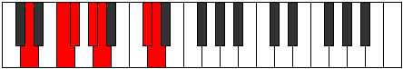

# Mode Ionophimic

## Links

- [Documentation](README.md)
- [Scales Index](Scales.md)
- [Modes Index](Modes.md)
- [Chords Index](Chords.md)

## Parent Scale

[Solimic](ScaleSolimic.md)

## Number

[2265](https://ianring.com/musictheory/scales/2265)

## Luminosity

-1

## Transposition

3, 1, 2, 1, 4, 1

## Chord Pattern

I, VI

## Perfection

- 3 Perfect notes
- 3 Perfect notes

## Perfection Profile

true, false, true, false, false, true

## Permutations

| Tonic | Notes | Signature | Illustration | Audio |
|-------|-------|-----------|--------------|-------|
| [C](ModeCNaturalIonophimic.md) | C, **D#**, E, **F#**, **G**, A##, C | C |  | [midi](https://github.com/edipermadi/music/blob/main/docs/ModeCNaturalIonophimic.mid?raw=true) |
| [C#](ModeCSharpIonophimic.md) | C#, **D##**, E#, **F##**, **G#**, A###, C# | C |  | [midi](https://github.com/edipermadi/music/blob/main/docs/ModeCSharpIonophimic.mid?raw=true) |
| [Db](ModeDFlatIonophimic.md) | Db, **E**, F, **G**, **Ab**, B#, Db | C |  | [midi](https://github.com/edipermadi/music/blob/main/docs/ModeDFlatIonophimic.mid?raw=true) |
| [D](ModeDNaturalIonophimic.md) | D, **E#**, F#, **G#**, **A**, B##, D | C |  | [midi](https://github.com/edipermadi/music/blob/main/docs/ModeDNaturalIonophimic.mid?raw=true) |
| [D#](ModeDSharpIonophimic.md) | D#, **E##**, F##, **G##**, **A#**, B###, D# | C |  | [midi](https://github.com/edipermadi/music/blob/main/docs/ModeDSharpIonophimic.mid?raw=true) |
| [Eb](ModeEFlatIonophimic.md) | Eb, **F#**, G, **A**, **Bb**, C##, Eb | C |  | [midi](https://github.com/edipermadi/music/blob/main/docs/ModeEFlatIonophimic.mid?raw=true) |
| [E](ModeENaturalIonophimic.md) | E, **F##**, G#, **A#**, **B**, C###, E | C |  | [midi](https://github.com/edipermadi/music/blob/main/docs/ModeENaturalIonophimic.mid?raw=true) |
| [F](ModeFNaturalIonophimic.md) | F, **G#**, A, **B**, **C**, D##, F | C |  | [midi](https://github.com/edipermadi/music/blob/main/docs/ModeFNaturalIonophimic.mid?raw=true) |
| [F#](ModeFSharpIonophimic.md) | F#, **G##**, A#, **B#**, **C#**, D###, F# | C |  | [midi](https://github.com/edipermadi/music/blob/main/docs/ModeFSharpIonophimic.mid?raw=true) |
| [Gb](ModeGFlatIonophimic.md) | Gb, **A**, Bb, **C**, **Db**, E#, Gb | C |  | [midi](https://github.com/edipermadi/music/blob/main/docs/ModeGFlatIonophimic.mid?raw=true) |
| [G](ModeGNaturalIonophimic.md) | G, **A#**, B, **C#**, **D**, E##, G | C |  | [midi](https://github.com/edipermadi/music/blob/main/docs/ModeGNaturalIonophimic.mid?raw=true) |
| [G#](ModeGSharpIonophimic.md) | G#, **A##**, B#, **C##**, **D#**, E###, G# | C |  | [midi](https://github.com/edipermadi/music/blob/main/docs/ModeGSharpIonophimic.mid?raw=true) |
| [Ab](ModeAFlatIonophimic.md) | Ab, **B**, C, **D**, **Eb**, F##, Ab | C |  | [midi](https://github.com/edipermadi/music/blob/main/docs/ModeAFlatIonophimic.mid?raw=true) |
| [A](ModeANaturalIonophimic.md) | A, **B#**, C#, **D#**, **E**, F###, A | C |  | [midi](https://github.com/edipermadi/music/blob/main/docs/ModeANaturalIonophimic.mid?raw=true) |
| [A#](ModeASharpIonophimic.md) | A#, **B##**, C##, **D##**, **E#**, Cbbb, A# | C |  | [midi](https://github.com/edipermadi/music/blob/main/docs/ModeASharpIonophimic.mid?raw=true) |
| [Bb](ModeBFlatIonophimic.md) | Bb, **C#**, D, **E**, **F**, G##, Bb | C |  | [midi](https://github.com/edipermadi/music/blob/main/docs/ModeBFlatIonophimic.mid?raw=true) |
| [B](ModeBNaturalIonophimic.md) | B, **C##**, D#, **E#**, **F#**, G###, B | C |  | [midi](https://github.com/edipermadi/music/blob/main/docs/ModeBNaturalIonophimic.mid?raw=true) |
