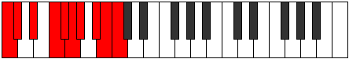

# Mode Ionoptygic

## Links

- [Documentation](index.md)
- [Scales Index](Scales.md)
- [Modes Index](Modes.md)
- [Chords Index](Chords.md)

## Parent Scale

[Aerycrygic](ScaleAerycrygic.md)

## Number

[3563](https://ianring.com/musictheory/scales/3563)

## Perfection

- 8 Perfect notes
- 1 Perfect notes

## Perfection Profile

[true true true true true false true true true]

## Permutations

| Tonic | Notes | Signature | Illustration | Audio |
|-------|-------|-----------|--------------|-------|
| [C](ModeCNaturalIonoptygic.md) | C, C#, D#, F, F#, **G**, G#, A#, B, C | C |  | [midi](ModeCNaturalIonoptygic.mid) [ogg](ModeCNaturalIonoptygic.ogg) |
| [C#](ModeCSharpIonoptygic.md) | C#, D, E, F#, G, **G#**, A, B, C, C# | C |  | [midi](ModeCSharpIonoptygic.mid) [ogg](ModeCSharpIonoptygic.ogg) |
| [Db](ModeDFlatIonoptygic.md) | Db, D, E, Gb, G, **Ab**, A, B, C, Db | C |  | [midi](ModeDFlatIonoptygic.mid) [ogg](ModeDFlatIonoptygic.ogg) |
| [D](ModeDNaturalIonoptygic.md) | D, D#, F, G, G#, **A**, A#, C, C#, D | C |  | [midi](ModeDNaturalIonoptygic.mid) [ogg](ModeDNaturalIonoptygic.ogg) |
| [D#](ModeDSharpIonoptygic.md) | D#, E, F#, G#, A, **A#**, B, C#, D, D# | C |  | [midi](ModeDSharpIonoptygic.mid) [ogg](ModeDSharpIonoptygic.ogg) |
| [Eb](ModeEFlatIonoptygic.md) | Eb, E, Gb, Ab, A, **Bb**, B, Db, D, Eb | C |  | [midi](ModeEFlatIonoptygic.mid) [ogg](ModeEFlatIonoptygic.ogg) |
| [E](ModeENaturalIonoptygic.md) | E, F, G, A, A#, **B**, C, D, D#, E | C |  | [midi](ModeENaturalIonoptygic.mid) [ogg](ModeENaturalIonoptygic.ogg) |
| [F](ModeFNaturalIonoptygic.md) | F, F#, G#, A#, B, **C**, C#, D#, E, F | C |  | [midi](ModeFNaturalIonoptygic.mid) [ogg](ModeFNaturalIonoptygic.ogg) |
| [F#](ModeFSharpIonoptygic.md) | F#, G, A, B, C, **C#**, D, E, F, F# | C |  | [midi](ModeFSharpIonoptygic.mid) [ogg](ModeFSharpIonoptygic.ogg) |
| [Gb](ModeGFlatIonoptygic.md) | Gb, G, A, B, C, **Db**, D, E, F, Gb | C |  | [midi](ModeGFlatIonoptygic.mid) [ogg](ModeGFlatIonoptygic.ogg) |
| [G](ModeGNaturalIonoptygic.md) | G, G#, A#, C, C#, **D**, D#, F, F#, G | C |  | [midi](ModeGNaturalIonoptygic.mid) [ogg](ModeGNaturalIonoptygic.ogg) |
| [G#](ModeGSharpIonoptygic.md) | G#, A, B, C#, D, **D#**, E, F#, G, G# | C |  | [midi](ModeGSharpIonoptygic.mid) [ogg](ModeGSharpIonoptygic.ogg) |
| [Ab](ModeAFlatIonoptygic.md) | Ab, A, B, Db, D, **Eb**, E, Gb, G, Ab | C |  | [midi](ModeAFlatIonoptygic.mid) [ogg](ModeAFlatIonoptygic.ogg) |
| [A](ModeANaturalIonoptygic.md) | A, A#, C, D, D#, **E**, F, G, G#, A | C |  | [midi](ModeANaturalIonoptygic.mid) [ogg](ModeANaturalIonoptygic.ogg) |
| [A#](ModeASharpIonoptygic.md) | A#, B, C#, D#, E, **F**, F#, G#, A, A# | C |  | [midi](ModeASharpIonoptygic.mid) [ogg](ModeASharpIonoptygic.ogg) |
| [Bb](ModeBFlatIonoptygic.md) | Bb, B, Db, Eb, E, **F**, Gb, Ab, A, Bb | C |  | [midi](ModeBFlatIonoptygic.mid) [ogg](ModeBFlatIonoptygic.ogg) |
| [B](ModeBNaturalIonoptygic.md) | B, C, D, E, F, **F#**, G, A, A#, B | C |  | [midi](ModeBNaturalIonoptygic.mid) [ogg](ModeBNaturalIonoptygic.ogg) |
