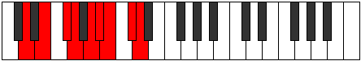

# Mode Ionoptyllic

## Links

- [Documentation](index.md)
- [Scales Index](Scales.md)
- [Modes Index](Modes.md)
- [Chords Index](Chords.md)

## Parent Scale

[Ionoptyllic](ScaleIonoptyllic.md)

## Number

[2997](https://ianring.com/musictheory/scales/2997)

## Perfection

- 6 Perfect notes
- 2 Perfect notes

## Perfection Profile

[true true true true true false true false]

## Permutations

| Tonic | Notes | Signature | Illustration | Audio |
|-------|-------|-----------|--------------|-------|
| [C](ModeCNaturalIonoptyllic.md) | C, D, E, F, G, **G#**, A, **B**, C | C |  | [midi](https://github.com/edipermadi/music/blob/main/docs/ModeCNaturalIonoptyllic.mid?raw=true) |
| [C#](ModeCSharpIonoptyllic.md) | C#, D#, F, F#, G#, **A**, A#, **C**, C# | C |  | [midi](https://github.com/edipermadi/music/blob/main/docs/ModeCSharpIonoptyllic.mid?raw=true) |
| [Db](ModeDFlatIonoptyllic.md) | Db, Eb, F, Gb, Ab, **A**, Bb, **C**, Db | C |  | [midi](https://github.com/edipermadi/music/blob/main/docs/ModeDFlatIonoptyllic.mid?raw=true) |
| [D](ModeDNaturalIonoptyllic.md) | D, E, F#, G, A, **A#**, B, **C#**, D | C |  | [midi](https://github.com/edipermadi/music/blob/main/docs/ModeDNaturalIonoptyllic.mid?raw=true) |
| [D#](ModeDSharpIonoptyllic.md) | D#, F, G, G#, A#, **B**, C, **D**, D# | C |  | [midi](https://github.com/edipermadi/music/blob/main/docs/ModeDSharpIonoptyllic.mid?raw=true) |
| [Eb](ModeEFlatIonoptyllic.md) | Eb, F, G, Ab, Bb, **B**, C, **D**, Eb | C |  | [midi](https://github.com/edipermadi/music/blob/main/docs/ModeEFlatIonoptyllic.mid?raw=true) |
| [E](ModeENaturalIonoptyllic.md) | E, F#, G#, A, B, **C**, C#, **D#**, E | C |  | [midi](https://github.com/edipermadi/music/blob/main/docs/ModeENaturalIonoptyllic.mid?raw=true) |
| [F](ModeFNaturalIonoptyllic.md) | F, G, A, A#, C, **C#**, D, **E**, F | C |  | [midi](https://github.com/edipermadi/music/blob/main/docs/ModeFNaturalIonoptyllic.mid?raw=true) |
| [F#](ModeFSharpIonoptyllic.md) | F#, G#, A#, B, C#, **D**, D#, **F**, F# | C |  | [midi](https://github.com/edipermadi/music/blob/main/docs/ModeFSharpIonoptyllic.mid?raw=true) |
| [Gb](ModeGFlatIonoptyllic.md) | Gb, Ab, Bb, B, Db, **D**, Eb, **F**, Gb | C |  | [midi](https://github.com/edipermadi/music/blob/main/docs/ModeGFlatIonoptyllic.mid?raw=true) |
| [G](ModeGNaturalIonoptyllic.md) | G, A, B, C, D, **D#**, E, **F#**, G | C |  | [midi](https://github.com/edipermadi/music/blob/main/docs/ModeGNaturalIonoptyllic.mid?raw=true) |
| [G#](ModeGSharpIonoptyllic.md) | G#, A#, C, C#, D#, **E**, F, **G**, G# | C |  | [midi](https://github.com/edipermadi/music/blob/main/docs/ModeGSharpIonoptyllic.mid?raw=true) |
| [Ab](ModeAFlatIonoptyllic.md) | Ab, Bb, C, Db, Eb, **E**, F, **G**, Ab | C |  | [midi](https://github.com/edipermadi/music/blob/main/docs/ModeAFlatIonoptyllic.mid?raw=true) |
| [A](ModeANaturalIonoptyllic.md) | A, B, C#, D, E, **F**, F#, **G#**, A | C |  | [midi](https://github.com/edipermadi/music/blob/main/docs/ModeANaturalIonoptyllic.mid?raw=true) |
| [A#](ModeASharpIonoptyllic.md) | A#, C, D, D#, F, **F#**, G, **A**, A# | C |  | [midi](https://github.com/edipermadi/music/blob/main/docs/ModeASharpIonoptyllic.mid?raw=true) |
| [Bb](ModeBFlatIonoptyllic.md) | Bb, C, D, Eb, F, **Gb**, G, **A**, Bb | C |  | [midi](https://github.com/edipermadi/music/blob/main/docs/ModeBFlatIonoptyllic.mid?raw=true) |
| [B](ModeBNaturalIonoptyllic.md) | B, C#, D#, E, F#, **G**, G#, **A#**, B | C |  | [midi](https://github.com/edipermadi/music/blob/main/docs/ModeBNaturalIonoptyllic.mid?raw=true) |
