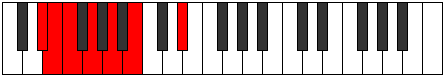
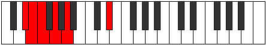
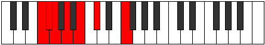
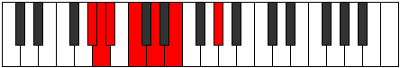

# Mode Ionorimic

## Links

- [Documentation](index.md)
- [Scales Index](Scales.md)
- [Modes Index](Modes.md)
- [Chords Index](Chords.md)

## Parent Scale

[Mycrimic](ScaleMycrimic.md)

## Number

[343](https://ianring.com/musictheory/scales/343)

## Perfection

- 2 Perfect notes
- 4 Perfect notes

## Perfection Profile

[false true false false true false]

## Permutations

| Tonic | Notes | Signature | Illustration | Audio |
|-------|-------|-----------|--------------|-------|
| [C](ModeCNaturalIonorimic.md) | **C**, Db, **Ebb**, **Fb**, Gb, **Ab**, **C** | C |  | [midi](https://github.com/edipermadi/music/blob/main/docs/ModeCNaturalIonorimic.mid?raw=true) |
| [C#](ModeCSharpIonorimic.md) | **C#**, D, **Eb**, **F**, G, **A**, **C#** | C |  | [midi](https://github.com/edipermadi/music/blob/main/docs/ModeCSharpIonorimic.mid?raw=true) |
| [Db](ModeDFlatIonorimic.md) | **Db**, Ebb, **Fbb**, **Gbb**, Abb, **Bbb**, **Db** | C |  | [midi](https://github.com/edipermadi/music/blob/main/docs/ModeDFlatIonorimic.mid?raw=true) |
| [D](ModeDNaturalIonorimic.md) | **D**, Eb, **Fb**, **Gb**, Ab, **Bb**, **D** | C |  | [midi](https://github.com/edipermadi/music/blob/main/docs/ModeDNaturalIonorimic.mid?raw=true) |
| [D#](ModeDSharpIonorimic.md) | **D#**, E, **F**, **G**, A, **B**, **D#** | C |  | [midi](https://github.com/edipermadi/music/blob/main/docs/ModeDSharpIonorimic.mid?raw=true) |
| [Eb](ModeEFlatIonorimic.md) | **Eb**, Fb, **Gbb**, **Abb**, Bbb, **Cb**, **Eb** | C |  | [midi](https://github.com/edipermadi/music/blob/main/docs/ModeEFlatIonorimic.mid?raw=true) |
| [E](ModeENaturalIonorimic.md) | **E**, F, **Gb**, **Ab**, Bb, **C**, **E** | C |  | [midi](https://github.com/edipermadi/music/blob/main/docs/ModeENaturalIonorimic.mid?raw=true) |
| [F](ModeFNaturalIonorimic.md) | **F**, Gb, **Abb**, **Bbb**, Cb, **Db**, **F** | C |  | [midi](https://github.com/edipermadi/music/blob/main/docs/ModeFNaturalIonorimic.mid?raw=true) |
| [F#](ModeFSharpIonorimic.md) | **F#**, G, **Ab**, **Bb**, C, **D**, **F#** | C |  | [midi](https://github.com/edipermadi/music/blob/main/docs/ModeFSharpIonorimic.mid?raw=true) |
| [Gb](ModeGFlatIonorimic.md) | **Gb**, Abb, **Bbbb**, **Cbb**, Dbb, **Ebb**, **Gb** | C |  | [midi](https://github.com/edipermadi/music/blob/main/docs/ModeGFlatIonorimic.mid?raw=true) |
| [G](ModeGNaturalIonorimic.md) | **G**, Ab, **Bbb**, **Cb**, Db, **Eb**, **G** | C |  | [midi](https://github.com/edipermadi/music/blob/main/docs/ModeGNaturalIonorimic.mid?raw=true) |
| [G#](ModeGSharpIonorimic.md) | **G#**, A, **Bb**, **C**, D, **E**, **G#** | C |  | [midi](https://github.com/edipermadi/music/blob/main/docs/ModeGSharpIonorimic.mid?raw=true) |
| [Ab](ModeAFlatIonorimic.md) | **Ab**, Bbb, **Cbb**, **Dbb**, Ebb, **Fb**, **Ab** | C |  | [midi](https://github.com/edipermadi/music/blob/main/docs/ModeAFlatIonorimic.mid?raw=true) |
| [A](ModeANaturalIonorimic.md) | **A**, Bb, **Cb**, **Db**, Eb, **F**, **A** | C |  | [midi](https://github.com/edipermadi/music/blob/main/docs/ModeANaturalIonorimic.mid?raw=true) |
| [A#](ModeASharpIonorimic.md) | **A#**, B, **C**, **D**, E, **F#**, **A#** | C |  | [midi](https://github.com/edipermadi/music/blob/main/docs/ModeASharpIonorimic.mid?raw=true) |
| [Bb](ModeBFlatIonorimic.md) | **Bb**, Cb, **Dbb**, **Ebb**, Fb, **Gb**, **Bb** | C |  | [midi](https://github.com/edipermadi/music/blob/main/docs/ModeBFlatIonorimic.mid?raw=true) |
| [B](ModeBNaturalIonorimic.md) | **B**, C, **Db**, **Eb**, F, **G**, **B** | C |  | [midi](https://github.com/edipermadi/music/blob/main/docs/ModeBNaturalIonorimic.mid?raw=true) |
