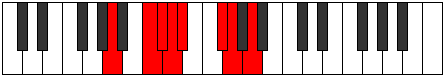

# Mode Ionothian

## Links

- [Documentation](index.md)
- [Scales Index](Scales.md)
- [Modes Index](Modes.md)
- [Chords Index](Chords.md)

## Parent Scale

[Ranian](ScaleRanian.md)

## Number

[1657](https://ianring.com/musictheory/scales/1657)

## Perfection

- 4 Perfect notes
- 3 Perfect notes

## Perfection Profile

[false true false true false true true]

## Permutations

| Tonic | Notes | Signature | Illustration | Audio |
|-------|-------|-----------|--------------|-------|
| [C](ModeCNaturalIonothian.md) | **C**, D#, **E**, F, **Gb**, A, Bb, **C** | C |  | [midi](ModeCNaturalIonothian.mid) [ogg](ModeCNaturalIonothian.ogg) |
| [C#](ModeCSharpIonothian.md) | **C#**, D##, **E#**, F#, **G**, A#, B, **C#** | C |  | [midi](ModeCSharpIonothian.mid) [ogg](ModeCSharpIonothian.ogg) |
| [Db](ModeDFlatIonothian.md) | **Db**, E, **F**, Gb, **Abb**, Bb, Cb, **Db** | C |  | [midi](ModeDFlatIonothian.mid) [ogg](ModeDFlatIonothian.ogg) |
| [D](ModeDNaturalIonothian.md) | **D**, E#, **F#**, G, **Ab**, B, C, **D** | C |  | [midi](ModeDNaturalIonothian.mid) [ogg](ModeDNaturalIonothian.ogg) |
| [D#](ModeDSharpIonothian.md) | **D#**, E##, **F##**, G#, **A**, B#, C#, **D#** | C |  | [midi](ModeDSharpIonothian.mid) [ogg](ModeDSharpIonothian.ogg) |
| [Eb](ModeEFlatIonothian.md) | **Eb**, F#, **G**, Ab, **Bbb**, C, Db, **Eb** | C |  | [midi](ModeEFlatIonothian.mid) [ogg](ModeEFlatIonothian.ogg) |
| [E](ModeENaturalIonothian.md) | **E**, F##, **G#**, A, **Bb**, C#, D, **E** | C |  | [midi](ModeENaturalIonothian.mid) [ogg](ModeENaturalIonothian.ogg) |
| [F](ModeFNaturalIonothian.md) | **F**, G#, **A**, Bb, **Cb**, D, Eb, **F** | C |  | [midi](ModeFNaturalIonothian.mid) [ogg](ModeFNaturalIonothian.ogg) |
| [F#](ModeFSharpIonothian.md) | **F#**, G##, **A#**, B, **C**, D#, E, **F#** | C |  | [midi](ModeFSharpIonothian.mid) [ogg](ModeFSharpIonothian.ogg) |
| [Gb](ModeGFlatIonothian.md) | **Gb**, A, **Bb**, Cb, **Dbb**, Eb, Fb, **Gb** | C |  | [midi](ModeGFlatIonothian.mid) [ogg](ModeGFlatIonothian.ogg) |
| [G](ModeGNaturalIonothian.md) | **G**, A#, **B**, C, **Db**, E, F, **G** | C |  | [midi](ModeGNaturalIonothian.mid) [ogg](ModeGNaturalIonothian.ogg) |
| [G#](ModeGSharpIonothian.md) | **G#**, A##, **B#**, C#, **D**, E#, F#, **G#** | C |  | [midi](ModeGSharpIonothian.mid) [ogg](ModeGSharpIonothian.ogg) |
| [Ab](ModeAFlatIonothian.md) | **Ab**, B, **C**, Db, **Ebb**, F, Gb, **Ab** | C |  | [midi](ModeAFlatIonothian.mid) [ogg](ModeAFlatIonothian.ogg) |
| [A](ModeANaturalIonothian.md) | **A**, B#, **C#**, D, **Eb**, F#, G, **A** | C |  | [midi](ModeANaturalIonothian.mid) [ogg](ModeANaturalIonothian.ogg) |
| [A#](ModeASharpIonothian.md) | **A#**, B##, **C##**, D#, **E**, F##, G#, **A#** | C |  | [midi](ModeASharpIonothian.mid) [ogg](ModeASharpIonothian.ogg) |
| [Bb](ModeBFlatIonothian.md) | **Bb**, C#, **D**, Eb, **Fb**, G, Ab, **Bb** | C |  | [midi](ModeBFlatIonothian.mid) [ogg](ModeBFlatIonothian.ogg) |
| [B](ModeBNaturalIonothian.md) | **B**, C##, **D#**, E, **F**, G#, A, **B** | C |  | [midi](ModeBNaturalIonothian.mid) [ogg](ModeBNaturalIonothian.ogg) |
