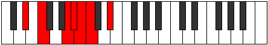

# Mode Ionothimic

## Links

- [Documentation](index.md)
- [Scales Index](Scales.md)
- [Modes Index](Modes.md)
- [Chords Index](Chords.md)

## Parent Scale

[Pynimic](ScalePynimic.md)

## Number

[965](https://ianring.com/musictheory/scales/965)

## Perfection

- 3 Perfect notes
- 3 Perfect notes

## Perfection Profile

[true true false true false false]

## Permutations

| Tonic | Notes | Signature | Illustration | Audio |
|-------|-------|-----------|--------------|-------|
| [C](ModeCNaturalIonothimic.md) | C, D, **E##**, F##, **G#**, **A**, C | C |  | [midi](ModeCNaturalIonothimic.mid) [ogg](ModeCNaturalIonothimic.ogg) |
| [C#](ModeCSharpIonothimic.md) | C#, D#, **E###**, F###, **G##**, **A#**, C# | C |  | [midi](ModeCSharpIonothimic.mid) [ogg](ModeCSharpIonothimic.ogg) |
| [Db](ModeDFlatIonothimic.md) | Db, Eb, **F##**, G#, **A**, **Bb**, Db | C |  | [midi](ModeDFlatIonothimic.mid) [ogg](ModeDFlatIonothimic.ogg) |
| [D](ModeDNaturalIonothimic.md) | D, E, **F###**, G##, **A#**, **B**, D | C |  | [midi](ModeDNaturalIonothimic.mid) [ogg](ModeDNaturalIonothimic.ogg) |
| [D#](ModeDSharpIonothimic.md) | D#, E#, **Cbbb**, Cbb, **Dbbb**, **Dbb**, D# | C |  | [midi](ModeDSharpIonothimic.mid) [ogg](ModeDSharpIonothimic.ogg) |
| [Eb](ModeEFlatIonothimic.md) | Eb, F, **G##**, A#, **B**, **C**, Eb | C |  | [midi](ModeEFlatIonothimic.mid) [ogg](ModeEFlatIonothimic.ogg) |
| [E](ModeENaturalIonothimic.md) | E, F#, **G###**, A##, **B#**, **C#**, E | C |  | [midi](ModeENaturalIonothimic.mid) [ogg](ModeENaturalIonothimic.ogg) |
| [F](ModeFNaturalIonothimic.md) | F, G, **A##**, B#, **C#**, **D**, F | C |  | [midi](ModeFNaturalIonothimic.mid) [ogg](ModeFNaturalIonothimic.ogg) |
| [F#](ModeFSharpIonothimic.md) | F#, G#, **A###**, B##, **C##**, **D#**, F# | C |  | [midi](ModeFSharpIonothimic.mid) [ogg](ModeFSharpIonothimic.ogg) |
| [Gb](ModeGFlatIonothimic.md) | Gb, Ab, **B#**, C#, **D**, **Eb**, Gb | C |  | [midi](ModeGFlatIonothimic.mid) [ogg](ModeGFlatIonothimic.ogg) |
| [G](ModeGNaturalIonothimic.md) | G, A, **B##**, C##, **D#**, **E**, G | C |  | [midi](ModeGNaturalIonothimic.mid) [ogg](ModeGNaturalIonothimic.ogg) |
| [G#](ModeGSharpIonothimic.md) | G#, A#, **B###**, C###, **D##**, **E#**, G# | C |  | [midi](ModeGSharpIonothimic.mid) [ogg](ModeGSharpIonothimic.ogg) |
| [Ab](ModeAFlatIonothimic.md) | Ab, Bb, **C##**, D#, **E**, **F**, Ab | C |  | [midi](ModeAFlatIonothimic.mid) [ogg](ModeAFlatIonothimic.ogg) |
| [A](ModeANaturalIonothimic.md) | A, B, **C###**, D##, **E#**, **F#**, A | C |  | [midi](ModeANaturalIonothimic.mid) [ogg](ModeANaturalIonothimic.ogg) |
| [A#](ModeASharpIonothimic.md) | A#, B#, **D##**, E#, **F#**, **G**, A# | C |  | [midi](ModeASharpIonothimic.mid) [ogg](ModeASharpIonothimic.ogg) |
| [Bb](ModeBFlatIonothimic.md) | Bb, C, **D##**, E#, **F#**, **G**, Bb | C |  | [midi](ModeBFlatIonothimic.mid) [ogg](ModeBFlatIonothimic.ogg) |
| [B](ModeBNaturalIonothimic.md) | B, C#, **D###**, E##, **F##**, **G#**, B | C |  | [midi](ModeBNaturalIonothimic.mid) [ogg](ModeBNaturalIonothimic.ogg) |
