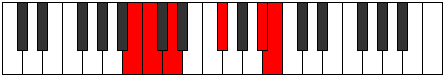

# Mode Ionothitonic

## Links

- [Documentation](index.md)
- [Scales Index](Scales.md)
- [Modes Index](Modes.md)
- [Chords Index](Chords.md)

## Parent Scale

[Ranitonic](ScaleRanitonic.md)

## Number

[2187](https://ianring.com/musictheory/scales/2187)

## Perfection

- 1 Perfect notes
- 4 Perfect notes

## Perfection Profile

[true false false false false]

## Permutations

| Tonic | Notes | Signature | Illustration | Audio |
|-------|-------|-----------|--------------|-------|
| [C](ModeCNaturalIonothitonic.md) | C, **C#**, **D#**, **G**, **B**, C | C |  | [midi](https://github.com/edipermadi/music/blob/main/docs/ModeCNaturalIonothitonic.mid?raw=true) |
| [C#](ModeCSharpIonothitonic.md) | C#, **D**, **E**, **G#**, **C**, C# | C |  | [midi](https://github.com/edipermadi/music/blob/main/docs/ModeCSharpIonothitonic.mid?raw=true) |
| [Db](ModeDFlatIonothitonic.md) | Db, **D**, **E**, **Ab**, **C**, Db | C |  | [midi](https://github.com/edipermadi/music/blob/main/docs/ModeDFlatIonothitonic.mid?raw=true) |
| [D](ModeDNaturalIonothitonic.md) | D, **D#**, **F**, **A**, **C#**, D | C |  | [midi](https://github.com/edipermadi/music/blob/main/docs/ModeDNaturalIonothitonic.mid?raw=true) |
| [D#](ModeDSharpIonothitonic.md) | D#, **E**, **F#**, **A#**, **D**, D# | C |  | [midi](https://github.com/edipermadi/music/blob/main/docs/ModeDSharpIonothitonic.mid?raw=true) |
| [Eb](ModeEFlatIonothitonic.md) | Eb, **E**, **Gb**, **Bb**, **D**, Eb | C |  | [midi](https://github.com/edipermadi/music/blob/main/docs/ModeEFlatIonothitonic.mid?raw=true) |
| [E](ModeENaturalIonothitonic.md) | E, **F**, **G**, **B**, **D#**, E | C |  | [midi](https://github.com/edipermadi/music/blob/main/docs/ModeENaturalIonothitonic.mid?raw=true) |
| [F](ModeFNaturalIonothitonic.md) | F, **F#**, **G#**, **C**, **E**, F | C |  | [midi](https://github.com/edipermadi/music/blob/main/docs/ModeFNaturalIonothitonic.mid?raw=true) |
| [F#](ModeFSharpIonothitonic.md) | F#, **G**, **A**, **C#**, **F**, F# | C |  | [midi](https://github.com/edipermadi/music/blob/main/docs/ModeFSharpIonothitonic.mid?raw=true) |
| [Gb](ModeGFlatIonothitonic.md) | Gb, **G**, **A**, **Db**, **F**, Gb | C |  | [midi](https://github.com/edipermadi/music/blob/main/docs/ModeGFlatIonothitonic.mid?raw=true) |
| [G](ModeGNaturalIonothitonic.md) | G, **G#**, **A#**, **D**, **F#**, G | C |  | [midi](https://github.com/edipermadi/music/blob/main/docs/ModeGNaturalIonothitonic.mid?raw=true) |
| [G#](ModeGSharpIonothitonic.md) | G#, **A**, **B**, **D#**, **G**, G# | C |  | [midi](https://github.com/edipermadi/music/blob/main/docs/ModeGSharpIonothitonic.mid?raw=true) |
| [Ab](ModeAFlatIonothitonic.md) | Ab, **A**, **B**, **Eb**, **G**, Ab | C |  | [midi](https://github.com/edipermadi/music/blob/main/docs/ModeAFlatIonothitonic.mid?raw=true) |
| [A](ModeANaturalIonothitonic.md) | A, **A#**, **C**, **E**, **G#**, A | C |  | [midi](https://github.com/edipermadi/music/blob/main/docs/ModeANaturalIonothitonic.mid?raw=true) |
| [A#](ModeASharpIonothitonic.md) | A#, **B**, **C#**, **F**, **A**, A# | C |  | [midi](https://github.com/edipermadi/music/blob/main/docs/ModeASharpIonothitonic.mid?raw=true) |
| [Bb](ModeBFlatIonothitonic.md) | Bb, **B**, **Db**, **F**, **A**, Bb | C |  | [midi](https://github.com/edipermadi/music/blob/main/docs/ModeBFlatIonothitonic.mid?raw=true) |
| [B](ModeBNaturalIonothitonic.md) | B, **C**, **D**, **F#**, **A#**, B | C |  | [midi](https://github.com/edipermadi/music/blob/main/docs/ModeBNaturalIonothitonic.mid?raw=true) |
