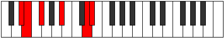
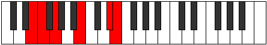
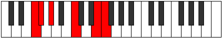
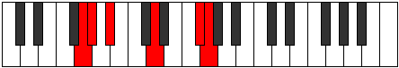
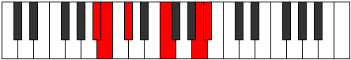

# Mode Ionothitonic

## Links

- [Documentation](index.md)
- [Scales Index](Scales.md)
- [Modes Index](Modes.md)
- [Chords Index](Chords.md)

## Parent Scale

[Ranitonic](ScaleRanitonic.md)

## Number

[2187](https://ianring.com/musictheory/scales/2187)

## Perfection

- 1 Perfect notes
- 4 Perfect notes

## Perfection Profile

[true false false false false]

## Permutations

| Tonic | Notes | Signature | Illustration | Audio |
|-------|-------|-----------|--------------|-------|
| [C](ModeCNaturalIonothitonic.md) | C, **C#**, **D#**, **G**, **B**, C | C |  | [midi](ModeCNaturalIonothitonic.mid) [ogg](ModeCNaturalIonothitonic.ogg) |
| [C#](ModeCSharpIonothitonic.md) | C#, **D**, **E**, **G#**, **C**, C# | C |  | [midi](ModeCSharpIonothitonic.mid) [ogg](ModeCSharpIonothitonic.ogg) |
| [Db](ModeDFlatIonothitonic.md) | Db, **D**, **E**, **Ab**, **C**, Db | C |  | [midi](ModeDFlatIonothitonic.mid) [ogg](ModeDFlatIonothitonic.ogg) |
| [D](ModeDNaturalIonothitonic.md) | D, **D#**, **F**, **A**, **C#**, D | C |  | [midi](ModeDNaturalIonothitonic.mid) [ogg](ModeDNaturalIonothitonic.ogg) |
| [D#](ModeDSharpIonothitonic.md) | D#, **E**, **F#**, **A#**, **D**, D# | C |  | [midi](ModeDSharpIonothitonic.mid) [ogg](ModeDSharpIonothitonic.ogg) |
| [Eb](ModeEFlatIonothitonic.md) | Eb, **E**, **Gb**, **Bb**, **D**, Eb | C |  | [midi](ModeEFlatIonothitonic.mid) [ogg](ModeEFlatIonothitonic.ogg) |
| [E](ModeENaturalIonothitonic.md) | E, **F**, **G**, **B**, **D#**, E | C |  | [midi](ModeENaturalIonothitonic.mid) [ogg](ModeENaturalIonothitonic.ogg) |
| [F](ModeFNaturalIonothitonic.md) | F, **F#**, **G#**, **C**, **E**, F | C |  | [midi](ModeFNaturalIonothitonic.mid) [ogg](ModeFNaturalIonothitonic.ogg) |
| [F#](ModeFSharpIonothitonic.md) | F#, **G**, **A**, **C#**, **F**, F# | C |  | [midi](ModeFSharpIonothitonic.mid) [ogg](ModeFSharpIonothitonic.ogg) |
| [Gb](ModeGFlatIonothitonic.md) | Gb, **G**, **A**, **Db**, **F**, Gb | C |  | [midi](ModeGFlatIonothitonic.mid) [ogg](ModeGFlatIonothitonic.ogg) |
| [G](ModeGNaturalIonothitonic.md) | G, **G#**, **A#**, **D**, **F#**, G | C |  | [midi](ModeGNaturalIonothitonic.mid) [ogg](ModeGNaturalIonothitonic.ogg) |
| [G#](ModeGSharpIonothitonic.md) | G#, **A**, **B**, **D#**, **G**, G# | C |  | [midi](ModeGSharpIonothitonic.mid) [ogg](ModeGSharpIonothitonic.ogg) |
| [Ab](ModeAFlatIonothitonic.md) | Ab, **A**, **B**, **Eb**, **G**, Ab | C |  | [midi](ModeAFlatIonothitonic.mid) [ogg](ModeAFlatIonothitonic.ogg) |
| [A](ModeANaturalIonothitonic.md) | A, **A#**, **C**, **E**, **G#**, A | C |  | [midi](ModeANaturalIonothitonic.mid) [ogg](ModeANaturalIonothitonic.ogg) |
| [A#](ModeASharpIonothitonic.md) | A#, **B**, **C#**, **F**, **A**, A# | C |  | [midi](ModeASharpIonothitonic.mid) [ogg](ModeASharpIonothitonic.ogg) |
| [Bb](ModeBFlatIonothitonic.md) | Bb, **B**, **Db**, **F**, **A**, Bb | C |  | [midi](ModeBFlatIonothitonic.mid) [ogg](ModeBFlatIonothitonic.ogg) |
| [B](ModeBNaturalIonothitonic.md) | B, **C**, **D**, **F#**, **A#**, B | C |  | [midi](ModeBNaturalIonothitonic.mid) [ogg](ModeBNaturalIonothitonic.ogg) |
