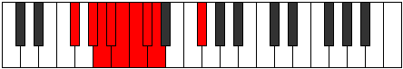

# Mode Ionothyllic

## Links

- [Documentation](README.md)
- [Scales Index](Scales.md)
- [Modes Index](Modes.md)
- [Chords Index](Chords.md)

## Parent Scale

[Stycryllic](ScaleStycryllic.md)

## Number

[509](https://ianring.com/musictheory/scales/509)

## Interval Pattern

2, 1, 1, 1, 1, 1, 1, 4

## Chord Pattern

## Perfection

- 4 Perfect notes
- 4 Perfect notes

## Perfection Profile

[true false false false true false true true]

## Permutations

| Tonic | Notes | Signature | Illustration | Audio |
|-------|-------|-----------|--------------|-------|
| [C](ModeCNaturalIonothyllic.md) | C, **D**, **D#**, **E**, F, **F#**, G, G#, C | C |  | [midi](https://github.com/edipermadi/music/blob/main/docs/ModeCNaturalIonothyllic.mid?raw=true) |
| [C#](ModeCSharpIonothyllic.md) | C#, **D#**, **E**, **F**, F#, **G**, G#, A, C# | C |  | [midi](https://github.com/edipermadi/music/blob/main/docs/ModeCSharpIonothyllic.mid?raw=true) |
| [Db](ModeDFlatIonothyllic.md) | Db, **Eb**, **E**, **F**, Gb, **G**, Ab, A, Db | C |  | [midi](https://github.com/edipermadi/music/blob/main/docs/ModeDFlatIonothyllic.mid?raw=true) |
| [D](ModeDNaturalIonothyllic.md) | D, **E**, **F**, **F#**, G, **G#**, A, A#, D | C |  | [midi](https://github.com/edipermadi/music/blob/main/docs/ModeDNaturalIonothyllic.mid?raw=true) |
| [D#](ModeDSharpIonothyllic.md) | D#, **F**, **F#**, **G**, G#, **A**, A#, B, D# | C |  | [midi](https://github.com/edipermadi/music/blob/main/docs/ModeDSharpIonothyllic.mid?raw=true) |
| [Eb](ModeEFlatIonothyllic.md) | Eb, **F**, **Gb**, **G**, Ab, **A**, Bb, B, Eb | C |  | [midi](https://github.com/edipermadi/music/blob/main/docs/ModeEFlatIonothyllic.mid?raw=true) |
| [E](ModeENaturalIonothyllic.md) | E, **F#**, **G**, **G#**, A, **A#**, B, C, E | C |  | [midi](https://github.com/edipermadi/music/blob/main/docs/ModeENaturalIonothyllic.mid?raw=true) |
| [F](ModeFNaturalIonothyllic.md) | F, **G**, **G#**, **A**, A#, **B**, C, C#, F | C |  | [midi](https://github.com/edipermadi/music/blob/main/docs/ModeFNaturalIonothyllic.mid?raw=true) |
| [F#](ModeFSharpIonothyllic.md) | F#, **G#**, **A**, **A#**, B, **C**, C#, D, F# | C |  | [midi](https://github.com/edipermadi/music/blob/main/docs/ModeFSharpIonothyllic.mid?raw=true) |
| [Gb](ModeGFlatIonothyllic.md) | Gb, **Ab**, **A**, **Bb**, B, **C**, Db, D, Gb | C |  | [midi](https://github.com/edipermadi/music/blob/main/docs/ModeGFlatIonothyllic.mid?raw=true) |
| [G](ModeGNaturalIonothyllic.md) | G, **A**, **A#**, **B**, C, **C#**, D, D#, G | C |  | [midi](https://github.com/edipermadi/music/blob/main/docs/ModeGNaturalIonothyllic.mid?raw=true) |
| [G#](ModeGSharpIonothyllic.md) | G#, **A#**, **B**, **C**, C#, **D**, D#, E, G# | C |  | [midi](https://github.com/edipermadi/music/blob/main/docs/ModeGSharpIonothyllic.mid?raw=true) |
| [Ab](ModeAFlatIonothyllic.md) | Ab, **Bb**, **B**, **C**, Db, **D**, Eb, E, Ab | C |  | [midi](https://github.com/edipermadi/music/blob/main/docs/ModeAFlatIonothyllic.mid?raw=true) |
| [A](ModeANaturalIonothyllic.md) | A, **B**, **C**, **C#**, D, **D#**, E, F, A | C |  | [midi](https://github.com/edipermadi/music/blob/main/docs/ModeANaturalIonothyllic.mid?raw=true) |
| [A#](ModeASharpIonothyllic.md) | A#, **C**, **C#**, **D**, D#, **E**, F, F#, A# | C |  | [midi](https://github.com/edipermadi/music/blob/main/docs/ModeASharpIonothyllic.mid?raw=true) |
| [Bb](ModeBFlatIonothyllic.md) | Bb, **C**, **Db**, **D**, Eb, **E**, F, Gb, Bb | C |  | [midi](https://github.com/edipermadi/music/blob/main/docs/ModeBFlatIonothyllic.mid?raw=true) |
| [B](ModeBNaturalIonothyllic.md) | B, **C#**, **D**, **D#**, E, **F**, F#, G, B | C |  | [midi](https://github.com/edipermadi/music/blob/main/docs/ModeBNaturalIonothyllic.mid?raw=true) |
