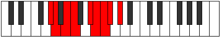
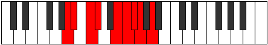
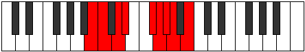

# Mode Ionoyllic

## Links

- [Documentation](README.md)
- [Scales Index](Scales.md)
- [Modes Index](Modes.md)
- [Chords Index](Chords.md)

## Parent Scale

[Aeolathyllic](ScaleAeolathyllic.md)

## Number

[1947](https://ianring.com/musictheory/scales/1947)

## Interval Pattern

1, 2, 1, 3, 1, 1, 1, 2

## Chord Pattern

i, ii, IIIb5, IVb5, vii⁰, viii⁰

## Perfection

- 5 Perfect notes
- 3 Perfect notes

## Perfection Profile

[true true true false false true true false]

## Permutations

| Tonic | Notes | Signature | Illustration | Audio |
|-------|-------|-----------|--------------|-------|
| [C](ModeCNaturalIonoyllic.md) | C, C#, D#, **E**, **G**, G#, A, **A#**, C | C |  | [midi](https://github.com/edipermadi/music/blob/main/docs/ModeCNaturalIonoyllic.mid?raw=true) |
| [C#](ModeCSharpIonoyllic.md) | C#, D, E, **F**, **G#**, A, A#, **B**, C# | C |  | [midi](https://github.com/edipermadi/music/blob/main/docs/ModeCSharpIonoyllic.mid?raw=true) |
| [Db](ModeDFlatIonoyllic.md) | Db, D, E, **F**, **Ab**, A, Bb, **B**, Db | C |  | [midi](https://github.com/edipermadi/music/blob/main/docs/ModeDFlatIonoyllic.mid?raw=true) |
| [D](ModeDNaturalIonoyllic.md) | D, D#, F, **F#**, **A**, A#, B, **C**, D | C |  | [midi](https://github.com/edipermadi/music/blob/main/docs/ModeDNaturalIonoyllic.mid?raw=true) |
| [D#](ModeDSharpIonoyllic.md) | D#, E, F#, **G**, **A#**, B, C, **C#**, D# | C |  | [midi](https://github.com/edipermadi/music/blob/main/docs/ModeDSharpIonoyllic.mid?raw=true) |
| [Eb](ModeEFlatIonoyllic.md) | Eb, E, Gb, **G**, **Bb**, B, C, **Db**, Eb | C |  | [midi](https://github.com/edipermadi/music/blob/main/docs/ModeEFlatIonoyllic.mid?raw=true) |
| [E](ModeENaturalIonoyllic.md) | E, F, G, **G#**, **B**, C, C#, **D**, E | C |  | [midi](https://github.com/edipermadi/music/blob/main/docs/ModeENaturalIonoyllic.mid?raw=true) |
| [F](ModeFNaturalIonoyllic.md) | F, F#, G#, **A**, **C**, C#, D, **D#**, F | C |  | [midi](https://github.com/edipermadi/music/blob/main/docs/ModeFNaturalIonoyllic.mid?raw=true) |
| [F#](ModeFSharpIonoyllic.md) | F#, G, A, **A#**, **C#**, D, D#, **E**, F# | C |  | [midi](https://github.com/edipermadi/music/blob/main/docs/ModeFSharpIonoyllic.mid?raw=true) |
| [Gb](ModeGFlatIonoyllic.md) | Gb, G, A, **Bb**, **Db**, D, Eb, **E**, Gb | C |  | [midi](https://github.com/edipermadi/music/blob/main/docs/ModeGFlatIonoyllic.mid?raw=true) |
| [G](ModeGNaturalIonoyllic.md) | G, G#, A#, **B**, **D**, D#, E, **F**, G | C |  | [midi](https://github.com/edipermadi/music/blob/main/docs/ModeGNaturalIonoyllic.mid?raw=true) |
| [G#](ModeGSharpIonoyllic.md) | G#, A, B, **C**, **D#**, E, F, **F#**, G# | C |  | [midi](https://github.com/edipermadi/music/blob/main/docs/ModeGSharpIonoyllic.mid?raw=true) |
| [Ab](ModeAFlatIonoyllic.md) | Ab, A, B, **C**, **Eb**, E, F, **Gb**, Ab | C |  | [midi](https://github.com/edipermadi/music/blob/main/docs/ModeAFlatIonoyllic.mid?raw=true) |
| [A](ModeANaturalIonoyllic.md) | A, A#, C, **C#**, **E**, F, F#, **G**, A | C |  | [midi](https://github.com/edipermadi/music/blob/main/docs/ModeANaturalIonoyllic.mid?raw=true) |
| [A#](ModeASharpIonoyllic.md) | A#, B, C#, **D**, **F**, F#, G, **G#**, A# | C |  | [midi](https://github.com/edipermadi/music/blob/main/docs/ModeASharpIonoyllic.mid?raw=true) |
| [Bb](ModeBFlatIonoyllic.md) | Bb, B, Db, **D**, **F**, Gb, G, **Ab**, Bb | C |  | [midi](https://github.com/edipermadi/music/blob/main/docs/ModeBFlatIonoyllic.mid?raw=true) |
| [B](ModeBNaturalIonoyllic.md) | B, C, D, **D#**, **F#**, G, G#, **A**, B | C |  | [midi](https://github.com/edipermadi/music/blob/main/docs/ModeBNaturalIonoyllic.mid?raw=true) |
