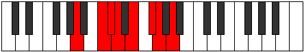

# Mode Ionycrian

## Links

- [Documentation](index.md)
- [Scales Index](Scales.md)
- [Modes Index](Modes.md)
- [Chords Index](Chords.md)

## Parent Scale

[Ionycrian](ScaleIonycrian.md)

## Number

[1721](https://ianring.com/musictheory/scales/1721)

## Perfection

- 5 Perfect notes
- 2 Perfect notes

## Perfection Profile

[true true false true false true true]

## Permutations

| Tonic | Notes | Signature | Illustration | Audio |
|-------|-------|-----------|--------------|-------|
| [C](ModeCNaturalIonycrian.md) | C, D#, **E**, F, **G**, A, Bb, C | C |  | [midi](ModeCNaturalIonycrian.mid) [ogg](ModeCNaturalIonycrian.ogg) |
| [C#](ModeCSharpIonycrian.md) | C#, D##, **E#**, F#, **G#**, A#, B, C# | C |  | [midi](ModeCSharpIonycrian.mid) [ogg](ModeCSharpIonycrian.ogg) |
| [Db](ModeDFlatIonycrian.md) | Db, E, **F**, Gb, **Ab**, Bb, Cb, Db | C |  | [midi](ModeDFlatIonycrian.mid) [ogg](ModeDFlatIonycrian.ogg) |
| [D](ModeDNaturalIonycrian.md) | D, E#, **F#**, G, **A**, B, C, D | C |  | [midi](ModeDNaturalIonycrian.mid) [ogg](ModeDNaturalIonycrian.ogg) |
| [D#](ModeDSharpIonycrian.md) | D#, E##, **F##**, G#, **A#**, B#, C#, D# | C |  | [midi](ModeDSharpIonycrian.mid) [ogg](ModeDSharpIonycrian.ogg) |
| [Eb](ModeEFlatIonycrian.md) | Eb, F#, **G**, Ab, **Bb**, C, Db, Eb | C |  | [midi](ModeEFlatIonycrian.mid) [ogg](ModeEFlatIonycrian.ogg) |
| [E](ModeENaturalIonycrian.md) | E, F##, **G#**, A, **B**, C#, D, E | C |  | [midi](ModeENaturalIonycrian.mid) [ogg](ModeENaturalIonycrian.ogg) |
| [F](ModeFNaturalIonycrian.md) | F, G#, **A**, Bb, **C**, D, Eb, F | C |  | [midi](ModeFNaturalIonycrian.mid) [ogg](ModeFNaturalIonycrian.ogg) |
| [F#](ModeFSharpIonycrian.md) | F#, G##, **A#**, B, **C#**, D#, E, F# | C |  | [midi](ModeFSharpIonycrian.mid) [ogg](ModeFSharpIonycrian.ogg) |
| [Gb](ModeGFlatIonycrian.md) | Gb, A, **Bb**, Cb, **Db**, Eb, Fb, Gb | C |  | [midi](ModeGFlatIonycrian.mid) [ogg](ModeGFlatIonycrian.ogg) |
| [G](ModeGNaturalIonycrian.md) | G, A#, **B**, C, **D**, E, F, G | C |  | [midi](ModeGNaturalIonycrian.mid) [ogg](ModeGNaturalIonycrian.ogg) |
| [G#](ModeGSharpIonycrian.md) | G#, A##, **B#**, C#, **D#**, E#, F#, G# | C |  | [midi](ModeGSharpIonycrian.mid) [ogg](ModeGSharpIonycrian.ogg) |
| [Ab](ModeAFlatIonycrian.md) | Ab, B, **C**, Db, **Eb**, F, Gb, Ab | C |  | [midi](ModeAFlatIonycrian.mid) [ogg](ModeAFlatIonycrian.ogg) |
| [A](ModeANaturalIonycrian.md) | A, B#, **C#**, D, **E**, F#, G, A | C |  | [midi](ModeANaturalIonycrian.mid) [ogg](ModeANaturalIonycrian.ogg) |
| [A#](ModeASharpIonycrian.md) | A#, B##, **C##**, D#, **E#**, F##, G#, A# | C |  | [midi](ModeASharpIonycrian.mid) [ogg](ModeASharpIonycrian.ogg) |
| [Bb](ModeBFlatIonycrian.md) | Bb, C#, **D**, Eb, **F**, G, Ab, Bb | C |  | [midi](ModeBFlatIonycrian.mid) [ogg](ModeBFlatIonycrian.ogg) |
| [B](ModeBNaturalIonycrian.md) | B, C##, **D#**, E, **F#**, G#, A, B | C |  | [midi](ModeBNaturalIonycrian.mid) [ogg](ModeBNaturalIonycrian.ogg) |
