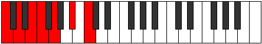

# Mode Ionycrimic

## Links

- [Documentation](index.md)
- [Scales Index](Scales.md)
- [Modes Index](Modes.md)
- [Chords Index](Chords.md)

## Parent Scale

[Darmic](ScaleDarmic.md)

## Number

[1205](https://ianring.com/musictheory/scales/1205)

## Perfection

- 4 Perfect notes
- 2 Perfect notes

## Perfection Profile

[true false false true true true]

## Permutations

| Tonic | Notes | Signature | Illustration | Audio |
|-------|-------|-----------|--------------|-------|
| [C](ModeCNaturalIonycrimic.md) | C, **D**, **E**, F, G, A#, C | C |  | [midi](ModeCNaturalIonycrimic.mid) [ogg](ModeCNaturalIonycrimic.ogg) |
| [C#](ModeCSharpIonycrimic.md) | C#, **D#**, **E#**, F#, G#, A##, C# | C |  | [midi](ModeCSharpIonycrimic.mid) [ogg](ModeCSharpIonycrimic.ogg) |
| [Db](ModeDFlatIonycrimic.md) | Db, **Eb**, **F**, Gb, Ab, B, Db | C |  | [midi](ModeDFlatIonycrimic.mid) [ogg](ModeDFlatIonycrimic.ogg) |
| [D](ModeDNaturalIonycrimic.md) | D, **E**, **F#**, G, A, B#, D | C |  | [midi](ModeDNaturalIonycrimic.mid) [ogg](ModeDNaturalIonycrimic.ogg) |
| [D#](ModeDSharpIonycrimic.md) | D#, **E#**, **F##**, G#, A#, B##, D# | C |  | [midi](ModeDSharpIonycrimic.mid) [ogg](ModeDSharpIonycrimic.ogg) |
| [Eb](ModeEFlatIonycrimic.md) | Eb, **F**, **G**, Ab, Bb, C#, Eb | C |  | [midi](ModeEFlatIonycrimic.mid) [ogg](ModeEFlatIonycrimic.ogg) |
| [E](ModeENaturalIonycrimic.md) | E, **F#**, **G#**, A, B, C##, E | C |  | [midi](ModeENaturalIonycrimic.mid) [ogg](ModeENaturalIonycrimic.ogg) |
| [F](ModeFNaturalIonycrimic.md) | F, **G**, **A**, Bb, C, D#, F | C |  | [midi](ModeFNaturalIonycrimic.mid) [ogg](ModeFNaturalIonycrimic.ogg) |
| [F#](ModeFSharpIonycrimic.md) | F#, **G#**, **A#**, B, C#, D##, F# | C |  | [midi](ModeFSharpIonycrimic.mid) [ogg](ModeFSharpIonycrimic.ogg) |
| [Gb](ModeGFlatIonycrimic.md) | Gb, **Ab**, **Bb**, Cb, Db, E, Gb | C |  | [midi](ModeGFlatIonycrimic.mid) [ogg](ModeGFlatIonycrimic.ogg) |
| [G](ModeGNaturalIonycrimic.md) | G, **A**, **B**, C, D, E#, G | C |  | [midi](ModeGNaturalIonycrimic.mid) [ogg](ModeGNaturalIonycrimic.ogg) |
| [G#](ModeGSharpIonycrimic.md) | G#, **A#**, **B#**, C#, D#, E##, G# | C |  | [midi](ModeGSharpIonycrimic.mid) [ogg](ModeGSharpIonycrimic.ogg) |
| [Ab](ModeAFlatIonycrimic.md) | Ab, **Bb**, **C**, Db, Eb, F#, Ab | C |  | [midi](ModeAFlatIonycrimic.mid) [ogg](ModeAFlatIonycrimic.ogg) |
| [A](ModeANaturalIonycrimic.md) | A, **B**, **C#**, D, E, F##, A | C |  | [midi](ModeANaturalIonycrimic.mid) [ogg](ModeANaturalIonycrimic.ogg) |
| [A#](ModeASharpIonycrimic.md) | A#, **B#**, **C##**, D#, E#, F###, A# | C |  | [midi](ModeASharpIonycrimic.mid) [ogg](ModeASharpIonycrimic.ogg) |
| [Bb](ModeBFlatIonycrimic.md) | Bb, **C**, **D**, Eb, F, G#, Bb | C |  | [midi](ModeBFlatIonycrimic.mid) [ogg](ModeBFlatIonycrimic.ogg) |
| [B](ModeBNaturalIonycrimic.md) | B, **C#**, **D#**, E, F#, G##, B | C |  | [midi](ModeBNaturalIonycrimic.mid) [ogg](ModeBNaturalIonycrimic.ogg) |
