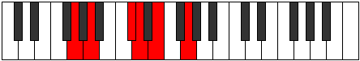

# Mode Ionycritonic

## Links

- [Documentation](index.md)
- [Scales Index](Scales.md)
- [Modes Index](Modes.md)
- [Chords Index](Chords.md)

## Parent Scale

[Aeracritonic](ScaleAeracritonic.md)

## Number

[709](https://ianring.com/musictheory/scales/709)

## Perfection

- 3 Perfect notes
- 2 Perfect notes

## Perfection Profile

[true true false true false]

## Permutations

| Tonic | Notes | Signature | Illustration | Audio |
|-------|-------|-----------|--------------|-------|
| [C](ModeCNaturalIonycritonic.md) | C, D, **F#**, G, **A**, C | C |  | [midi](ModeCNaturalIonycritonic.mid) [ogg](ModeCNaturalIonycritonic.ogg) |
| [C#](ModeCSharpIonycritonic.md) | C#, D#, **G**, G#, **A#**, C# | C |  | [midi](ModeCSharpIonycritonic.mid) [ogg](ModeCSharpIonycritonic.ogg) |
| [Db](ModeDFlatIonycritonic.md) | Db, Eb, **G**, Ab, **Bb**, Db | C |  | [midi](ModeDFlatIonycritonic.mid) [ogg](ModeDFlatIonycritonic.ogg) |
| [D](ModeDNaturalIonycritonic.md) | D, E, **G#**, A, **B**, D | C |  | [midi](ModeDNaturalIonycritonic.mid) [ogg](ModeDNaturalIonycritonic.ogg) |
| [D#](ModeDSharpIonycritonic.md) | D#, F, **A**, A#, **C**, D# | C |  | [midi](ModeDSharpIonycritonic.mid) [ogg](ModeDSharpIonycritonic.ogg) |
| [Eb](ModeEFlatIonycritonic.md) | Eb, F, **A**, Bb, **C**, Eb | C |  | [midi](ModeEFlatIonycritonic.mid) [ogg](ModeEFlatIonycritonic.ogg) |
| [E](ModeENaturalIonycritonic.md) | E, F#, **A#**, B, **C#**, E | C |  | [midi](ModeENaturalIonycritonic.mid) [ogg](ModeENaturalIonycritonic.ogg) |
| [F](ModeFNaturalIonycritonic.md) | F, G, **B**, C, **D**, F | C |  | [midi](ModeFNaturalIonycritonic.mid) [ogg](ModeFNaturalIonycritonic.ogg) |
| [F#](ModeFSharpIonycritonic.md) | F#, G#, **C**, C#, **D#**, F# | C |  | [midi](ModeFSharpIonycritonic.mid) [ogg](ModeFSharpIonycritonic.ogg) |
| [Gb](ModeGFlatIonycritonic.md) | Gb, Ab, **C**, Db, **Eb**, Gb | C |  | [midi](ModeGFlatIonycritonic.mid) [ogg](ModeGFlatIonycritonic.ogg) |
| [G](ModeGNaturalIonycritonic.md) | G, A, **C#**, D, **E**, G | C |  | [midi](ModeGNaturalIonycritonic.mid) [ogg](ModeGNaturalIonycritonic.ogg) |
| [G#](ModeGSharpIonycritonic.md) | G#, A#, **D**, D#, **F**, G# | C |  | [midi](ModeGSharpIonycritonic.mid) [ogg](ModeGSharpIonycritonic.ogg) |
| [Ab](ModeAFlatIonycritonic.md) | Ab, Bb, **D**, Eb, **F**, Ab | C |  | [midi](ModeAFlatIonycritonic.mid) [ogg](ModeAFlatIonycritonic.ogg) |
| [A](ModeANaturalIonycritonic.md) | A, B, **D#**, E, **F#**, A | C |  | [midi](ModeANaturalIonycritonic.mid) [ogg](ModeANaturalIonycritonic.ogg) |
| [A#](ModeASharpIonycritonic.md) | A#, C, **E**, F, **G**, A# | C |  | [midi](ModeASharpIonycritonic.mid) [ogg](ModeASharpIonycritonic.ogg) |
| [Bb](ModeBFlatIonycritonic.md) | Bb, C, **E**, F, **G**, Bb | C |  | [midi](ModeBFlatIonycritonic.mid) [ogg](ModeBFlatIonycritonic.ogg) |
| [B](ModeBNaturalIonycritonic.md) | B, C#, **F**, F#, **G#**, B | C |  | [midi](ModeBNaturalIonycritonic.mid) [ogg](ModeBNaturalIonycritonic.ogg) |
