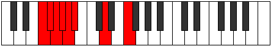

# Mode Ionydian

## Links

- [Documentation](README.md)
- [Scales Index](Scales.md)
- [Modes Index](Modes.md)
- [Chords Index](Chords.md)

## Parent Scale

[Thadian](ScaleThadian.md)

## Number

[575](https://ianring.com/musictheory/scales/575)

## Transposition

1, 1, 1, 1, 1, 4, 3

## Chord Pattern

VIIb5

## Perfection

- 3 Perfect notes
- 4 Perfect notes

## Perfection Profile

[false false true false false true true]

## Permutations

| Tonic | Notes | Signature | Illustration | Audio |
|-------|-------|-----------|--------------|-------|
| [C](ModeCNaturalIonydian.md) | **C**, **Db**, Ebb, **Fbb**, **Gbbb**, D###, Cbbb, **C** | C |  | [midi](https://github.com/edipermadi/music/blob/main/docs/ModeCNaturalIonydian.mid?raw=true) |
| [C#](ModeCSharpIonydian.md) | **C#**, **D**, Eb, **Fb**, **Gbb**, Abbb, Bb, **C#** | C |  | [midi](https://github.com/edipermadi/music/blob/main/docs/ModeCSharpIonydian.mid?raw=true) |
| [Db](ModeDFlatIonydian.md) | **Db**, **Ebb**, Fbb, **Gbbb**, **D###**, E##, Cbb, **Db** | C |  | [midi](https://github.com/edipermadi/music/blob/main/docs/ModeDFlatIonydian.mid?raw=true) |
| [D](ModeDNaturalIonydian.md) | **D**, **Eb**, Fb, **Gbb**, **Abbb**, E###, Cb, **D** | C |  | [midi](https://github.com/edipermadi/music/blob/main/docs/ModeDNaturalIonydian.mid?raw=true) |
| [D#](ModeDSharpIonydian.md) | **D#**, **E**, F, **Gb**, **Abb**, Bbbb, C, **D#** | C |  | [midi](https://github.com/edipermadi/music/blob/main/docs/ModeDSharpIonydian.mid?raw=true) |
| [Eb](ModeEFlatIonydian.md) | **Eb**, **Fb**, Gbb, **Abbb**, **E###**, F###, Dbb, **Eb** | C |  | [midi](https://github.com/edipermadi/music/blob/main/docs/ModeEFlatIonydian.mid?raw=true) |
| [E](ModeENaturalIonydian.md) | **E**, **F**, Gb, **Abb**, **Bbbb**, Cbbb, Db, **E** | C |  | [midi](https://github.com/edipermadi/music/blob/main/docs/ModeENaturalIonydian.mid?raw=true) |
| [F](ModeFNaturalIonydian.md) | **F**, **Gb**, Abb, **Bbbb**, **Cbbb**, Cbb, D, **F** | C |  | [midi](https://github.com/edipermadi/music/blob/main/docs/ModeFNaturalIonydian.mid?raw=true) |
| [F#](ModeFSharpIonydian.md) | **F#**, **G**, Ab, **Bbb**, **Cbb**, Dbbb, Eb, **F#** | C |  | [midi](https://github.com/edipermadi/music/blob/main/docs/ModeFSharpIonydian.mid?raw=true) |
| [Gb](ModeGFlatIonydian.md) | **Gb**, **Abb**, Bbbb, **Cbbb**, **Cbb**, Dbbb, Eb, **Gb** | C |  | [midi](https://github.com/edipermadi/music/blob/main/docs/ModeGFlatIonydian.mid?raw=true) |
| [G](ModeGNaturalIonydian.md) | **G**, **Ab**, Bbb, **Cbb**, **Dbbb**, Dbb, E, **G** | C |  | [midi](https://github.com/edipermadi/music/blob/main/docs/ModeGNaturalIonydian.mid?raw=true) |
| [G#](ModeGSharpIonydian.md) | **G#**, **A**, Bb, **Cb**, **Dbb**, Ebbb, F, **G#** | C |  | [midi](https://github.com/edipermadi/music/blob/main/docs/ModeGSharpIonydian.mid?raw=true) |
| [Ab](ModeAFlatIonydian.md) | **Ab**, **Bbb**, Cbb, **Dbbb**, **Dbb**, Ebbb, F, **Ab** | C |  | [midi](https://github.com/edipermadi/music/blob/main/docs/ModeAFlatIonydian.mid?raw=true) |
| [A](ModeANaturalIonydian.md) | **A**, **Bb**, Cb, **Dbb**, **Ebbb**, Fbbb, Gb, **A** | C |  | [midi](https://github.com/edipermadi/music/blob/main/docs/ModeANaturalIonydian.mid?raw=true) |
| [A#](ModeASharpIonydian.md) | **A#**, **B**, C, **Db**, **Ebb**, Fbb, G, **A#** | C |  | [midi](https://github.com/edipermadi/music/blob/main/docs/ModeASharpIonydian.mid?raw=true) |
| [Bb](ModeBFlatIonydian.md) | **Bb**, **Cb**, Dbb, **Ebbb**, **Fbbb**, C###, E###, **Bb** | C |  | [midi](https://github.com/edipermadi/music/blob/main/docs/ModeBFlatIonydian.mid?raw=true) |
| [B](ModeBNaturalIonydian.md) | **B**, **C**, Db, **Ebb**, **Fbb**, Gbbb, Ab, **B** | C |  | [midi](https://github.com/edipermadi/music/blob/main/docs/ModeBNaturalIonydian.mid?raw=true) |
