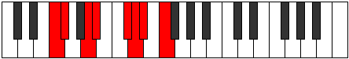

# Mode Ionygian

## Links

- [Documentation](README.md)
- [Scales Index](Scales.md)
- [Modes Index](Modes.md)
- [Chords Index](Chords.md)

## Parent Scale

[Tholian](ScaleTholian.md)

## Number

[1843](https://ianring.com/musictheory/scales/1843)

## Transposition

1, 3, 1, 3, 1, 1, 2

## Chord Pattern

I⁺, II⁺, IIIb5, IV, vi, vii

## Perfection

- 4 Perfect notes
- 3 Perfect notes

## Perfection Profile

[false true false true false true true]

## Permutations

| Tonic | Notes | Signature | Illustration | Audio |
|-------|-------|-----------|--------------|-------|
| [C](ModeCNaturalIonygian.md) | **C**, Db, **E**, F, **G#**, A, Bb, **C** | C |  | [midi](https://github.com/edipermadi/music/blob/main/docs/ModeCNaturalIonygian.mid?raw=true) |
| [C#](ModeCSharpIonygian.md) | **C#**, D, **E#**, F#, **G##**, A#, B, **C#** | C |  | [midi](https://github.com/edipermadi/music/blob/main/docs/ModeCSharpIonygian.mid?raw=true) |
| [Db](ModeDFlatIonygian.md) | **Db**, Ebb, **F**, Gb, **A**, Bb, Cb, **Db** | C |  | [midi](https://github.com/edipermadi/music/blob/main/docs/ModeDFlatIonygian.mid?raw=true) |
| [D](ModeDNaturalIonygian.md) | **D**, Eb, **F#**, G, **A#**, B, C, **D** | C |  | [midi](https://github.com/edipermadi/music/blob/main/docs/ModeDNaturalIonygian.mid?raw=true) |
| [D#](ModeDSharpIonygian.md) | **D#**, E, **F##**, G#, **A##**, B#, C#, **D#** | C |  | [midi](https://github.com/edipermadi/music/blob/main/docs/ModeDSharpIonygian.mid?raw=true) |
| [Eb](ModeEFlatIonygian.md) | **Eb**, Fb, **G**, Ab, **B**, C, Db, **Eb** | C |  | [midi](https://github.com/edipermadi/music/blob/main/docs/ModeEFlatIonygian.mid?raw=true) |
| [E](ModeENaturalIonygian.md) | **E**, F, **G#**, A, **B#**, C#, D, **E** | C |  | [midi](https://github.com/edipermadi/music/blob/main/docs/ModeENaturalIonygian.mid?raw=true) |
| [F](ModeFNaturalIonygian.md) | **F**, Gb, **A**, Bb, **C#**, D, Eb, **F** | C |  | [midi](https://github.com/edipermadi/music/blob/main/docs/ModeFNaturalIonygian.mid?raw=true) |
| [F#](ModeFSharpIonygian.md) | **F#**, G, **A#**, B, **C##**, D#, E, **F#** | C |  | [midi](https://github.com/edipermadi/music/blob/main/docs/ModeFSharpIonygian.mid?raw=true) |
| [Gb](ModeGFlatIonygian.md) | **Gb**, Abb, **Bb**, Cb, **D**, Eb, Fb, **Gb** | C |  | [midi](https://github.com/edipermadi/music/blob/main/docs/ModeGFlatIonygian.mid?raw=true) |
| [G](ModeGNaturalIonygian.md) | **G**, Ab, **B**, C, **D#**, E, F, **G** | C |  | [midi](https://github.com/edipermadi/music/blob/main/docs/ModeGNaturalIonygian.mid?raw=true) |
| [G#](ModeGSharpIonygian.md) | **G#**, A, **B#**, C#, **D##**, E#, F#, **G#** | C |  | [midi](https://github.com/edipermadi/music/blob/main/docs/ModeGSharpIonygian.mid?raw=true) |
| [Ab](ModeAFlatIonygian.md) | **Ab**, Bbb, **C**, Db, **E**, F, Gb, **Ab** | C |  | [midi](https://github.com/edipermadi/music/blob/main/docs/ModeAFlatIonygian.mid?raw=true) |
| [A](ModeANaturalIonygian.md) | **A**, Bb, **C#**, D, **E#**, F#, G, **A** | C |  | [midi](https://github.com/edipermadi/music/blob/main/docs/ModeANaturalIonygian.mid?raw=true) |
| [A#](ModeASharpIonygian.md) | **A#**, B, **C##**, D#, **E##**, F##, G#, **A#** | C |  | [midi](https://github.com/edipermadi/music/blob/main/docs/ModeASharpIonygian.mid?raw=true) |
| [Bb](ModeBFlatIonygian.md) | **Bb**, Cb, **D**, Eb, **F#**, G, Ab, **Bb** | C |  | [midi](https://github.com/edipermadi/music/blob/main/docs/ModeBFlatIonygian.mid?raw=true) |
| [B](ModeBNaturalIonygian.md) | **B**, C, **D#**, E, **F##**, G#, A, **B** | C |  | [midi](https://github.com/edipermadi/music/blob/main/docs/ModeBNaturalIonygian.mid?raw=true) |
