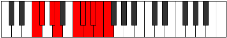

# Mode Ionygic

## Links

- [Documentation](index.md)
- [Scales Index](Scales.md)
- [Modes Index](Modes.md)
- [Chords Index](Chords.md)

## Parent Scale

[Zothygic](ScaleZothygic.md)

## Number

[3995](https://ianring.com/musictheory/scales/3995)

## Perfection

- 6 Perfect notes
- 3 Perfect notes

## Perfection Profile

[true true true true false true true false false]

## Permutations

| Tonic | Notes | Signature | Illustration | Audio |
|-------|-------|-----------|--------------|-------|
| [C](ModeCNaturalIonygic.md) | C, C#, D#, E, **G**, G#, A, **A#**, **B**, C | C |  | [midi](ModeCNaturalIonygic.mid) [ogg](ModeCNaturalIonygic.ogg) |
| [C#](ModeCSharpIonygic.md) | C#, D, E, F, **G#**, A, A#, **B**, **C**, C# | C |  | [midi](ModeCSharpIonygic.mid) [ogg](ModeCSharpIonygic.ogg) |
| [Db](ModeDFlatIonygic.md) | Db, D, E, F, **Ab**, A, Bb, **B**, **C**, Db | C |  | [midi](ModeDFlatIonygic.mid) [ogg](ModeDFlatIonygic.ogg) |
| [D](ModeDNaturalIonygic.md) | D, D#, F, F#, **A**, A#, B, **C**, **C#**, D | C |  | [midi](ModeDNaturalIonygic.mid) [ogg](ModeDNaturalIonygic.ogg) |
| [D#](ModeDSharpIonygic.md) | D#, E, F#, G, **A#**, B, C, **C#**, **D**, D# | C |  | [midi](ModeDSharpIonygic.mid) [ogg](ModeDSharpIonygic.ogg) |
| [Eb](ModeEFlatIonygic.md) | Eb, E, Gb, G, **Bb**, B, C, **Db**, **D**, Eb | C |  | [midi](ModeEFlatIonygic.mid) [ogg](ModeEFlatIonygic.ogg) |
| [E](ModeENaturalIonygic.md) | E, F, G, G#, **B**, C, C#, **D**, **D#**, E | C |  | [midi](ModeENaturalIonygic.mid) [ogg](ModeENaturalIonygic.ogg) |
| [F](ModeFNaturalIonygic.md) | F, F#, G#, A, **C**, C#, D, **D#**, **E**, F | C |  | [midi](ModeFNaturalIonygic.mid) [ogg](ModeFNaturalIonygic.ogg) |
| [F#](ModeFSharpIonygic.md) | F#, G, A, A#, **C#**, D, D#, **E**, **F**, F# | C |  | [midi](ModeFSharpIonygic.mid) [ogg](ModeFSharpIonygic.ogg) |
| [Gb](ModeGFlatIonygic.md) | Gb, G, A, Bb, **Db**, D, Eb, **E**, **F**, Gb | C |  | [midi](ModeGFlatIonygic.mid) [ogg](ModeGFlatIonygic.ogg) |
| [G](ModeGNaturalIonygic.md) | G, G#, A#, B, **D**, D#, E, **F**, **F#**, G | C |  | [midi](ModeGNaturalIonygic.mid) [ogg](ModeGNaturalIonygic.ogg) |
| [G#](ModeGSharpIonygic.md) | G#, A, B, C, **D#**, E, F, **F#**, **G**, G# | C |  | [midi](ModeGSharpIonygic.mid) [ogg](ModeGSharpIonygic.ogg) |
| [Ab](ModeAFlatIonygic.md) | Ab, A, B, C, **Eb**, E, F, **Gb**, **G**, Ab | C |  | [midi](ModeAFlatIonygic.mid) [ogg](ModeAFlatIonygic.ogg) |
| [A](ModeANaturalIonygic.md) | A, A#, C, C#, **E**, F, F#, **G**, **G#**, A | C |  | [midi](ModeANaturalIonygic.mid) [ogg](ModeANaturalIonygic.ogg) |
| [A#](ModeASharpIonygic.md) | A#, B, C#, D, **F**, F#, G, **G#**, **A**, A# | C |  | [midi](ModeASharpIonygic.mid) [ogg](ModeASharpIonygic.ogg) |
| [Bb](ModeBFlatIonygic.md) | Bb, B, Db, D, **F**, Gb, G, **Ab**, **A**, Bb | C |  | [midi](ModeBFlatIonygic.mid) [ogg](ModeBFlatIonygic.ogg) |
| [B](ModeBNaturalIonygic.md) | B, C, D, D#, **F#**, G, G#, **A**, **A#**, B | C |  | [midi](ModeBNaturalIonygic.mid) [ogg](ModeBNaturalIonygic.ogg) |
