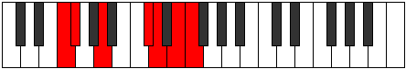

# Mode Ionygimic

## Links

- [Documentation](index.md)
- [Scales Index](Scales.md)
- [Modes Index](Modes.md)
- [Chords Index](Chords.md)

## Parent Scale

[Syrimic](ScaleSyrimic.md)

## Number

[2835](https://ianring.com/musictheory/scales/2835)

## Interval Pattern

1, 3, 4, 1, 2, 1

## Chord Pattern

I⁺, ii, III⁺, III, IV⁺, v, V

## Perfection

- 3 Perfect notes
- 3 Perfect notes

## Perfection Profile

[false true true false true false]

## Permutations

| Tonic | Notes | Signature | Illustration | Audio |
|-------|-------|-----------|--------------|-------|
| [C](ModeCNaturalIonygimic.md) | **C**, Db, E, **F###**, G##, **A##**, **C** | C |  | [midi](https://github.com/edipermadi/music/blob/main/docs/ModeCNaturalIonygimic.mid?raw=true) |
| [C#](ModeCSharpIonygimic.md) | **C#**, D, E#, **Cbbb**, Cbb, **Dbb**, **C#** | C |  | [midi](https://github.com/edipermadi/music/blob/main/docs/ModeCSharpIonygimic.mid?raw=true) |
| [Db](ModeDFlatIonygimic.md) | **Db**, Ebb, F, **G##**, A#, **B#**, **Db** | C |  | [midi](https://github.com/edipermadi/music/blob/main/docs/ModeDFlatIonygimic.mid?raw=true) |
| [D](ModeDNaturalIonygimic.md) | **D**, Eb, F#, **G###**, A##, **B##**, **D** | C |  | [midi](https://github.com/edipermadi/music/blob/main/docs/ModeDNaturalIonygimic.mid?raw=true) |
| [D#](ModeDSharpIonygimic.md) | **D#**, E, F##, **Cb**, Dbb, **Ebb**, **D#** | C |  | [midi](https://github.com/edipermadi/music/blob/main/docs/ModeDSharpIonygimic.mid?raw=true) |
| [Eb](ModeEFlatIonygimic.md) | **Eb**, Fb, G, **A##**, B#, **C##**, **Eb** | C |  | [midi](https://github.com/edipermadi/music/blob/main/docs/ModeEFlatIonygimic.mid?raw=true) |
| [E](ModeENaturalIonygimic.md) | **E**, F, G#, **A###**, B##, **C###**, **E** | C |  | [midi](https://github.com/edipermadi/music/blob/main/docs/ModeENaturalIonygimic.mid?raw=true) |
| [F](ModeFNaturalIonygimic.md) | **F**, Gb, A, **B##**, C##, **D##**, **F** | C |  | [midi](https://github.com/edipermadi/music/blob/main/docs/ModeFNaturalIonygimic.mid?raw=true) |
| [F#](ModeFSharpIonygimic.md) | **F#**, G, A#, **B###**, C###, **D###**, **F#** | C |  | [midi](https://github.com/edipermadi/music/blob/main/docs/ModeFSharpIonygimic.mid?raw=true) |
| [Gb](ModeGFlatIonygimic.md) | **Gb**, Abb, Bb, **C##**, D#, **E#**, **Gb** | C |  | [midi](https://github.com/edipermadi/music/blob/main/docs/ModeGFlatIonygimic.mid?raw=true) |
| [G](ModeGNaturalIonygimic.md) | **G**, Ab, B, **C###**, D##, **E##**, **G** | C |  | [midi](https://github.com/edipermadi/music/blob/main/docs/ModeGNaturalIonygimic.mid?raw=true) |
| [G#](ModeGSharpIonygimic.md) | **G#**, A, B#, **D##**, E#, **F##**, **G#** | C |  | [midi](https://github.com/edipermadi/music/blob/main/docs/ModeGSharpIonygimic.mid?raw=true) |
| [Ab](ModeAFlatIonygimic.md) | **Ab**, Bbb, C, **D##**, E#, **F##**, **Ab** | C |  | [midi](https://github.com/edipermadi/music/blob/main/docs/ModeAFlatIonygimic.mid?raw=true) |
| [A](ModeANaturalIonygimic.md) | **A**, Bb, C#, **D###**, E##, **F###**, **A** | C |  | [midi](https://github.com/edipermadi/music/blob/main/docs/ModeANaturalIonygimic.mid?raw=true) |
| [A#](ModeASharpIonygimic.md) | **A#**, B, C##, **E##**, F##, **G##**, **A#** | C |  | [midi](https://github.com/edipermadi/music/blob/main/docs/ModeASharpIonygimic.mid?raw=true) |
| [Bb](ModeBFlatIonygimic.md) | **Bb**, Cb, D, **E##**, F##, **G##**, **Bb** | C |  | [midi](https://github.com/edipermadi/music/blob/main/docs/ModeBFlatIonygimic.mid?raw=true) |
| [B](ModeBNaturalIonygimic.md) | **B**, C, D#, **E###**, F###, **G###**, **B** | C |  | [midi](https://github.com/edipermadi/music/blob/main/docs/ModeBNaturalIonygimic.mid?raw=true) |
