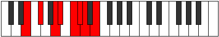

# Mode Ionylian

## Links

- [Documentation](index.md)
- [Scales Index](Scales.md)
- [Modes Index](Modes.md)
- [Chords Index](Chords.md)

## Parent Scale

[Ionanian](ScaleIonanian.md)

## Number

[1893](https://ianring.com/musictheory/scales/1893)

## Perfection

- 3 Perfect notes
- 4 Perfect notes

## Interval Pattern

2, 3, 1, 2, 1, 1, 2

## Perfection Profile

[false true true false false false true]

## Permutations

| Tonic | Notes | Signature | Illustration | Audio |
|-------|-------|-----------|--------------|-------|
| [C](ModeCNaturalIonylian.md) | **C**, D, E#, **F#**, **G#**, **A**, Bb, **C** | C |  | [midi](https://github.com/edipermadi/music/blob/main/docs/ModeCNaturalIonylian.mid?raw=true) |
| [C#](ModeCSharpIonylian.md) | **C#**, D#, E##, **F##**, **G##**, **A#**, B, **C#** | C |  | [midi](https://github.com/edipermadi/music/blob/main/docs/ModeCSharpIonylian.mid?raw=true) |
| [Db](ModeDFlatIonylian.md) | **Db**, Eb, F#, **G**, **A**, **Bb**, Cb, **Db** | C |  | [midi](https://github.com/edipermadi/music/blob/main/docs/ModeDFlatIonylian.mid?raw=true) |
| [D](ModeDNaturalIonylian.md) | **D**, E, F##, **G#**, **A#**, **B**, C, **D** | C |  | [midi](https://github.com/edipermadi/music/blob/main/docs/ModeDNaturalIonylian.mid?raw=true) |
| [D#](ModeDSharpIonylian.md) | **D#**, E#, F###, **G##**, **A##**, **B#**, C#, **D#** | C |  | [midi](https://github.com/edipermadi/music/blob/main/docs/ModeDSharpIonylian.mid?raw=true) |
| [Eb](ModeEFlatIonylian.md) | **Eb**, F, G#, **A**, **B**, **C**, Db, **Eb** | C |  | [midi](https://github.com/edipermadi/music/blob/main/docs/ModeEFlatIonylian.mid?raw=true) |
| [E](ModeENaturalIonylian.md) | **E**, F#, G##, **A#**, **B#**, **C#**, D, **E** | C |  | [midi](https://github.com/edipermadi/music/blob/main/docs/ModeENaturalIonylian.mid?raw=true) |
| [F](ModeFNaturalIonylian.md) | **F**, G, A#, **B**, **C#**, **D**, Eb, **F** | C |  | [midi](https://github.com/edipermadi/music/blob/main/docs/ModeFNaturalIonylian.mid?raw=true) |
| [F#](ModeFSharpIonylian.md) | **F#**, G#, A##, **B#**, **C##**, **D#**, E, **F#** | C |  | [midi](https://github.com/edipermadi/music/blob/main/docs/ModeFSharpIonylian.mid?raw=true) |
| [Gb](ModeGFlatIonylian.md) | **Gb**, Ab, B, **C**, **D**, **Eb**, Fb, **Gb** | C |  | [midi](https://github.com/edipermadi/music/blob/main/docs/ModeGFlatIonylian.mid?raw=true) |
| [G](ModeGNaturalIonylian.md) | **G**, A, B#, **C#**, **D#**, **E**, F, **G** | C |  | [midi](https://github.com/edipermadi/music/blob/main/docs/ModeGNaturalIonylian.mid?raw=true) |
| [G#](ModeGSharpIonylian.md) | **G#**, A#, B##, **C##**, **D##**, **E#**, F#, **G#** | C |  | [midi](https://github.com/edipermadi/music/blob/main/docs/ModeGSharpIonylian.mid?raw=true) |
| [Ab](ModeAFlatIonylian.md) | **Ab**, Bb, C#, **D**, **E**, **F**, Gb, **Ab** | C |  | [midi](https://github.com/edipermadi/music/blob/main/docs/ModeAFlatIonylian.mid?raw=true) |
| [A](ModeANaturalIonylian.md) | **A**, B, C##, **D#**, **E#**, **F#**, G, **A** | C |  | [midi](https://github.com/edipermadi/music/blob/main/docs/ModeANaturalIonylian.mid?raw=true) |
| [A#](ModeASharpIonylian.md) | **A#**, B#, C###, **D##**, **E##**, **F##**, G#, **A#** | C |  | [midi](https://github.com/edipermadi/music/blob/main/docs/ModeASharpIonylian.mid?raw=true) |
| [Bb](ModeBFlatIonylian.md) | **Bb**, C, D#, **E**, **F#**, **G**, Ab, **Bb** | C |  | [midi](https://github.com/edipermadi/music/blob/main/docs/ModeBFlatIonylian.mid?raw=true) |
| [B](ModeBNaturalIonylian.md) | **B**, C#, D##, **E#**, **F##**, **G#**, A, **B** | C |  | [midi](https://github.com/edipermadi/music/blob/main/docs/ModeBNaturalIonylian.mid?raw=true) |
