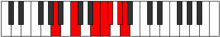

# Mode Ionylimic

## Links

- [Documentation](README.md)
- [Scales Index](Scales.md)
- [Modes Index](Modes.md)
- [Chords Index](Chords.md)

## Parent Scale

[Aerothimic](ScaleAerothimic.md)

## Number

[2953](https://ianring.com/musictheory/scales/2953)

## Transposition

3, 4, 1, 1, 2, 1

## Chord Pattern

iv

## Perfection

- 2 Perfect notes
- 4 Perfect notes

## Perfection Profile

[true false false true false false]

## Permutations

| Tonic | Notes | Signature | Illustration | Audio |
|-------|-------|-----------|--------------|-------|
| [C](ModeCNaturalIonylimic.md) | C, **D#**, **E###**, F###, **G##**, **A##**, C | C |  | [midi](https://github.com/edipermadi/music/blob/main/docs/ModeCNaturalIonylimic.mid?raw=true) |
| [C#](ModeCSharpIonylimic.md) | C#, **D##**, **F###**, G##, **A#**, **B#**, C# | C |  | [midi](https://github.com/edipermadi/music/blob/main/docs/ModeCSharpIonylimic.mid?raw=true) |
| [Db](ModeDFlatIonylimic.md) | Db, **E**, **F###**, G##, **A#**, **B#**, Db | C |  | [midi](https://github.com/edipermadi/music/blob/main/docs/ModeDFlatIonylimic.mid?raw=true) |
| [D](ModeDNaturalIonylimic.md) | D, **E#**, **Cbbb**, Cbb, **Dbbb**, **Ebbb**, D | C |  | [midi](https://github.com/edipermadi/music/blob/main/docs/ModeDNaturalIonylimic.mid?raw=true) |
| [D#](ModeDSharpIonylimic.md) | D#, **E##**, **Cbb**, Dbbb, **Dbb**, **Ebb**, D# | C |  | [midi](https://github.com/edipermadi/music/blob/main/docs/ModeDSharpIonylimic.mid?raw=true) |
| [Eb](ModeEFlatIonylimic.md) | Eb, **F#**, **G###**, A##, **B#**, **C##**, Eb | C |  | [midi](https://github.com/edipermadi/music/blob/main/docs/ModeEFlatIonylimic.mid?raw=true) |
| [E](ModeENaturalIonylimic.md) | E, **F##**, **Cb**, Dbb, **Ebbb**, **Fbb**, E | C |  | [midi](https://github.com/edipermadi/music/blob/main/docs/ModeENaturalIonylimic.mid?raw=true) |
| [F](ModeFNaturalIonylimic.md) | F, **G#**, **A###**, B##, **C##**, **D##**, F | C |  | [midi](https://github.com/edipermadi/music/blob/main/docs/ModeFNaturalIonylimic.mid?raw=true) |
| [F#](ModeFSharpIonylimic.md) | F#, **G##**, **Db**, Ebb, **Fbb**, **Gbb**, F# | C |  | [midi](https://github.com/edipermadi/music/blob/main/docs/ModeFSharpIonylimic.mid?raw=true) |
| [Gb](ModeGFlatIonylimic.md) | Gb, **A**, **B##**, C##, **D#**, **E#**, Gb | C |  | [midi](https://github.com/edipermadi/music/blob/main/docs/ModeGFlatIonylimic.mid?raw=true) |
| [G](ModeGNaturalIonylimic.md) | G, **A#**, **B###**, C###, **D##**, **E##**, G | C |  | [midi](https://github.com/edipermadi/music/blob/main/docs/ModeGNaturalIonylimic.mid?raw=true) |
| [G#](ModeGSharpIonylimic.md) | G#, **A##**, **C###**, D##, **E#**, **F##**, G# | C |  | [midi](https://github.com/edipermadi/music/blob/main/docs/ModeGSharpIonylimic.mid?raw=true) |
| [Ab](ModeAFlatIonylimic.md) | Ab, **B**, **C###**, D##, **E#**, **F##**, Ab | C |  | [midi](https://github.com/edipermadi/music/blob/main/docs/ModeAFlatIonylimic.mid?raw=true) |
| [A](ModeANaturalIonylimic.md) | A, **B#**, **D##**, E#, **F#**, **G#**, A | C |  | [midi](https://github.com/edipermadi/music/blob/main/docs/ModeANaturalIonylimic.mid?raw=true) |
| [A#](ModeASharpIonylimic.md) | A#, **B##**, **D###**, E##, **F##**, **G##**, A# | C |  | [midi](https://github.com/edipermadi/music/blob/main/docs/ModeASharpIonylimic.mid?raw=true) |
| [Bb](ModeBFlatIonylimic.md) | Bb, **C#**, **D###**, E##, **F##**, **G##**, Bb | C |  | [midi](https://github.com/edipermadi/music/blob/main/docs/ModeBFlatIonylimic.mid?raw=true) |
| [B](ModeBNaturalIonylimic.md) | B, **C##**, **E##**, F##, **G#**, **A#**, B | C |  | [midi](https://github.com/edipermadi/music/blob/main/docs/ModeBNaturalIonylimic.mid?raw=true) |
