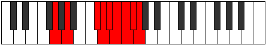

# Mode Ionyllic

## Links

- [Documentation](index.md)
- [Scales Index](Scales.md)
- [Modes Index](Modes.md)
- [Chords Index](Chords.md)

## Parent Scale

[Stolyllic](ScaleStolyllic.md)

## Number

[4037](https://ianring.com/musictheory/scales/4037)

## Perfection

- 4 Perfect notes
- 4 Perfect notes

## Perfection Profile

[true true false true false false false true]

## Permutations

| Tonic | Notes | Signature | Illustration | Audio |
|-------|-------|-----------|--------------|-------|
| [C](ModeCNaturalIonyllic.md) | C, D, **F#**, G, **G#**, **A**, **A#**, B, C | C |  | [midi](ModeCNaturalIonyllic.mid) [ogg](ModeCNaturalIonyllic.ogg) |
| [C#](ModeCSharpIonyllic.md) | C#, D#, **G**, G#, **A**, **A#**, **B**, C, C# | C |  | [midi](ModeCSharpIonyllic.mid) [ogg](ModeCSharpIonyllic.ogg) |
| [Db](ModeDFlatIonyllic.md) | Db, Eb, **G**, Ab, **A**, **Bb**, **B**, C, Db | C |  | [midi](ModeDFlatIonyllic.mid) [ogg](ModeDFlatIonyllic.ogg) |
| [D](ModeDNaturalIonyllic.md) | D, E, **G#**, A, **A#**, **B**, **C**, C#, D | C |  | [midi](ModeDNaturalIonyllic.mid) [ogg](ModeDNaturalIonyllic.ogg) |
| [D#](ModeDSharpIonyllic.md) | D#, F, **A**, A#, **B**, **C**, **C#**, D, D# | C |  | [midi](ModeDSharpIonyllic.mid) [ogg](ModeDSharpIonyllic.ogg) |
| [Eb](ModeEFlatIonyllic.md) | Eb, F, **A**, Bb, **B**, **C**, **Db**, D, Eb | C |  | [midi](ModeEFlatIonyllic.mid) [ogg](ModeEFlatIonyllic.ogg) |
| [E](ModeENaturalIonyllic.md) | E, F#, **A#**, B, **C**, **C#**, **D**, D#, E | C |  | [midi](ModeENaturalIonyllic.mid) [ogg](ModeENaturalIonyllic.ogg) |
| [F](ModeFNaturalIonyllic.md) | F, G, **B**, C, **C#**, **D**, **D#**, E, F | C |  | [midi](ModeFNaturalIonyllic.mid) [ogg](ModeFNaturalIonyllic.ogg) |
| [F#](ModeFSharpIonyllic.md) | F#, G#, **C**, C#, **D**, **D#**, **E**, F, F# | C |  | [midi](ModeFSharpIonyllic.mid) [ogg](ModeFSharpIonyllic.ogg) |
| [Gb](ModeGFlatIonyllic.md) | Gb, Ab, **C**, Db, **D**, **Eb**, **E**, F, Gb | C |  | [midi](ModeGFlatIonyllic.mid) [ogg](ModeGFlatIonyllic.ogg) |
| [G](ModeGNaturalIonyllic.md) | G, A, **C#**, D, **D#**, **E**, **F**, F#, G | C |  | [midi](ModeGNaturalIonyllic.mid) [ogg](ModeGNaturalIonyllic.ogg) |
| [G#](ModeGSharpIonyllic.md) | G#, A#, **D**, D#, **E**, **F**, **F#**, G, G# | C |  | [midi](ModeGSharpIonyllic.mid) [ogg](ModeGSharpIonyllic.ogg) |
| [Ab](ModeAFlatIonyllic.md) | Ab, Bb, **D**, Eb, **E**, **F**, **Gb**, G, Ab | C |  | [midi](ModeAFlatIonyllic.mid) [ogg](ModeAFlatIonyllic.ogg) |
| [A](ModeANaturalIonyllic.md) | A, B, **D#**, E, **F**, **F#**, **G**, G#, A | C |  | [midi](ModeANaturalIonyllic.mid) [ogg](ModeANaturalIonyllic.ogg) |
| [A#](ModeASharpIonyllic.md) | A#, C, **E**, F, **F#**, **G**, **G#**, A, A# | C |  | [midi](ModeASharpIonyllic.mid) [ogg](ModeASharpIonyllic.ogg) |
| [Bb](ModeBFlatIonyllic.md) | Bb, C, **E**, F, **Gb**, **G**, **Ab**, A, Bb | C |  | [midi](ModeBFlatIonyllic.mid) [ogg](ModeBFlatIonyllic.ogg) |
| [B](ModeBNaturalIonyllic.md) | B, C#, **F**, F#, **G**, **G#**, **A**, A#, B | C |  | [midi](ModeBNaturalIonyllic.mid) [ogg](ModeBNaturalIonyllic.ogg) |
