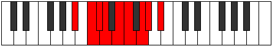

# Mode Ionyphyllic

## Links

- [Documentation](README.md)
- [Scales Index](Scales.md)
- [Modes Index](Modes.md)
- [Chords Index](Chords.md)

## Parent Scale

[Dalyllic](ScaleDalyllic.md)

## Number

[1757](https://ianring.com/musictheory/scales/1757)

## Interval Pattern

2, 1, 1, 2, 1, 2, 1, 2

## Chord Pattern

i⁰, iii⁰, iv⁰, v⁰, vi, vii⁰, VIIIb5

## Perfection

- 5 Perfect notes
- 3 Perfect notes

## Perfection Profile

[true true true false false true true false]

## Permutations

| Tonic | Notes | Signature | Illustration | Audio |
|-------|-------|-----------|--------------|-------|
| [C](ModeCNaturalIonyphyllic.md) | C, D, D#, **E**, **F#**, G, A, **A#**, C | C |  | [midi](https://github.com/edipermadi/music/blob/main/docs/ModeCNaturalIonyphyllic.mid?raw=true) |
| [C#](ModeCSharpIonyphyllic.md) | C#, D#, E, **F**, **G**, G#, A#, **B**, C# | C |  | [midi](https://github.com/edipermadi/music/blob/main/docs/ModeCSharpIonyphyllic.mid?raw=true) |
| [Db](ModeDFlatIonyphyllic.md) | Db, Eb, E, **F**, **G**, Ab, Bb, **B**, Db | C |  | [midi](https://github.com/edipermadi/music/blob/main/docs/ModeDFlatIonyphyllic.mid?raw=true) |
| [D](ModeDNaturalIonyphyllic.md) | D, E, F, **F#**, **G#**, A, B, **C**, D | C |  | [midi](https://github.com/edipermadi/music/blob/main/docs/ModeDNaturalIonyphyllic.mid?raw=true) |
| [D#](ModeDSharpIonyphyllic.md) | D#, F, F#, **G**, **A**, A#, C, **C#**, D# | C |  | [midi](https://github.com/edipermadi/music/blob/main/docs/ModeDSharpIonyphyllic.mid?raw=true) |
| [Eb](ModeEFlatIonyphyllic.md) | Eb, F, Gb, **G**, **A**, Bb, C, **Db**, Eb | C |  | [midi](https://github.com/edipermadi/music/blob/main/docs/ModeEFlatIonyphyllic.mid?raw=true) |
| [E](ModeENaturalIonyphyllic.md) | E, F#, G, **G#**, **A#**, B, C#, **D**, E | C |  | [midi](https://github.com/edipermadi/music/blob/main/docs/ModeENaturalIonyphyllic.mid?raw=true) |
| [F](ModeFNaturalIonyphyllic.md) | F, G, G#, **A**, **B**, C, D, **D#**, F | C |  | [midi](https://github.com/edipermadi/music/blob/main/docs/ModeFNaturalIonyphyllic.mid?raw=true) |
| [F#](ModeFSharpIonyphyllic.md) | F#, G#, A, **A#**, **C**, C#, D#, **E**, F# | C |  | [midi](https://github.com/edipermadi/music/blob/main/docs/ModeFSharpIonyphyllic.mid?raw=true) |
| [Gb](ModeGFlatIonyphyllic.md) | Gb, Ab, A, **Bb**, **C**, Db, Eb, **E**, Gb | C |  | [midi](https://github.com/edipermadi/music/blob/main/docs/ModeGFlatIonyphyllic.mid?raw=true) |
| [G](ModeGNaturalIonyphyllic.md) | G, A, A#, **B**, **C#**, D, E, **F**, G | C |  | [midi](https://github.com/edipermadi/music/blob/main/docs/ModeGNaturalIonyphyllic.mid?raw=true) |
| [G#](ModeGSharpIonyphyllic.md) | G#, A#, B, **C**, **D**, D#, F, **F#**, G# | C |  | [midi](https://github.com/edipermadi/music/blob/main/docs/ModeGSharpIonyphyllic.mid?raw=true) |
| [Ab](ModeAFlatIonyphyllic.md) | Ab, Bb, B, **C**, **D**, Eb, F, **Gb**, Ab | C |  | [midi](https://github.com/edipermadi/music/blob/main/docs/ModeAFlatIonyphyllic.mid?raw=true) |
| [A](ModeANaturalIonyphyllic.md) | A, B, C, **C#**, **D#**, E, F#, **G**, A | C |  | [midi](https://github.com/edipermadi/music/blob/main/docs/ModeANaturalIonyphyllic.mid?raw=true) |
| [A#](ModeASharpIonyphyllic.md) | A#, C, C#, **D**, **E**, F, G, **G#**, A# | C |  | [midi](https://github.com/edipermadi/music/blob/main/docs/ModeASharpIonyphyllic.mid?raw=true) |
| [Bb](ModeBFlatIonyphyllic.md) | Bb, C, Db, **D**, **E**, F, G, **Ab**, Bb | C |  | [midi](https://github.com/edipermadi/music/blob/main/docs/ModeBFlatIonyphyllic.mid?raw=true) |
| [B](ModeBNaturalIonyphyllic.md) | B, C#, D, **D#**, **F**, F#, G#, **A**, B | C |  | [midi](https://github.com/edipermadi/music/blob/main/docs/ModeBNaturalIonyphyllic.mid?raw=true) |
