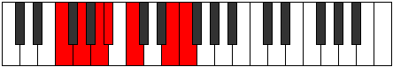

# Mode Ionyptimic

## Links

- [Documentation](index.md)
- [Scales Index](Scales.md)
- [Modes Index](Modes.md)
- [Chords Index](Chords.md)

## Parent Scale

[Garimic](ScaleGarimic.md)

## Number

[2229](https://ianring.com/musictheory/scales/2229)

## Perfection

- 4 Perfect notes
- 2 Perfect notes

## Perfection Profile

[true false true true true false]

## Permutations

| Tonic | Notes | Signature | Illustration | Audio |
|-------|-------|-----------|--------------|-------|
| [C](ModeCNaturalIonyptimic.md) | C, **D**, E, F, G, **A##**, C | C |  | [midi](ModeCNaturalIonyptimic.mid) [ogg](ModeCNaturalIonyptimic.ogg) |
| [C#](ModeCSharpIonyptimic.md) | C#, **D#**, E#, F#, G#, **A###**, C# | C |  | [midi](ModeCSharpIonyptimic.mid) [ogg](ModeCSharpIonyptimic.ogg) |
| [Db](ModeDFlatIonyptimic.md) | Db, **Eb**, F, Gb, Ab, **B#**, Db | C |  | [midi](ModeDFlatIonyptimic.mid) [ogg](ModeDFlatIonyptimic.ogg) |
| [D](ModeDNaturalIonyptimic.md) | D, **E**, F#, G, A, **B##**, D | C |  | [midi](ModeDNaturalIonyptimic.mid) [ogg](ModeDNaturalIonyptimic.ogg) |
| [D#](ModeDSharpIonyptimic.md) | D#, **E#**, F##, G#, A#, **B###**, D# | C |  | [midi](ModeDSharpIonyptimic.mid) [ogg](ModeDSharpIonyptimic.ogg) |
| [Eb](ModeEFlatIonyptimic.md) | Eb, **F**, G, Ab, Bb, **C##**, Eb | C |  | [midi](ModeEFlatIonyptimic.mid) [ogg](ModeEFlatIonyptimic.ogg) |
| [E](ModeENaturalIonyptimic.md) | E, **F#**, G#, A, B, **C###**, E | C |  | [midi](ModeENaturalIonyptimic.mid) [ogg](ModeENaturalIonyptimic.ogg) |
| [F](ModeFNaturalIonyptimic.md) | F, **G**, A, Bb, C, **D##**, F | C |  | [midi](ModeFNaturalIonyptimic.mid) [ogg](ModeFNaturalIonyptimic.ogg) |
| [F#](ModeFSharpIonyptimic.md) | F#, **G#**, A#, B, C#, **D###**, F# | C |  | [midi](ModeFSharpIonyptimic.mid) [ogg](ModeFSharpIonyptimic.ogg) |
| [Gb](ModeGFlatIonyptimic.md) | Gb, **Ab**, Bb, Cb, Db, **E#**, Gb | C |  | [midi](ModeGFlatIonyptimic.mid) [ogg](ModeGFlatIonyptimic.ogg) |
| [G](ModeGNaturalIonyptimic.md) | G, **A**, B, C, D, **E##**, G | C |  | [midi](ModeGNaturalIonyptimic.mid) [ogg](ModeGNaturalIonyptimic.ogg) |
| [G#](ModeGSharpIonyptimic.md) | G#, **A#**, B#, C#, D#, **E###**, G# | C |  | [midi](ModeGSharpIonyptimic.mid) [ogg](ModeGSharpIonyptimic.ogg) |
| [Ab](ModeAFlatIonyptimic.md) | Ab, **Bb**, C, Db, Eb, **F##**, Ab | C |  | [midi](ModeAFlatIonyptimic.mid) [ogg](ModeAFlatIonyptimic.ogg) |
| [A](ModeANaturalIonyptimic.md) | A, **B**, C#, D, E, **F###**, A | C |  | [midi](ModeANaturalIonyptimic.mid) [ogg](ModeANaturalIonyptimic.ogg) |
| [A#](ModeASharpIonyptimic.md) | A#, **B#**, C##, D#, E#, **Cbbb**, A# | C |  | [midi](ModeASharpIonyptimic.mid) [ogg](ModeASharpIonyptimic.ogg) |
| [Bb](ModeBFlatIonyptimic.md) | Bb, **C**, D, Eb, F, **G##**, Bb | C |  | [midi](ModeBFlatIonyptimic.mid) [ogg](ModeBFlatIonyptimic.ogg) |
| [B](ModeBNaturalIonyptimic.md) | B, **C#**, D#, E, F#, **G###**, B | C |  | [midi](ModeBNaturalIonyptimic.mid) [ogg](ModeBNaturalIonyptimic.ogg) |
