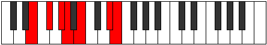

# Mode Ionyptimic

## Links

- [Documentation](index.md)
- [Scales Index](Scales.md)
- [Modes Index](Modes.md)
- [Chords Index](Chords.md)

## Parent Scale

[Garimic](ScaleGarimic.md)

## Number

[2229](https://ianring.com/musictheory/scales/2229)

## Interval Pattern

2, 2, 1, 2, 4, 1

## Chord Pattern

I, iii, V, vi⁰

## Perfection

- 4 Perfect notes
- 2 Perfect notes

## Perfection Profile

[true false true true true false]

## Permutations

| Tonic | Notes | Signature | Illustration | Audio |
|-------|-------|-----------|--------------|-------|
| [C](ModeCNaturalIonyptimic.md) | C, **D**, E, F, G, **A##**, C | C |  | [midi](https://github.com/edipermadi/music/blob/main/docs/ModeCNaturalIonyptimic.mid?raw=true) |
| [C#](ModeCSharpIonyptimic.md) | C#, **D#**, E#, F#, G#, **A###**, C# | C |  | [midi](https://github.com/edipermadi/music/blob/main/docs/ModeCSharpIonyptimic.mid?raw=true) |
| [Db](ModeDFlatIonyptimic.md) | Db, **Eb**, F, Gb, Ab, **B#**, Db | C |  | [midi](https://github.com/edipermadi/music/blob/main/docs/ModeDFlatIonyptimic.mid?raw=true) |
| [D](ModeDNaturalIonyptimic.md) | D, **E**, F#, G, A, **B##**, D | C |  | [midi](https://github.com/edipermadi/music/blob/main/docs/ModeDNaturalIonyptimic.mid?raw=true) |
| [D#](ModeDSharpIonyptimic.md) | D#, **E#**, F##, G#, A#, **B###**, D# | C |  | [midi](https://github.com/edipermadi/music/blob/main/docs/ModeDSharpIonyptimic.mid?raw=true) |
| [Eb](ModeEFlatIonyptimic.md) | Eb, **F**, G, Ab, Bb, **C##**, Eb | C |  | [midi](https://github.com/edipermadi/music/blob/main/docs/ModeEFlatIonyptimic.mid?raw=true) |
| [E](ModeENaturalIonyptimic.md) | E, **F#**, G#, A, B, **C###**, E | C |  | [midi](https://github.com/edipermadi/music/blob/main/docs/ModeENaturalIonyptimic.mid?raw=true) |
| [F](ModeFNaturalIonyptimic.md) | F, **G**, A, Bb, C, **D##**, F | C |  | [midi](https://github.com/edipermadi/music/blob/main/docs/ModeFNaturalIonyptimic.mid?raw=true) |
| [F#](ModeFSharpIonyptimic.md) | F#, **G#**, A#, B, C#, **D###**, F# | C |  | [midi](https://github.com/edipermadi/music/blob/main/docs/ModeFSharpIonyptimic.mid?raw=true) |
| [Gb](ModeGFlatIonyptimic.md) | Gb, **Ab**, Bb, Cb, Db, **E#**, Gb | C |  | [midi](https://github.com/edipermadi/music/blob/main/docs/ModeGFlatIonyptimic.mid?raw=true) |
| [G](ModeGNaturalIonyptimic.md) | G, **A**, B, C, D, **E##**, G | C |  | [midi](https://github.com/edipermadi/music/blob/main/docs/ModeGNaturalIonyptimic.mid?raw=true) |
| [G#](ModeGSharpIonyptimic.md) | G#, **A#**, B#, C#, D#, **E###**, G# | C |  | [midi](https://github.com/edipermadi/music/blob/main/docs/ModeGSharpIonyptimic.mid?raw=true) |
| [Ab](ModeAFlatIonyptimic.md) | Ab, **Bb**, C, Db, Eb, **F##**, Ab | C |  | [midi](https://github.com/edipermadi/music/blob/main/docs/ModeAFlatIonyptimic.mid?raw=true) |
| [A](ModeANaturalIonyptimic.md) | A, **B**, C#, D, E, **F###**, A | C |  | [midi](https://github.com/edipermadi/music/blob/main/docs/ModeANaturalIonyptimic.mid?raw=true) |
| [A#](ModeASharpIonyptimic.md) | A#, **B#**, C##, D#, E#, **Cbbb**, A# | C |  | [midi](https://github.com/edipermadi/music/blob/main/docs/ModeASharpIonyptimic.mid?raw=true) |
| [Bb](ModeBFlatIonyptimic.md) | Bb, **C**, D, Eb, F, **G##**, Bb | C |  | [midi](https://github.com/edipermadi/music/blob/main/docs/ModeBFlatIonyptimic.mid?raw=true) |
| [B](ModeBNaturalIonyptimic.md) | B, **C#**, D#, E, F#, **G###**, B | C |  | [midi](https://github.com/edipermadi/music/blob/main/docs/ModeBNaturalIonyptimic.mid?raw=true) |
