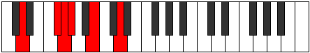
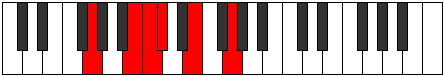

# Mode Ionyptitonic

## Links

- [Documentation](index.md)
- [Scales Index](Scales.md)
- [Modes Index](Modes.md)
- [Chords Index](Chords.md)

## Parent Scale

[Ionyptitonic](ScaleIonyptitonic.md)

## Number

[625](https://ianring.com/musictheory/scales/625)

## Perfection

- 2 Perfect notes
- 3 Perfect notes

## Perfection Profile

[false false true false true]

## Permutations

| Tonic | Notes | Signature | Illustration | Audio |
|-------|-------|-----------|--------------|-------|
| [C](ModeCNaturalIonyptitonic.md) | **C**, **E**, F, **F#**, A, **C** | C |  | [midi](https://github.com/edipermadi/music/blob/main/docs/ModeCNaturalIonyptitonic.mid?raw=true) |
| [C#](ModeCSharpIonyptitonic.md) | **C#**, **F**, F#, **G**, A#, **C#** | C |  | [midi](https://github.com/edipermadi/music/blob/main/docs/ModeCSharpIonyptitonic.mid?raw=true) |
| [Db](ModeDFlatIonyptitonic.md) | **Db**, **F**, Gb, **G**, Bb, **Db** | C |  | [midi](https://github.com/edipermadi/music/blob/main/docs/ModeDFlatIonyptitonic.mid?raw=true) |
| [D](ModeDNaturalIonyptitonic.md) | **D**, **F#**, G, **G#**, B, **D** | C |  | [midi](https://github.com/edipermadi/music/blob/main/docs/ModeDNaturalIonyptitonic.mid?raw=true) |
| [D#](ModeDSharpIonyptitonic.md) | **D#**, **G**, G#, **A**, C, **D#** | C |  | [midi](https://github.com/edipermadi/music/blob/main/docs/ModeDSharpIonyptitonic.mid?raw=true) |
| [Eb](ModeEFlatIonyptitonic.md) | **Eb**, **G**, Ab, **A**, C, **Eb** | C |  | [midi](https://github.com/edipermadi/music/blob/main/docs/ModeEFlatIonyptitonic.mid?raw=true) |
| [E](ModeENaturalIonyptitonic.md) | **E**, **G#**, A, **A#**, C#, **E** | C |  | [midi](https://github.com/edipermadi/music/blob/main/docs/ModeENaturalIonyptitonic.mid?raw=true) |
| [F](ModeFNaturalIonyptitonic.md) | **F**, **A**, A#, **B**, D, **F** | C |  | [midi](https://github.com/edipermadi/music/blob/main/docs/ModeFNaturalIonyptitonic.mid?raw=true) |
| [F#](ModeFSharpIonyptitonic.md) | **F#**, **A#**, B, **C**, D#, **F#** | C |  | [midi](https://github.com/edipermadi/music/blob/main/docs/ModeFSharpIonyptitonic.mid?raw=true) |
| [Gb](ModeGFlatIonyptitonic.md) | **Gb**, **Bb**, B, **C**, Eb, **Gb** | C |  | [midi](https://github.com/edipermadi/music/blob/main/docs/ModeGFlatIonyptitonic.mid?raw=true) |
| [G](ModeGNaturalIonyptitonic.md) | **G**, **B**, C, **C#**, E, **G** | C |  | [midi](https://github.com/edipermadi/music/blob/main/docs/ModeGNaturalIonyptitonic.mid?raw=true) |
| [G#](ModeGSharpIonyptitonic.md) | **G#**, **C**, C#, **D**, F, **G#** | C |  | [midi](https://github.com/edipermadi/music/blob/main/docs/ModeGSharpIonyptitonic.mid?raw=true) |
| [Ab](ModeAFlatIonyptitonic.md) | **Ab**, **C**, Db, **D**, F, **Ab** | C |  | [midi](https://github.com/edipermadi/music/blob/main/docs/ModeAFlatIonyptitonic.mid?raw=true) |
| [A](ModeANaturalIonyptitonic.md) | **A**, **C#**, D, **D#**, F#, **A** | C |  | [midi](https://github.com/edipermadi/music/blob/main/docs/ModeANaturalIonyptitonic.mid?raw=true) |
| [A#](ModeASharpIonyptitonic.md) | **A#**, **D**, D#, **E**, G, **A#** | C |  | [midi](https://github.com/edipermadi/music/blob/main/docs/ModeASharpIonyptitonic.mid?raw=true) |
| [Bb](ModeBFlatIonyptitonic.md) | **Bb**, **D**, Eb, **E**, G, **Bb** | C |  | [midi](https://github.com/edipermadi/music/blob/main/docs/ModeBFlatIonyptitonic.mid?raw=true) |
| [B](ModeBNaturalIonyptitonic.md) | **B**, **D#**, E, **F**, G#, **B** | C |  | [midi](https://github.com/edipermadi/music/blob/main/docs/ModeBNaturalIonyptitonic.mid?raw=true) |
